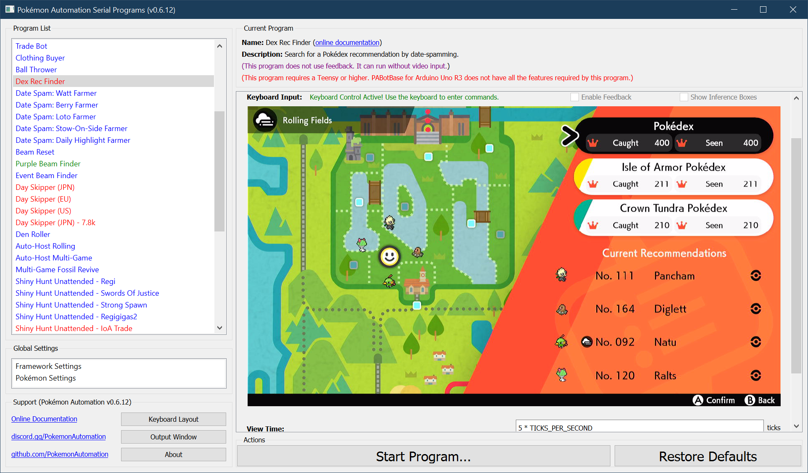
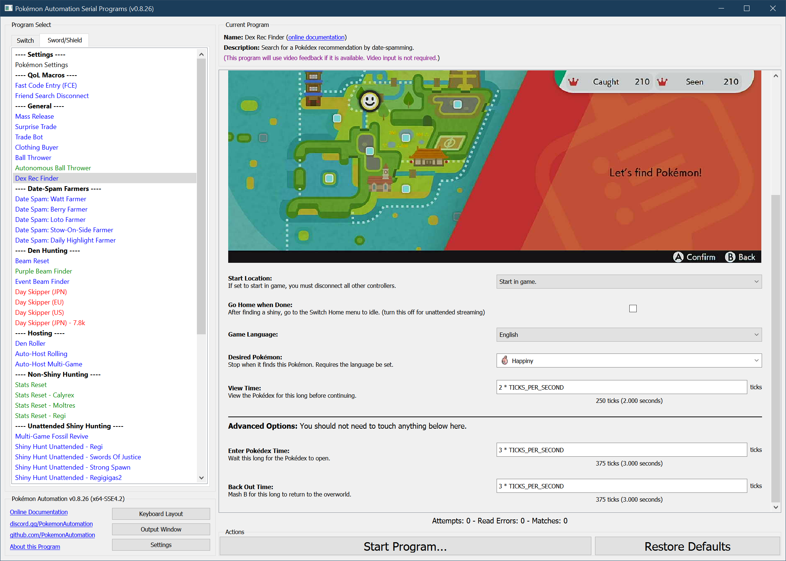

# Pokédex Recommendation Finder

## Program Description

Find a specific Pokédex Recommendation (Dex Rec). The purpose of dex recs is to increase the encounter odds of a particular Pokémon that you are trying to hunt. This program is typically used in combination with the [fishing](ShinyHuntAutonomous-Fishing.md) and [overworld](ShinyHuntAutonomous-Overworld.md) encounter bots.

**Note:**

If you are hunting authentic Sinistea, do not use a Dex Rec. Dex Rec for Sinistea only boosts the phony form. It does not boost the authentic form.
Boosting the Sinistea (or anything in the area you are hunting) will *lower* the chances of encounter authentic Sinistea.

### Setup of Settings

1. Text Speed: Fast
2. Casual mode: off
3. System time: Un-synced
4. VS (Y-Comm) glitch must be active

### Instructions

1. Select what Pokémon that you want to hunt
   > In the Dex Rec program menu
2. Go to the area where it spawns
3. Change the date so that the location has the correct weather to spawn the Pokémon that you want
4. Menu cursor must be over the Pokédex
   - Enter the menu
   - Adjust cursor to be over Pokédex
   - Press 'B' to exit the menu
5. You must be in the overworld (not inside the menu)
6. Start the program in game or the [Change Grip/Order Menu](https://github.com/PokemonAutomation/Microcontroller/blob/master/Wiki/Programs/NintendoSwitch/ChangeGripOrderMenu.md) depending on which option you choose.

   > The program will repeatedly date-skip and view the Pokédex. It has two operating modes:
   > 1. No feedback. If you do not select a game language or a desired Pokémon, you must watch it and manually stop it when you see what you want.
   > 2. With feedback. If you set the correct game language and a desired Pokémon, it will automatically stop when the desired Pokémon appears in the recommendations.

## After finding your selected Pokémon

Once you have found what you want, save the game and disable the Y-COMM glitch to lock in the dex rec.

> Note that a Pokémon will not appear as a dex rec if you already have it in your Pokédex, but your Pokédex is not complete.
> This also applies to the Isle of Armor and Crown Tundra Pokédexes if you have entered those areas.
> There is some evidence that suggests dex rec does not work unless you have a completed Pokédex. Thus, please complete your Pokédex before using this program.

---

### Options

This program does not have the ability to avoid the system update window.

### Game Language

If set to "None", the program will not stop by itself. You must manually stop it when you see what you want.
Otherwise, set it to the language of your game so that the program can properly read what Pokémon appears in each set of recommendations.

> Requires the game language be set and a video card to read what Pokémon appears in each set of recommendations.

### Desired Pokémon

Stop when this Pokémon is found.

> Requires the game language be set and a video card to read what Pokémon appears in each set of recommendations.

### View Time

View the Pokédex for this long before moving on to the next day skip.

### Back Out Time

Mash B for this long to return to the overworld from the Pokédex.

## Credits

- **Author:** Kuroneko/Mysticial

**Discord Server:** 

