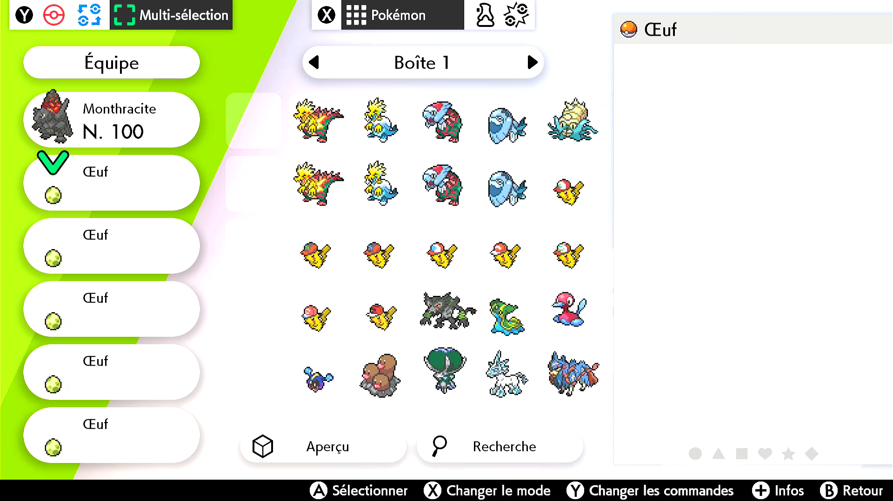
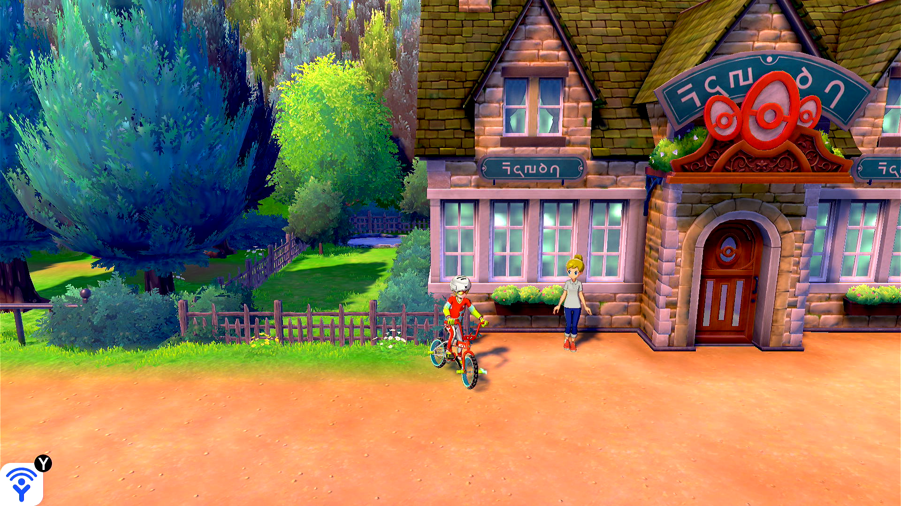
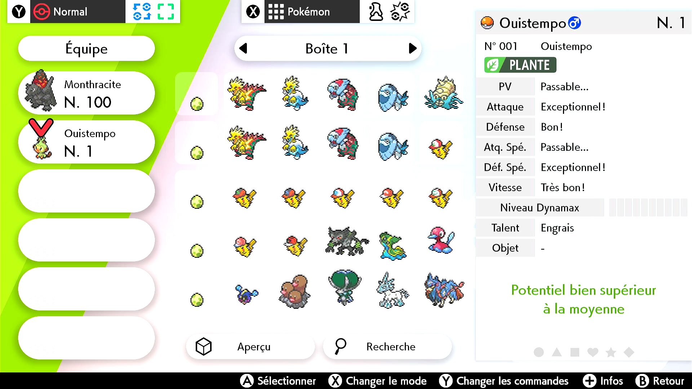

# Egg Autonomous

(This program is still under development and is not yet available. Track its progress here: https://github.com/PokemonAutomation/ComputerControl/issues/28)

## Program Description

A fully autonomous bot that uses visual feedback to fetch and hatch eggs. It will automatically detect and keep shinies and can also be configured to keep specific gender and IV spreads.

Unlike [Egg Combined 2](EggCombined2.md) and other Sword/Shield egg programs, this program can run completely unattended for many days without intervention.

Furthermore, this program doesn't care about step counts, egg-warming, or early hatching eggs. Visual feedback allows it to adapt to all of these variables as well game crashes and misc. program errors.

### Setup of Settings

1. Screen size: Must be 100% within the Switch settings.
2. Video Resolution: 1080p or higher in program settings.
3. Casual mode: Off.
4. The "Send to Boxes" option must be set to "Automatic".
5. Nicknaming needs to be off.
6. Your bike must be fully upgraded.
7. Text Speed: Fast.
8. The parents are already deposited at the Route 5 Nursery.
9. The Rotom Phone apps on the menu are in their default locations.
   1. The Town Map app must be in the 2nd row on the far left.
   2. The Pokémon app must be in the 1st row, 2nd from the left.
10. You already have the Pokédex entry for the Pokémon you are hatching.

**Strongly Recommended:**
- Masuda Method: The Pokémon in the Nursery are of different languages.
- Have the Oval Charm.
- Have the Shiny Charm.
- Your lead Pokémon is a flame body (or similar) Pokémon.

### Party Setup

1. Your lead Pokémon is not an egg.
2. The rest of your party consists of 5 eggs.

### Pokémon Box Setup

1. The current box is full except for an empty 1st column.
2. The box on the left of the current box has plenty of free spaces. This is where the kept babies will be deposited.
3. The right panel is set to the IV Judge Panel. (You can also set it to the stats panel if you are not doing IV filtering.)

### Required Parameters:

- The value of **Max Keepers** must be no greater than the number of free spaces in the left box. If the box becomes full, the program will break!

### Run Instructions

1. Travel to Route 5, in front of the Nursery.
2. Get on your bike.
3. Check that there is nothing in front of you that can be interacted with.
4. You do not have any active Repels.
5. Start the program.

Once the program starts, it will immediately save the game (if [Auto-Saving](#auto-saving) is enabled) and start doing bike loops. It will periodically fetch eggs and hatch your entire party.

Once it has fetched 5 eggs and hatched all 5 eggs in your party, it will enter the box system and check each of the 5 babies in your party. Each baby is run through the [Actions Table](#actions-table). Depending on what conditions are matched, the baby will be either released, deposited into the left box, or the program will stop.

Once it has finished processing your party, it will withdraw the 5 eggs in the first column of the current box and continue.

## Options

### Start Location:

Start the program in game or the [Change Grip/Order Menu](https://github.com/PokemonAutomation/Microcontroller/blob/master/Wiki/Programs/NintendoSwitch/ChangeGripOrderMenu.md).

### Rollover Prevention:

This is useful if your game is holding a den and you do not want an unintentional date-skip to destroy it.

Prevent the den from rolling over by periodically touching the date at this interval. Set this value to zero to disable the feature.

### Go Home when Done:

After the program finishes, go to the Switch Home to idle.

### Game Language:

The language you are playing in. This is required only if you are doing IV filtering via the [Actions Table](#actions-table).

### Max Keepers:

Stop the program once it has kept this many babies. This value should be no greater than the number of free spaces in the left box.

### Bike Loops Per Fetch:

Doing bike loops for this many times before attempting to fetch another egg.

### Num Eggs in Column:

How many eggs already deposited in the first column in the current box.
This option is useful if you interrupt the program and wish to resume it with some eggs already deposited in the box.

### Auto-Saving:

You can set it to save the game at the start of the program and after keeping a hatched Pokémon, or save before hatching every batch.
That way if the game crashes or the program encounters some error, you won't lose too much progress.
If set to saving before hatching every batch, you can also unhatch eggs. (Unhatching eggs can be useful for obtaining breeding parents by rehatching a perfect egg in a game with a different language.)

### Actions Table:

This tables lets you specify the actions to perform on babies that meet a certain criteria.

By default, there is one action which is to keep all shinies. (deposit them into the left box)
But you can add more actions to keep babies of certain gender and IV spreads. This is useful if you are still selectively breeding for perfect parents.

***If you are using any IV filters, the right panel in the box system must be set to the IV Judge. Similar if you are using any gender filter.***

## Credits

- **Author:** Gin, Kuroneko/Mysticial

**Discord Server:** 

