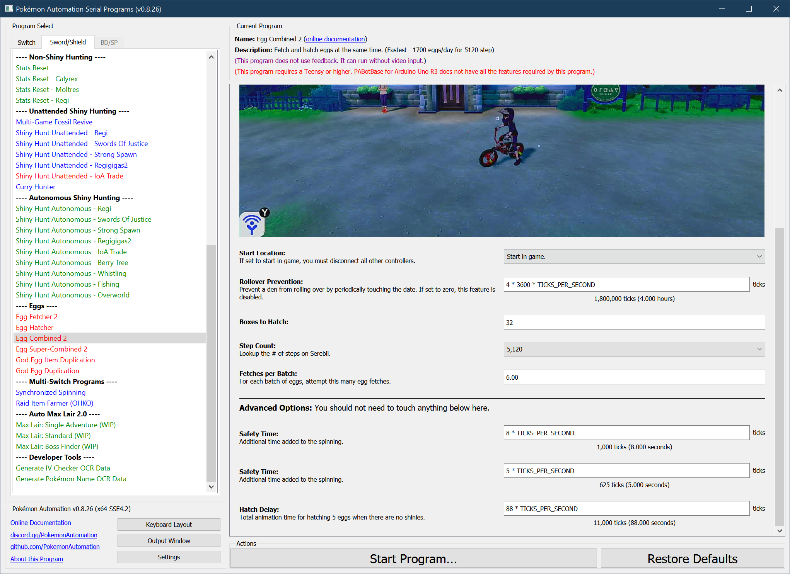

# Egg Combined 2

## Program Description

***(Do not use this program until you are experiented with [EggFetcher2](EggFetcher2.md) and [EggHatcher](EggHatcher.md). This program is very difficult to use and will require understanding of those simpler programs to use properly.)***

This is the combined egg fetching+hatching program. When used properly, it is nearly as fast as manual hatching.

This program is capable of sustaining upwards of ***1700 eggs/day*** (5120 step) even when including time to perform mass release. Thus this is one of the fastest (if not the fastest) automatic egg hatcher that does not require custom firmware.

The EggCombined programs require setup so they may be less convenient if you are only trying to hatch one or two shinies of a specific species. But if you are hatching for squares, then this is definitely the program for you.

This program requires that you already have a "reservoir" of eggs (recommended at least 3 boxes). You can run [EggFetcher2](EggFetcher2.md) to obtain these eggs.

Starting with this reservoir of eggs, this program will hatch those eggs while simultaneously fetching more eggs. Newly fetched can be hatched within the same run of the program. Thus with just 3 boxes of eggs, you can keep hatching until you run out of box space.

As with the previous version of this program, hatch and fetch rates will rarely be perfectly synced. Thus the reservoir of eggs will slowly increase or decrease as the program runs. So every once in a while, you will need to adjust the number of eggs with EggFetcher2 or [EggHatcher](EggHatcher.md). Advanced users can adjust the fetch rates in this program to keep the reservoir of eggs at the desired size.

Be aware that the complexity of this program makes it inherently less reliable than the regular EggHatcher. Unlike EggHatcher, it does not tolerate early hatching eggs and requires all eggs to hatch at the same time at the specified step count. If you need to clean up a bunch of eggs of unknown remaining step count, use EggHatcher.

### Setup of Settings

1. Text Speed: Fast
2. Casual mode: Off
3. The "Send to Boxes" option must be set to "Automatic".
4. Nicknaming needs to be off.
5. Your bike must be fully upgraded.
6. The parents are already deposited at the Route 5 daycare center.
7. The Rotom Phone apps on the menu are in their default locations.
   1. The Town Map app must be in the 2nd row on the far left.
   2. The Pokémon app must be in the 1st row, 2nd from the left.

> *If you are playing in Japanese or Italian, you need to [**"Egg Fetch Extra Line"**](PokemonSettings.md#egg-fetch-extra-line) or this program will not work.*

### Party Setup

1. Your party must have exactly 1 Pokémon.
   1. The Pokémon in your party MUST be a flame body (or similar) Pokémon.

### Pokémon Box Setup

1. Place entire boxes filled with eggs consecutively
   > It is okay to have non-eggs mixed in with eggs, but all boxes you intend to hatch must be completely filled with something.
2. You must be on the first box of eggs.
3. All the eggs that you are hatching MUST hatch at the same time and at the specified # of steps. Eggs are not allowed to hatch early
   > *Do not use this program on partially hatched eggs. Even a single early hatching egg can break the program.*

> **Failure Cases:**
> * It is safe to run out of box space. If the egg-fetching wraps around and occupies the current column, the program will fail safely by "re-hatching" the same party over and over again until it's done.
> * It is NOT safe to hatch an incomplete column due to running out of eggs. This will lead to an incomplete party being loaded which will swallow up newly fetched eggs. These eggs will not hatch at the correct time which will completely break the program.
> * It is NOT safe for eggs to hatch early. If an egg hatches during a fetch attempt, it can put the program into an unexpected state.

### Required Parameters:
- **Boxes to Hatch**: You MUST set this to the # of boxes you wish to hatch. Otherwise, you either won't hatch all the eggs you want, or the program goes crazy if you run out of eggs.
- **Step Count**: You MUST set this to the correct step-count for the Pokémon you are hatching. If this is set too small, the program will fail and may unintentionally start a trade. (see Precautions)

The program will hatch eggs in batches of 5 (one column at a time). Once a box is complete, it moves to the next box. It will continue until it has hatched N boxes where N is specified by **"Boxes to Hatch"**.

Newly fetched eggs will be dropped one box ahead of the one that's being hatched. These will spill forward to later boxes as necessary, thus it is possible to set **"Boxes to Hatch"** to more than what you have. But you will need to monitor the program to make sure it fetches eggs quickly enough to keep up with the hatching.

### Safety Recommendations:
- As a precaution, it is strongly recommended to be offline. In the event that the eggs do not finish hatching before the program enters the storage system, there is a high chance that it will go into YCOMM and start a trade.

### Run Instructions

1. Travel to Route 5.
2. Get on your bike.
3. Open the menu and place the cursor over the "Pokémon" option.
4. Hit "B" to return to the overworld (not in a menu).
5. Check that there is nothing in front of you that can be interacted with.
6. Start the program in game or the [Change Grip/Order Menu](https://github.com/PokemonAutomation/Microcontroller/blob/master/Wiki/Programs/NintendoSwitch/ChangeGripOrderMenu.md) depending on which option you choose.

## Options

This program uses [**Tolerate System Update Menu (fast)**](/Wiki/Programs/NintendoSwitch/FrameworkSettings.md#tolerate-system-update-menu-fast) to bypass the system update window.

In addition to the main options below, there are more [global options](PokemonSettings.md) that can be configured if you encounter problems.

### Boxes of Eggs to Hatch:

Hatch this many boxes of eggs.

### Egg Step-Count:

The number of steps needed to hatch the eggs. Select the species that will hatch from the Egg.

### Fetches per Batch:

For each batch of eggs, attempt this many egg fetches. If this is a non-integer, the program will vary the # of fetches across batches so that they average out to the specified number.

By changing this number you can adjust the fetch rate of eggs. Thus with careful tuning, you can make egg fetching nearly the same speed as hatching.

Since there are 5 eggs per batch, you will need to set this value to more than 5.0 to match the hatch rate since some fetches will fail. The optimal value will depend on the step count and the compatibility of the parents.
Since this program is new, the exact fetch rates that lead to fetch/hatch equilibrium is not yet known. But they are believed to all be between 5.1 and 6.5.

### Rollover Prevention:

This is useful if your game is holding a den and you do not want an unintentional date-skip to destroy it.

Prevent the den from rolling over by periodically touching the date at this interval. Set this value to zero to disable the feature.

## Advanced Settings:

These are advanced settings. You shouldn't need to touch these unless something isn't working and you're trying to debug it yourself.

### Safety Time:

Additional time added to the spinning. If any shinies are hatched, they will eat into this safety buffer along with any other unexpected slowdowns. Hatching a shiny takes 2 seconds longer than a non-shiny.

If you see that the program is going into Y-COMM or there is less than 5 seconds of extra spinning after the last egg in the batch, please report this as a bug. As a temporary work-around, you can increase this number.

### Early Hatch Safety:

Eggs will not hatch early by more than this period.

### Hatch Delay:

Total animation time for hatching 5 eggs when there are no shinies.

## Credits

- **Author:** Kuroneko/Mysticial

**Discord Server:** 

