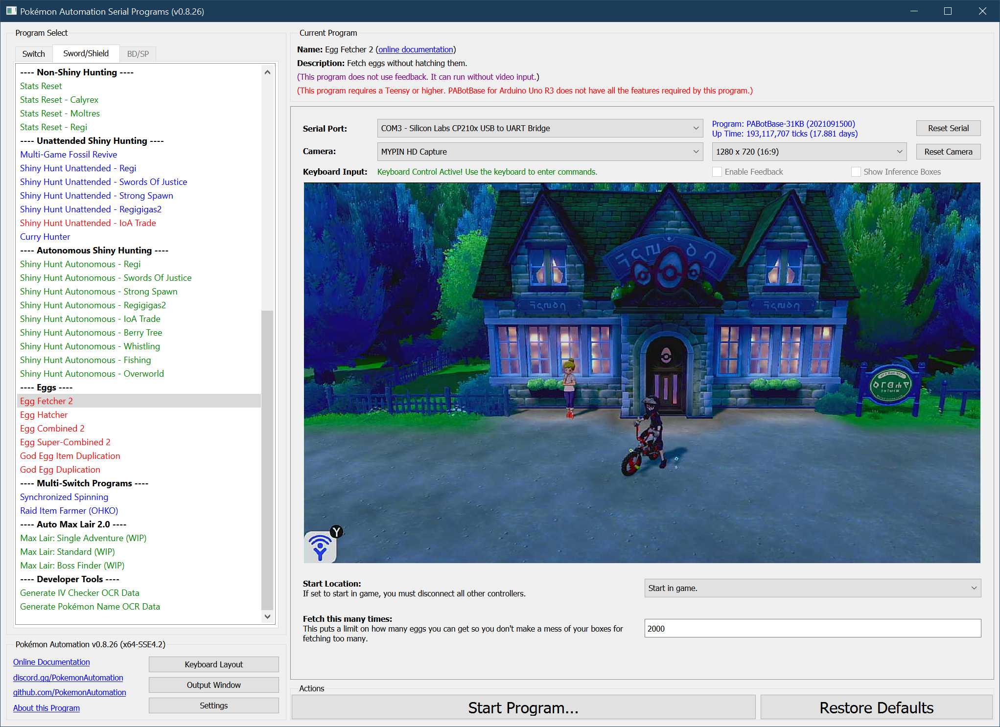

# Egg Fetcher 2

**Related Programs:**
- **Microcontroller:** [Egg Fetcher 2](https://github.com/PokemonAutomation/Microcontroller/blob/master/Wiki/Programs/PokemonSwSh/EggFetcher2.md)
- **Computer Control:** [Egg Fetcher 2](https://github.com/PokemonAutomation/ComputerControl/blob/master/Wiki/Programs/PokemonSwSh/EggFetcher2.md) (this program)

The microcontroller and computer-control versions of this program are functionally identical.

## Program Description

Fetch eggs into your boxes without hatching them.

This program is used with [EggHatcher](EggHatcher.md) to fetch and hatch eggs. Thus you first fetch a bunch of eggs with EggFetcher, then you hatch them with EggHatcher.

This program is also used to build a reservoir of eggs for running the faster [EggCombined2](EggCombined2.md) and [EggSuperCombined2](EggSuperCombined2.md) programs.

### Setup of Settings

1. Text Speed: Fast
2. Casual mode: Off
3. The "Send to Boxes" option must be set to "Automatic".
4. Your bike must be fully upgraded.
5. The parents are already deposited at the Route 5 daycare center.

   > Strongly Recommended:
   > - Masuda Method: The Pokémon in the daycare are of different languages.
   > - Have the Oval Charm.
   > - Have the Shiny Charm.

### Party Setup

1. Your party is full and none are eggs.

### Instructions

1. Travel to Route 5.
2. Get on your bike.
3. Open the menu and place the cursor over the "Town Map" option.
4. Hit "B" to return to the overworld (not in a menu).
5. Check that there is nothing in front of you that can be interacted with.
6. Start the program in game or the [Change Grip/Order Menu](https://github.com/PokemonAutomation/Microcontroller/blob/master/Wiki/Programs/NintendoSwitch/ChangeGripOrderMenu.md) depending on which option you choose.

> *If you are playing in Japanese or Italian, you need to [**"Egg Fetch Extra Line"**](PokemonSettings.md#egg-fetch-extra-line) or this program will not work.*

### Default Program Settings

For parents with neutral compatibility (same species or different OT), this program will fetch a box of eggs every ~15 min. or so.

It is okay to let this program fill all your boxes. If there's no room, you simply will not receive any more eggs. No harm is done.

## Options

This program uses [**Tolerate System Update Menu (fast)**](/Wiki/Programs/NintendoSwitch/FrameworkSettings.md#tolerate-system-update-menu-fast) to bypass the system update window.

In addition to the main options below, there are more [global options](PokemonSettings.md) that can be configured if you encounter problems.

### Fetch Attempts:

Make this many attempts to fetch an egg. The only reason to set this option is to avoid over-fetching of eggs and clogging up all your boxes.

**Discord Server:** 

