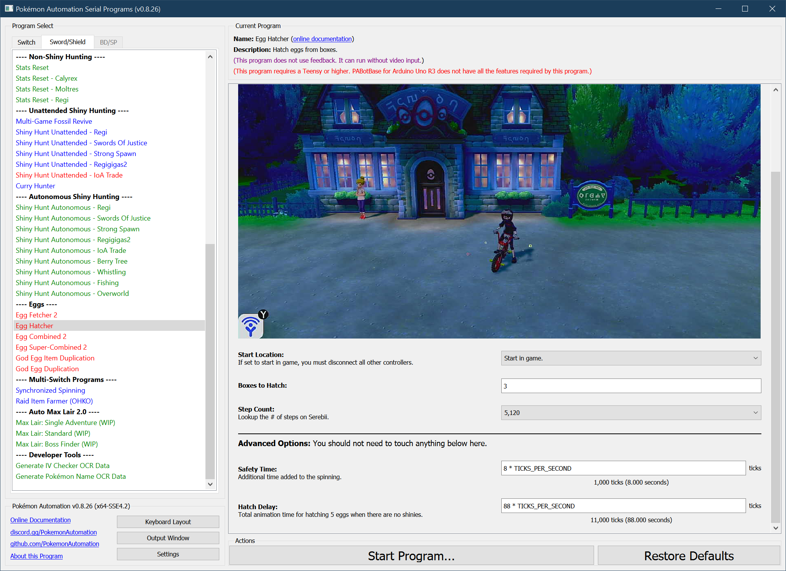

# Egg Hatcher

## Program Description

Hatch eggs from your boxes. This is the counterpart to [EggFetcher2](EggFetcher2.md).

This program will tolerate early hatching eggs as long as they don't hatch immediately to prevent the character from reaching the bridge. _**Thus EggHatcher is mainly used to clean up eggs of unknown remaining step-count.**_

This program does not use bike boosts, but is nevertheless roughly the same speed as brianuuuSonic's AutoController egg hatcher.
> For fastest egg hatching, you should use [EggCombined2](EggCombined2.md) and [EggSuperCombined2](EggSuperCombined2.md) once have familiarized yourself with this program.
> 
> This program is no longer optimized since you should be using the aforementioned combined egg hatchers for speed.

### Setup of Settings

1. Text Speed: Fast
2. Casual mode: Off
3. Nicknaming: Off
4. The menu icons are in their default locations.
   1. The Town Map must be in the 2nd row on the far left.
   2. The Pokémon option must be in the 1st row, 2nd from the left.

### Party Setup

1. Your party must have exactly 1 Pokémon.
   1. The Pokémon in your party MUST be a flame body (or similar) Pokémon.

### Pokémon Box Setup

1. Place entire boxes filled with eggs consecutively.
   1. It is okay to have non-eggs mixed in with eggs.
   2. The only requirement is that first row of each box is occupied.

2. You must be on the first box of eggs.

### Required Parameters:
- **Boxes to Hatch**: You MUST set this to the # of boxes you wish to hatch. Otherwise, you either won't hatch all the eggs you want, or the program goes crazy if you run out of eggs.
- **Step Count**: You MUST set this to the correct step-count for the Pokémon you are hatching. If this is set too small, the program will fail and may unintentionally start a trade. (see Precautions)

The program will hatch eggs in batches of 5 (one column at a time). Once a box is complete, it moves to the next box. It will continue until it has hatched N boxes where N is specified by **"Boxes to Hatch"**.

### Safety Recommendations:
- Make sure you're offline. (see below)
- Don't run this program unattended if any eggs are close to hatching.

As a precaution, it is strongly recommended to be offline. In the event that the eggs do not finish hatching before the program enters the storage system, there is a high chance that it will go into YCOMM and start a trade.

This program is not as reliable when the eggs hatch before the character can travel to the safe location on the bridge. Therefore, it is not recommended to run this program unattended when cleaning up eggs of unknown origin and unknown remaining step-count.

### Run Instructions

1. Travel to Route 5.
2. Get on your bike.
3. Open the menu and place the cursor over the "Pokémon" option.
4. Hit "B" to return to the overworld (not in a menu).
5. Check that there is nothing in front of you that can be interacted with.
6. Start the program in game or the [Change Grip/Order Menu](https://github.com/PokemonAutomation/Microcontroller/blob/master/Wiki/Programs/NintendoSwitch/ChangeGripOrderMenu.md) depending on which option you choose.

## Options

This program uses [**Tolerate System Update Menu (fast)**](/Wiki/Programs/NintendoSwitch/FrameworkSettings.md#tolerate-system-update-menu-fast) to bypass the system update window.

In addition to the main options below, there are more [global options](PokemonSettings.md) that can be configured if you encounter problems.

### Boxes of Eggs to Hatch:

Hatch this many boxes of eggs.

### Egg Step-Count:

The number of steps needed to hatch the eggs. Select the species that will hatch from the Egg.

## Advanced Settings:

These are advanced settings. You shouldn't need to touch these unless something isn't working and you're trying to debug it yourself.

### Safety Time:

Additional time added to the spinning. If any shinies are hatched, they will eat into this safety buffer along with any other unexpected slowdowns. Hatching a shiny takes 2 seconds longer than a non-shiny.

If you see that the program is going into Y-COMM or there is less than 5 seconds of extra spinning after the last egg in the batch, please report this as a bug. As a temporary work-around, you can increase this number.

### Hatch Delay:

Total animation time for hatching 5 eggs when there are no shinies.

## Credits

- **Author:** Kuroneko/Mysticial

**Discord Server:** 

