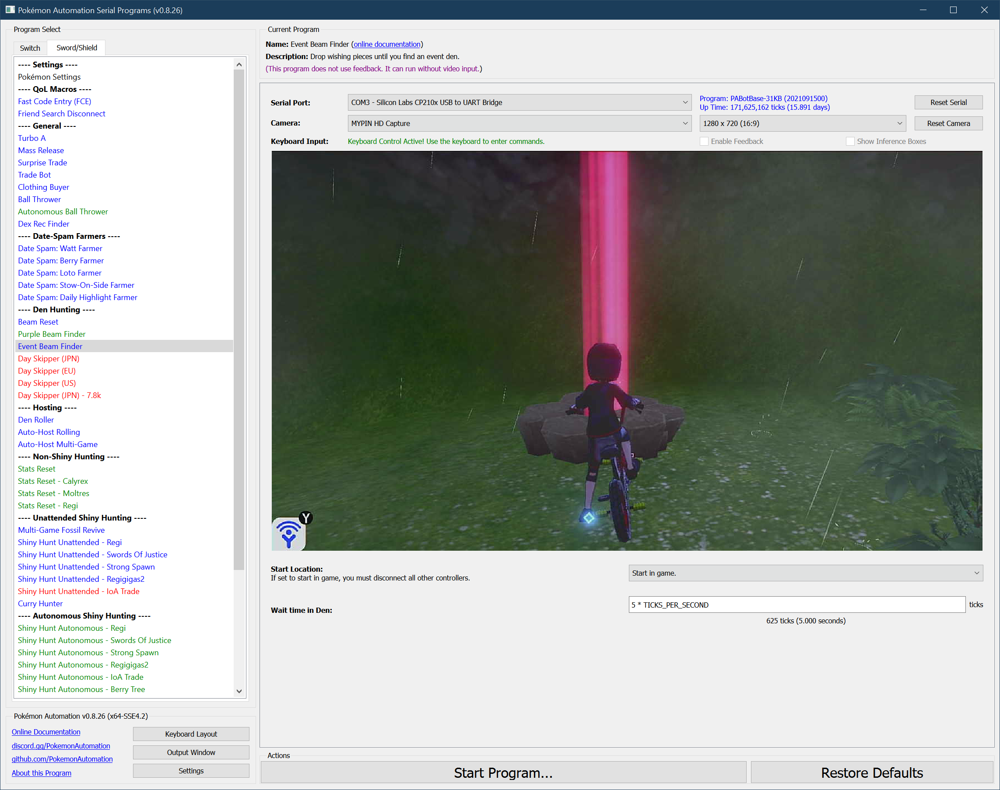

# Event Beam Finder

**Related Programs:**
- **Microcontroller:** [Event Beam Finder](https://github.com/PokemonAutomation/Microcontroller/blob/master/Wiki/Programs/PokemonSwSh/EventBeamFinder.md)
- **Computer Control:** [Event Beam Finder](https://github.com/PokemonAutomation/ComputerControl/blob/master/Wiki/Programs/PokemonSwSh/EventBeamFinder.md) (this program)

The microcontroller and computer-control versions of this program are functionally identical.

## Program Description

Drop wishing pieces between two dens until you find an event den.

### Setup of Settings

1. Text Speed: Fast
2. Casual mode: Off
3. Airplane mode; On
   > To run docked, undock the Switch, turn on airplane mode, then redock. The Switch will remain in airplane mode after redocking.
   > 
   > Airplane mode is required to avoid getting stuck inside a den as well as slowdowns from network traffic/interference.

### Instructions

1. Travel to Bridge Field daycare
2. Check that the two dens closet to the Bridge Field daycare do not have a natural beam.
   1. If they do, fight and despawn then.
   2. It is ok if a beam was created by wishing piece. They will be despawned.
3. Get on your bike.
4. Enter the menu and place the cursor over the Town Map.
5. Exit the menu with "B"
6. Confirm you are in the overworld (not in the menu).
7. Check that there is nothing in front of you that can be interacted with.
8. Start the program in game or the [Change Grip/Order Menu](https://github.com/PokemonAutomation/Microcontroller/blob/master/Wiki/Programs/NintendoSwitch/ChangeGripOrderMenu.md) depending on which option you choose.

### Default Program Settings

The program will travel back-and-forth between the two dens closest to the Bridge Field daycare center. Each time, it will drop a wishing piece and enter the den to let you view it.

This program goes back-and-forth between the following two dens:
- **Den 5/46 (Shedinja):** By the trees near the Obstagoon.
- **Den 4/92 (Gmax Orbeetle):** To the right of the Digging Duo.

## Options:

This program uses [**Tolerate System Update Menu (fast)**](/Wiki/Programs/NintendoSwitch/FrameworkSettings.md#tolerate-system-update-menu-fast) to bypass the system update window.

Most of the options here are self-explanatory.

## Credits

- **Author:** Kuroneko/Mysticial

**Discord Server:** 

