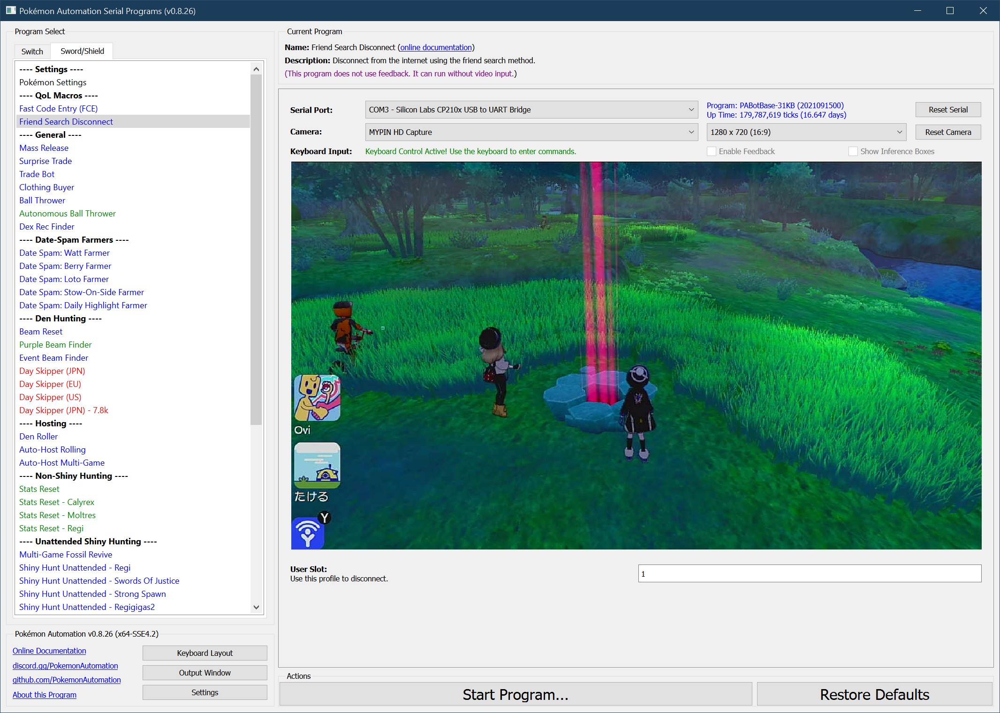

# Friend Search Disconnect

## Program Description

Disconnect from the internet using the friend search method.

This program is useful for activating the Y-COMM glitch while playing on the computer or remotely. This is because:
1. You cannot enter airplane mode while docked.
2. You cannot sleep the Switch since the device cannot wake it back up.

Therefore, friend-search is the only remaining option.

### Instructions

1. You are inside the game. (not the Switch Home or settings)
2. The device is the primary controller.
3. Run this program.

The program will quickly enter the Switch Home, navigate to the specified user profile, and perform a friend-search to disconnect from the internet.

### How to Use

To activate Y-COMM glitch using this program:

1. Use keyboard controls.
   - Keyboard input text on program must be purple
2. Open up Y-COMM in game.
3. Connect to the internet.
4. Start a link battle.
5. As soon as you match with someone, click "Start Program...".

The program will disconnect from the internet and return to the game.

## Options

### User Slot

This is the [user profile number](https://github.com/PokemonAutomation/Microcontroller/blob/master/Wiki/Programs/NintendoSwitch/UserSlotNumber.md) to use to perform the disconnect.

**Discord Server:** 

