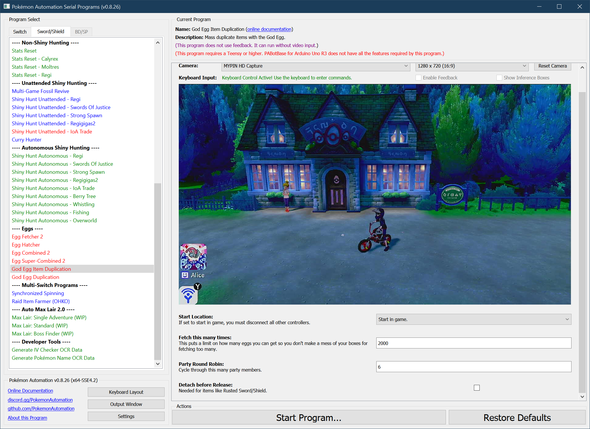

# God Egg Item Duplication

**Related Programs:**
- **Microcontroller:** [God Egg Item Duplication](https://github.com/PokemonAutomation/Microcontroller/blob/master/Wiki/Programs/PokemonSwSh/GodEggItemDuplication.md)
- **Computer Control:** [God Egg Item Duplication](https://github.com/PokemonAutomation/ComputerControl/blob/master/Wiki/Programs/PokemonSwSh/GodEggItemDuplication.md) (this program)

The microcontroller and computer-control versions of this program are functionally identical.

## Program Description

Duplicate items using the God Egg/MissingNo.

> **Keep in mind that the God Egg is considered a form of hacking since there is no known way to obtain it without someone having a hacked Switch.**

### Setup of Settings

1. Text Speed: Fast
2. Casual mode: Off
3. The "Send to Boxes" option must be set to "Manual".
4. The menu icons are in their default locations:
   1. The Town Map must be in the 2nd row on the far left.
   2. The Pokémon option must be in the 1st row, 2nd from the left.
5. Your bike must be fully upgraded.
6. You must have the God Egg and a Ditto deposited at the Route 5 daycare center.

   > Strongly Recommended:
   > - Have the Oval Charm.
   > - The Ditto and the God Egg should have different OTs.

### Setup of Party

1. Your party is full.
2. All 6 Pokémon in your party are releasable. (not an egg, not a fused mon)
   - If you don't want to clone items on all 6 Pokémon in your party, you can set **"Party Round Robin"** to cycle through fewer Pokémon/items.

### Box Setup:
- The entire 1st column of the current box must be empty.
- Your party has 6 throw-away Pokémon* - each holding an item you wish to duplicate.

### Safety Recommendations:
- Don't leave any Pokémon you care about in the game. This program releases Pokémon and has been observed to fail in a way that saves the game.
- If you do need to leave Pokémon you care about, keep them out of the 1st column of any box.

### Instructions

1. Fly to Route 5.
2. Get on your bike.
3. Open the menu and move the cursor over the Town Map.
4. Press "B" to return to the overworld (not in the menu).
5. Check there is nothing in front of you that can be interacted with.
6. Start the program in game or the [Change Grip/Order Menu](https://github.com/PokemonAutomation/Microcontroller/blob/master/Wiki/Programs/NintendoSwitch/ChangeGripOrderMenu.md) depending on which option you choose.

> *If you are playing in Japanese or Italian, you need to [**"Egg Fetch Extra Line"**](PokemonSettings.md#egg-fetch-extra-line) or this program will not work.*

### Default Program Settings

The program will clone each Pokémon in your party, take its item, and release it. Then it repeats the process forever.

## Options

This program uses [**Tolerate System Update Menu (fast)**](/Wiki/Programs/NintendoSwitch/FrameworkSettings.md#tolerate-system-update-menu-fast) to bypass the system update window.

In addition to the main options below, there are more [global options](PokemonSettings.md) that can be configured if you encounter problems.

### Fetch Attempts:

Make this many attempts to fetch and duplicate an item.

### Party Round Robin:

Round-robin through this many party Pokémon. By attaching different items to different Pokémon in your party, you can duplicate different items in the same run. Thus it can clone up to 6 different items in each run.

Examples:
- If set to 1, it will only clone the item held by the 1st party member.
- If set to 2, it will alternate cloning items held by the 1st and 2nd party members.
- If set to N, it will clone the items held by the 1st N members in your party in a round-robin fashion.
This option doesn't increase the speed of the item duplication. It merely gives you more variety. If you run the program unattended overnight, you may get around 300 of the same item. By setting this parameter, you can instead get 50 of 6 different items.

### Detach Item:

When you release a Pokémon, the item automatically detaches and goes to your inventory. But certain items (like Rusted Sword/Shield) will prevent you from releasing the Pokémon.

If you are duplicating such items, you must set this to true.

## Credits

- **Original:** SakuraKim
- **Ported to CC:** Kuroneko/Mysticial

**Discord Server:** 

