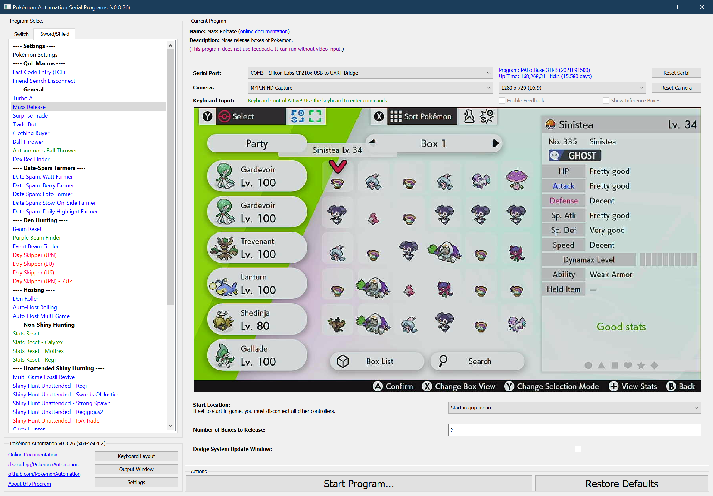

# Mass Release

## Program Description

MassRelease will release entire boxes of Pokémon. The main use case is getting rid of breedjects, non-shiny fossils, and other hunts.

### Setup of Settings

1. Text Speed: Fast
2. Casual mode: Off

### Box Setup

1. Place entire boxes filled with Pokémon to be released consecutively.
2. All boxes marked for deletion must be full.
   1. This program does not tolerate partial boxes.

### Instructions

1. You must in the box system.
2. The cursor must be over the 1st Pokémon in the box. (top-left corner)
3. The cursor must be red. (not blue or green)
2. Start the program in game or the [Change Grip/Order Menu](https://github.com/PokemonAutomation/Microcontroller/blob/master/Wiki/Programs/NintendoSwitch/ChangeGripOrderMenu.md) depending on which option you choose.

Once started, this program will release the specified number of boxes consecutively starting from the current box.

### Safety Recommendations:

See [Maximizing Switch Stability](https://github.com/PokemonAutomation/Microcontroller/blob/master/Wiki/Programs/NintendoSwitch/SwitchStability.md).

## Options

Most of the options here are self-explanatory.
This program does not use the global setting to bypassing the system update window. It has its own setting for that. (See below.)

### Dodge System Update Window:

When enabled, the program will dodge the system update window. Do not set this option if the system update window is not present. Unlike other programs, MassRelease will not be able to tolerate the extra button presses if they land in the box system.

## Credits

- **Author:** Kuroneko/Mysticial

**Discord Server:** 

