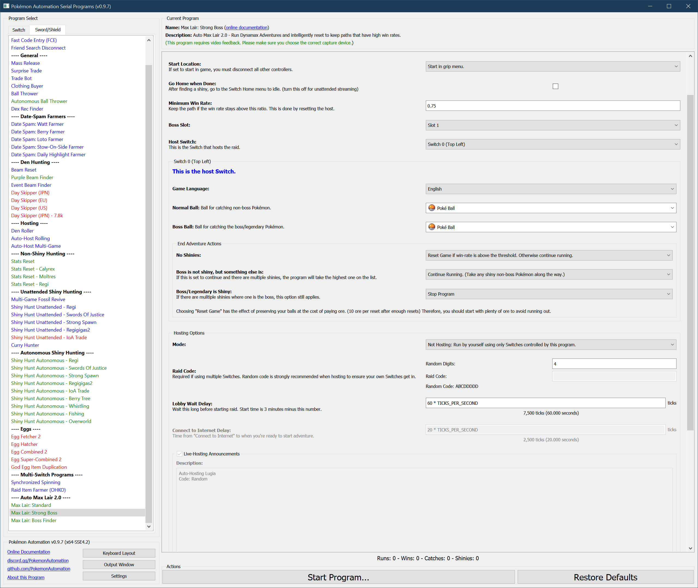

# Max Lair: Strong Boss

[Max Lair Info](MaxLair.md)

**Related Programs:**
- [Max Lair: Standard](MaxLair-Standard.md)
- [Max Lair: Strong Boss](MaxLair-StrongBoss.md) (this program)
- [Max Lair: Boss Finder](MaxLair-BossFinder.md)

## Program Description

This program hunts for a shiny boss. It will strategically reset the host to keep winning paths. Thus this program can be used for hunt strong bosses or finding winning paths to be used with MaxLair-Standard with path keeping.

### Setup of Settings

1. Screen size: Must be 100% within the Switch settings
2. Video Resolution: 1920 x 1080 or higher in program settings.
3. Text Speed: Fast
4. Casual mode: Off

This must be done to all participating Switches.

### Instructions

1. Stand in front of the professor.
2. Make sure the host has at least one boss saved.
3. The host has not caught the boss yet. (The program cannot distinguish an uncatchable boss from a loss. It needs to be able to catch to boss to determine if it won.)
4. If the hosting mode is "Alone" or "Host Locally", all Switches need to be offline.
5. Start the program in game or the [Change Grip/Order Menu](https://github.com/PokemonAutomation/Microcontroller/blob/master/Wiki/Programs/NintendoSwitch/ChangeGripOrderMenu.md) depending on which option you choose.

This must be done on all participating Switches.

The program will talk to the professor and start the adventure. It will automatically detect the boss from the silhouette (if available).

## General Options

This program uses [**Tolerate System Update Menu (fast)**](/Wiki/Programs/NintendoSwitch/FrameworkSettings.md#tolerate-system-update-menu-fast) to bypass the system update window.

### Minimum Win Rate

Keep the path if the win rate is at or above this number. This applies to the host Switch and affects the "Reset Game" option.

### Boss Slot

The slot number of the boss.

- Slot 1: The 1st boss on the list. (the top one)
- Slot 2: The 2nd boss on the list.
- Slot 3: The 3rd boss on the list.

### Host Switch

When running multiple Switches, this selects which one will be the hosting Switch. The host will be able to pick the boss. Everyone else will join the host.

## Per-Switch Options

### Game Language

You must pick the language that matches the game language.

### Normal Ball

This is the ball that will be used to catch all non-boss Pokémon.

### Boss Ball

This is the ball that will be used to catch the boss.

### No Shiny Action, Non-Boss Shiny Action, Shiny Boss Action

At the end of each adventure, the result will be one of the following:
1. No shinies found.
2. One (or more) non-boss Pokémon is shiny.
3. The boss is shiny.

This option lets you tell the program what to do for each of these cases.

The possible actions are:
1. Stop Program. This stops the *entire* program - including for all Switches.
2. Continue Running. Take any shiny non-boss Pokémon along the way.
3. Reset the game.

Resetting the game puts you back the entrance. While this costs ore, it will recover all the balls you used.

The reset option is different for the hosting Switch. It will reset only if the win-rate is above the threshold. Thus it will keep winning paths and throw away losing paths.

## Hosting Options

### Mode

Pretty self-explanatory. The options are:
- **Alone:** Run by yourself using only Switches controlled by this program.
- **Host Locally:** Allow other local Switches to join.
- **Host Online:** Allow other people online to join.

When hosting, you may not actually be the host. You may join someone else's lobby with a compatible boss selection. In reality, there is no distinction between host and non-host.
The program is fully capable of playing as the non-primary player.

If multiple people (online or not) start the program at the same time with the same code and using compatible boss selections, they will join each other and play together.
This collaboration will continue from raid-to-raid until someone stops or drops out. Thus multiple people can work together using the same program to increase win rates for everyone.

### Raid Code:

See [Raid Code Entry](https://github.com/PokemonAutomation/Microcontroller/blob/master/Wiki/Programs/PokemonSwSh/RaidCode.md).

A raid code is required when running multiple Switches. This is because a code is needed to ensure that all the Switches will join the same lobby.

**Discord Server:** 

