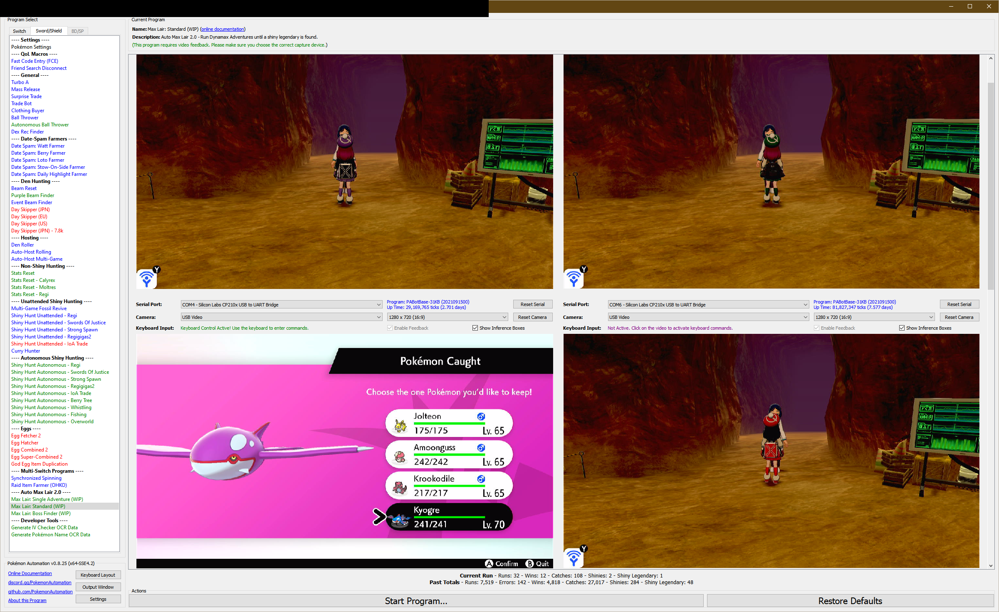

# Max Lair Programs

**Program List:**
- [Max Lair: Standard](MaxLair-Standard.md)
- [Max Lair: Strong Boss](MaxLair-StrongBoss.md)
- [Max Lair: Boss Finder](MaxLair-BossFinder.md)

## Program Description

***These programs are still in development. They are not yet available to the public. The documentation here is preliminary and may change.***

The Max Lair programs (also known as "Serial AutoDA") are programs that play and shiny-hunt the Dynamax Adventures. They are the successor to [AutoMaxLair](https://github.com/PokemonAutomation/AutoMaxLair).

The AutoDA programs will:

1. Automatically play DAs with an AI and take any shinies that appear.
2. Stop on any shiny legendary or a specific legendary that you're looking for.

It also supports the following enhancements:

1. **Multi-Switch Support:** The ability to run multiple Switch with a collaborative AI to increase win-rate.
2. **Online Mode:** Play online with other people.
3. **Auto-Hosting:** Host online with one or more Switches and have others join you.
4. Support for all 9 languages in Sword/Shield.

The online and auto-hosting functionality makes it possible for multiple people to run the same program in lock-step and automatically join/help each other.

## Differences from AutoMaxLair

Serial AutoDA is a rewrite/port of AutoMaxLair, but it's not an complete replacement.

**Features new to serial AutoDA:**
- Multi-Switch support.
- Online and multiplayer mode.
- Support for all 9 languages.
- Automatic detection of boss from its sprite. No need to manually specify.

**AutoMaxLair features missing from AutoDA:**
- Stat and IV hunting.
- Hunting for specific non-boss Pokémon.

**Discord Server:** 

