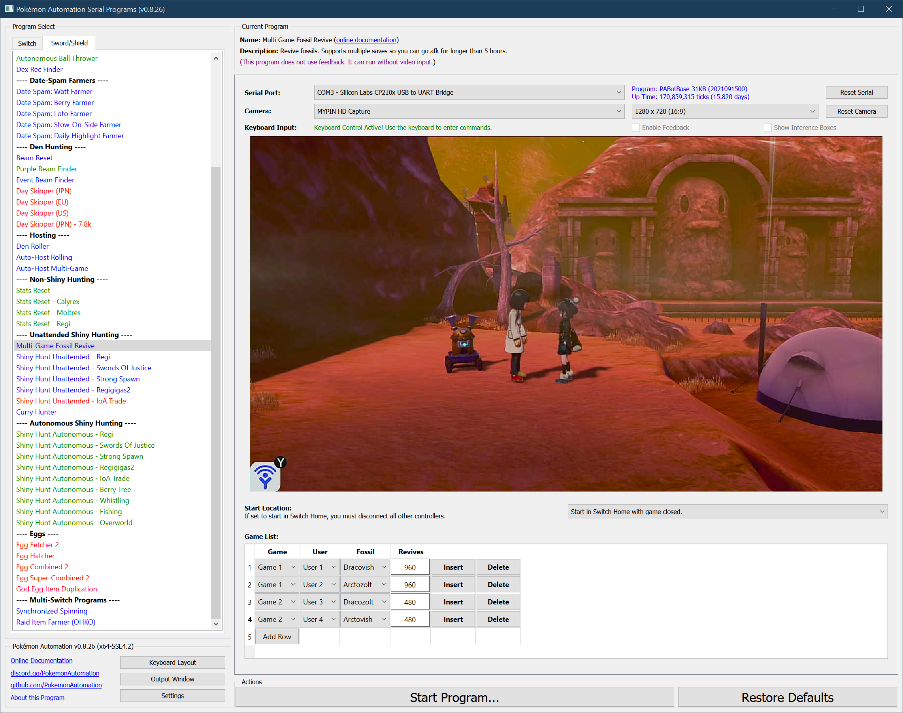

# Multi-Game Fossil Revive

## Program Description

MultiGameFossil is a more advanced fossil reviving program that can revive fossils across multiple game saves. Nevertheless, this program can still be used for a single game only.

> See end of page for motivation behind this program.

### Setup of Settings

> **These must be setup on *each* participating save.**

**Switch Settings:**
1. Screen size: Must be 100% within the Switch settings

**Program Settings:**
1. Video Resolution: 720p or higher

**Game Settings:**
1. Text Speed: Fast
2. Casual mode: Off
3. Have "Send to Boxes" set to "Automatic".
4. Have nicknaming off.
5. Have the Pokédex entry for the Pokémon they are reviving.
6. Have spoken to the professor before.
7. Game icon setup (on Home screen)
   1. If you are reviving from one game version only (Sword or Shield), it must be the 1st slot in the games list.
   2. If you are reviving from both Sword and Shield, they must be in slots 1 and 2 of the games list.

### Safety Recommendations:
- Because this program involves entering games, there is a chance that an error can cause it to enter the wrong game. If any of the games are holding dens, it is recommended to save them facing away from the den. The button presses for reviving fossils can easily destroy a den.

### Instructions

> **These must be setup on *each* participating save.**

1. Close all games currently running.
2. You must have at least one of every fossil.
3. You must have enough fossils to run its specified batch.
4. Be saved in front of the professor.
5. Start the program in the Switch home or the [Change Grip/Order Menu](https://github.com/PokemonAutomation/Microcontroller/blob/master/Wiki/Programs/NintendoSwitch/ChangeGripOrderMenu.md) depending on which option you choose.

> *If starting the game requires checking the internet (because it is digital on a non-primary Switch), you will need to enable ["**Start Game Requires Internet**"](/Wiki/Programs/NintendoSwitch/FrameworkSettings.md#start-game-requires-internet).

Once started, the program will iterate the specified game list in the order they are listed. For each entry, it will enter the game and revive the specified fossil the specified number of times. Once it has finished reviving in that game, it will save the game and move on to the next game. If it is the last entry in the list, it will not save the same and will return to the Switch Home to idle.
If you are only using one game, only use one entry.

### Checking if you have Revived a Shiny:

Once you have revived a ton of fossils, you need to check if there are any shinies. There are generally 3 ways to do this:
1. Manually check them one-by-one.
   > This option is pretty self-explanatory. Seriously, don't do this. It's time-consuming and error-prone. You won't want to miss a shiny because you're impatient and were checking them too quickly.
2. Check your Pokédex for the shiny sprite.
   > This option is a very fast way to check if you have a shiny, but it only works if you don't already have the Pokédex entry for it. Thus it's only good for the 1st time you revive the shiny. If you don't have the shiny sprite in the Pokédex before running the program, but you do afterwards, then you have revived a shiny!
3. Save the game, enter Pokémon Home, and filter by shiny.
   > This will always work, but requires Pokémon Home and the use of backup saves. Save the game if you haven't already, then immediately enter Pokémon Home. Pokémon Home lets you filter by shiny – thus you can quickly check if you have revived any shinies. If not, you need to close Home without saving and reload the backup save to recover the fossils. 

## Options

This program uses [**Tolerate System Update Menu (fast)**](/Wiki/Programs/NintendoSwitch/FrameworkSettings.md#tolerate-system-update-menu-fast) to bypass the system update window.

***
## Troubleshooting

- If you forgot to load the backup save and thus have a game full of non-shiny fossils, DO NOT fly! Flying will overwrite the backup save causing you to lose all the fossils that were used.
- When exiting Pokémon Home, you MUST select "exit without saving changes". If you exit saving changes, it will hard-save and wipe the backup save even if you made no changes!

***

## Motivation

The purpose of a multi-game fossil program is to allow you to go afk for a longer period of time.

Reviving fossils runs at approximately one revive/18.7 seconds. This comes out to about 5 hours for a full game of 960. Unfortunately, 5 hours is not enough to last overnight or a work day. Thus in order to prevent idling and to increase the efficiency of fossils reviving, you must use multiple game saves to get past the 32 box limit of 960 revives.

Thus with 2 games with empty boxes, you can run fossils for 10 hours continuously without needing any attention. This will be enough to last overnight and maybe a day of work. Using even more games will give more flexibility when you aren't able to revive 960 fossils at a time.

### Managing Backup Saves:

When reviving over multiple game saves, all but the last game will be saved. This means that the fossils will have been consumed. In order to recover them, you must use backup saves.

> If you don't know what backup saves or how to use them, look it up online. We won't re-iterate it here. As a reminder, you can load a backup save by pressing UP+X+B on the title screen.

The idea here is to hard-save in front of the professor before running the program. That way when you reload a backup save, you will reload the game from just before the reviving began. If you don't hard-save, you will reload further back – most likely the fly point in front of the Route 6 tent since flying will overwrite the backup save. This is fine too so hard-saving isn't really necessary.

Hard-saving can be done either by trading, or saving the game through Pokémon Home.

## Credits

- **Author:** Kuroneko/Mysticial

**Discord Server:** 

