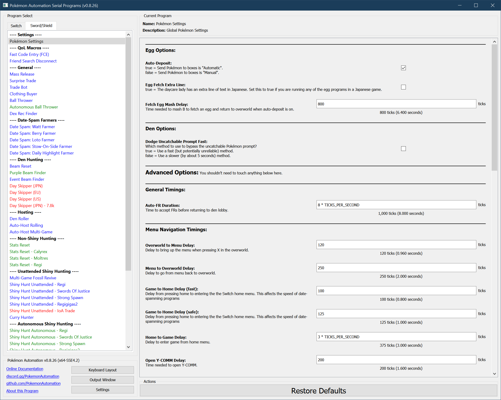

# Pokémon Settings

This is a list of global settings for Pokémon Sword/Shield.

## Egg Options

### Auto-Deposit:

Check this box if Send Pokémon to boxes is "Automatic". Don't check if Send Pokémon to boxes is "Manual".

### Egg Fetch Extra Line:

Check this box if fetching eggs from the daycare lady requires an extra line of text. This applies to Japanese, Italian (and possibily others).

### Fetch Egg Mash Delay:

Time needed to mash B to fetch an egg and return to overworld when auto-deposit is on.

## Den Options

### Dodge Uncatchable Prompt Fast:

Which method to use to bypass the uncatchable Pokémon prompt?

- Checked = Use a fast (but potentially unreliable) method.
- Not Checked = Use a slower (by about 5 seconds) method.

## General Advanced Timings:

### Auto-FR Duration:

Time to accept friend requests before returning to den lobby. (for auto-hosting)

## Menu Navigation Timings:

### Overworld to Menu Delay:

Delay to bring up the menu when pressing X in the overworld.

### Game to Home Delay (fast):

Delay from pressing home to entering the the Switch home menu. This affects the speed of date-spamming programs.

### Game to Home Delay (safe):

Delay from pressing home to entering the the Switch home menu. This affects the speed of date-spamming programs.

### Home to Game Delay:

Delay to enter game from home menu.

### Open Y-COMM Delay:

Time needed to open Y-COMM.

### Enter Profile Delay:

Delay to enter your Switch profile.

### Menu to Overworld Delay:

Delay to go from menu back to overworld.

## Start Game Timings:

### 1. Start Game Mash:

Mash A for this long to start the game.

### 2. Start Game Wait:

Wait this long for the game to load.

### 3. Enter Game Mash:

Mash A for this long to enter the game.

### 4. Enter Game Wait:

Wait this long for the game to enter the overworld.

## Den Timings:

### Enter Offline Game Delay:

Time needed to enter a den on final button press.

### Re-enter Den Delay:

Time from exiting den after a day-skip to when you can collect watts and re-enter it.

### Collect Watts Delay (offline):

Time needed to collect watts while offline.

### Collect Watts Delay (online):

Time needed to collect watts while online.

### Uncatchable Prompt Delay:

Time needed to bypass uncatchable Pokémon prompt.

### Open Local Den Lobby Delay:

Time needed to open a den lobby on local connection.

### Enter Switch Pokémon:

Time needed to enter Switch Pokémon.

### Exit Switch Pokémon:

Time needed to exit Switch Pokémon back to den lobby.

### Full Lobby Timer:

Always 3 minutes.

## Box Timings:

### Box Scroll Delay:

Delay to move the cursor.

### Box Change Delay:

Delay to change boxes.

### Box Pickup/Drop Delay:

Delay to pickup/drop Pokémon.

### Menu To Pokémon Delay:

Delay to enter Pokémon menu.

### Pokémon to Box Delay:

Delay to enter box system.

### Box to Pokémon Delay:

Delay to exit box system.

### Pokémon to Menu Delay:

Delay to return to menu.

**Discord Server:** 

