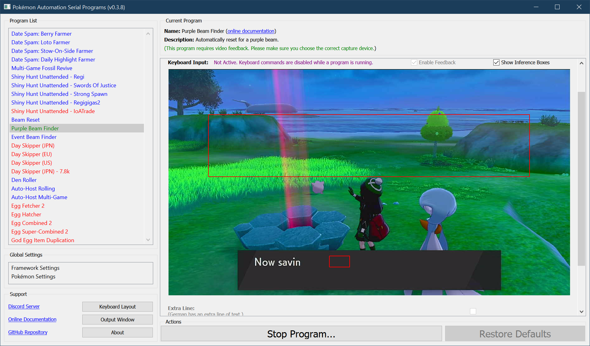
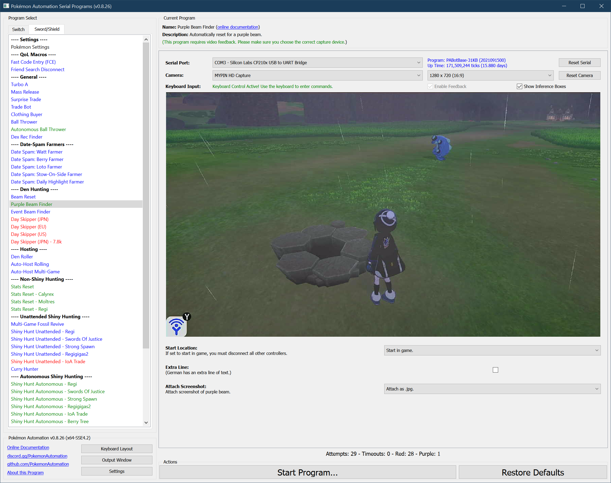

# Purple Beam Finder

**Related Programs:**
- **Microcontroller:** [Beam Reset](https://github.com/PokemonAutomation/Microcontroller/blob/master/Wiki/Programs/PokemonSwSh/BeamReset.md)
- **Computer Control:** [Beam Reset](https://github.com/PokemonAutomation/ComputerControl/blob/master/Wiki/Programs/PokemonSwSh/BeamReset.md)
- **Computer Control:** [Purple Beam Finder](https://github.com/PokemonAutomation/ComputerControl/blob/master/Wiki/Programs/PokemonSwSh/PurpleBeamFinder.md) (this program)

## Program Description

A smart version of Beam Reset that automatically stops on a purple beam.

> **This program requires video feedback!**

[Demo Video.mov](https://cdn.discordapp.com/attachments/755635697737531544/817957563287076864/PurpleBeamFinder.mp4)

### Setup of Settings

1. Screen size: Must be 100% within the Switch settings
2. Text Speed: Slow
2. Casual mode: Off

### Instructions

1. Stand in front of an empty den with watts collected.
2. Verify there are no purple beams visible in the background.

   > If there are, it may detect the background beam instead
3. The weather is not snow or snowstorm. Intensive weather can interfere with the detection.
4. Save in the position listed in #1
5. Return to the overworld
6. Start the program in game or the [Change Grip/Order Menu](/Wiki/Programs/NintendoSwitch/ChangeGripOrderMenu.md) depending on which option you choose.

   > When the program finds a purple beam, it will make a lot of noise to get your attention. Ensure you [setup sound](https://github.com/PokemonAutomation/SwSh-Arduino/wiki/Tutorial:-Windows_Serial#step-7-setup-sound) if viewing through the program interface.

## Options

This program uses [`TOLERATE_SYSTEM_UPDATE_MENU_FAST`](/Wiki/Programs/NintendoSwitch/FrameworkSettings.md#tolerate-system-update-menu-fast) to bypass the system update window.

Most of the options here are self-explanatory.

### Extra Line:

German (and possibly other languages) has an extra line of text before the wishing piece is dropped. Check this box if this is the case.

**Discord Server:** 

