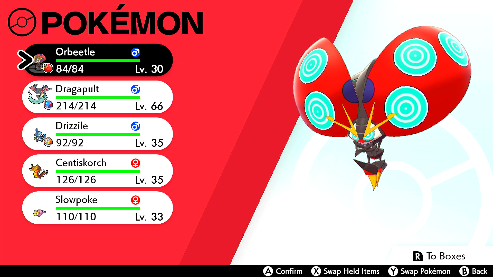

# Seedfinder

(This program is still under development and is not yet available.)

## Program Description

Find the current rng state based on Orbeetle's attack animations. 
This program is meant to support manual rng manipulation.

### Setup of Settings

1. Screen size: Must be 100% within the Switch settings
2. Video Resolution: 1280 x 720 or higher in program settings

### Instructions

1. You need to have a non-shiny Orbeetle in your party.
2. Open the party menu and move to Orbeetle.
3. Start the program in-game or the [Change Grip/Order Menu](https://github.com/PokemonAutomation/Microcontroller/blob/master/Wiki/Programs/NintendoSwitch/ChangeGripOrderMenu.md) depending on which option you choose.

## Options

### state[0] and state[1]:

After the program is finished the state will be filled in here. 

If 'Update state' is selected these are also used as the last known state.

### Update state:

Instead of performing 128 attack animations only check the necessary amount to find the rng state.
Make sure to set min and max advances accordingly and enter the last known rng state in state[0] and state[1]. 

### Min/Max advances:

How many advances did happen since the entered state.

## Credits

- **Author:** Fye

**Discord Server:** 

