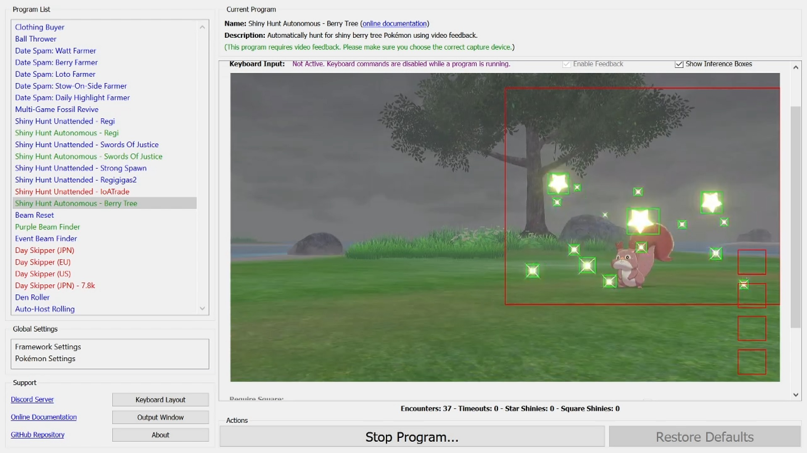
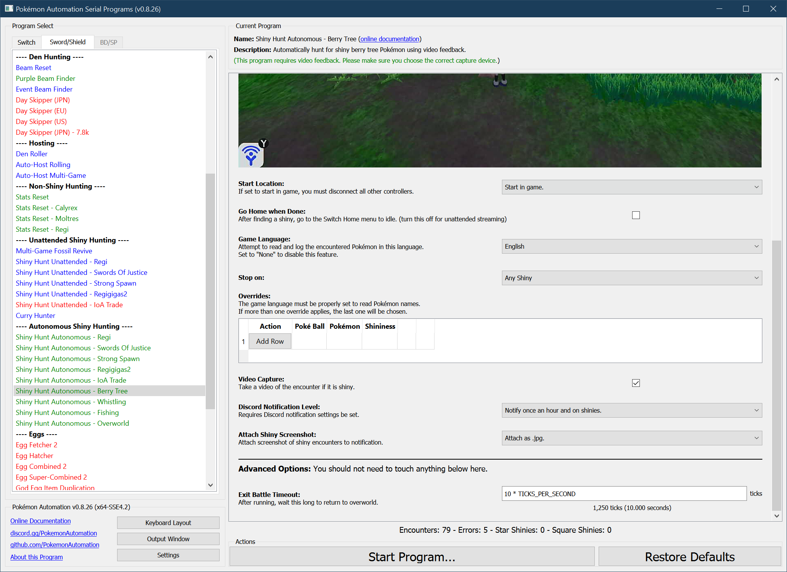

# Shiny Hunt (Autonomous) - Berry Tree

## Program Description

This program will shiny hunt the berry tree encounters.

[Demo Video.mov](https://cdn.discordapp.com/attachments/755635697737531544/821977215725469726/2021-03-18_00-21-14.mp4)

Unlike the Shiny Hunt (Unattended) programs, the Autonomous programs require *no* calibration. This program needs a capture card to detect a shiny from its animation.

### Setup of Settings

1. Screen size: Must be 100% within the Switch settings
2. Video Resolution: 1280 x 720 or higher in program settings
   > Shiny detection is not reliable at low resolutions.
3. Text Speed: Fast
4. Casual mode: Off
5. System time: Un-synced
6. VS (Y-Comm) glitch must be active

### Setup of Party
1. Your lead Pokémon must be able to run away. (faster or holding Smoke Ball)
2. Your lead Pokémon must not be shiny. (this will cause false positive detection)

   > **Recommended for Performance:**
   > - Have the Shiny Charm. This triples the chance to find a shiny.
   > - Your lead Pokémon does not have high happiness.
   > - Your lead Pokémon does not have an ability that activates upon entry to battle.

### Instructions

1. Stand in front of a berry tree.
2. Save.
3. Return to overworld (not inside the menu).
4. Start the program in game or the [Change Grip/Order Menu](https://github.com/PokemonAutomation/Microcontroller/blob/master/Wiki/Programs/NintendoSwitch/ChangeGripOrderMenu.md) depending on which option you choose.

### Default Program Settings

* The default setting of this program is to stop on any shiny.
* This program can distinguish star shinies from square shinies, and an associated check box to require square shiny to stop.
* When the desired shiny is found, the program will save a video of the encounter.
* This program will keep track of encounter statistics.

## Options

This program uses [**Tolerate System Update Menu (fast)**](/Wiki/Programs/NintendoSwitch/FrameworkSettings.md#tolerate-system-update-menu-fast) to bypass the system update window.

### Go Home when Done:

After finding a shiny, go to the Switch Home to idle. Turn this off for unattended streaming so that your viewers can see the shiny.

### Game Language:

If set to a language, the program will attempt to read the name of each Pokémon you encounter and log it.

If you are playing in an Asian language (Japanese, Korean, Chinese), set your video resolution to 1080p or higher. These languages are difficult to accurately read with text recognition at low resolutions.

## Advanced Settings:
These are advanced settings. You shouldn't need to touch these unless something isn't working and you're trying to debug it yourself.

### Exit Battle Timeout:

After running, wait this long to return to the overworld. The program will resume before this time if it detects that that the battle has ended.

**Discord Server:** 

