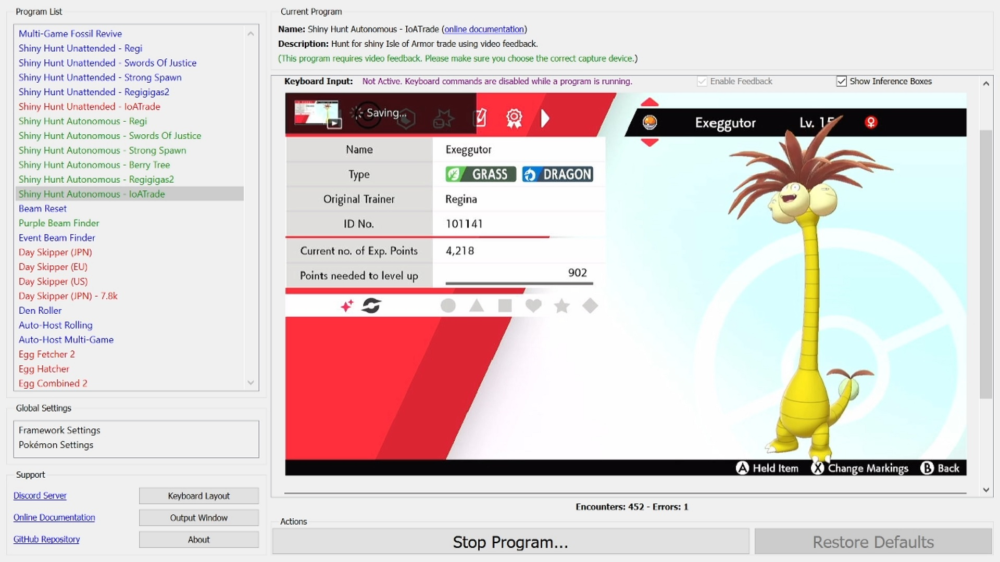
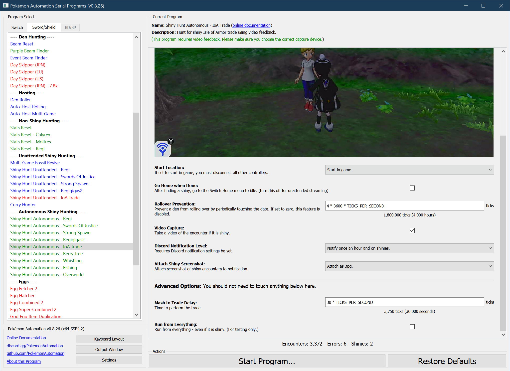

# Shiny Hunt (Autonomous) - IoA Trade

**Related Programs:**
- **Microcontroller:** [Shiny Hunt Unattended: IoA Trade](https://github.com/PokemonAutomation/Microcontroller/blob/master/Wiki/Programs/PokemonSwSh/ShinyHuntUnattended-IoATrade.md)
- **Computer Control:** [Shiny Hunt Unattended: IoA Trade](https://github.com/PokemonAutomation/ComputerControl/blob/master/Wiki/Programs/PokemonSwSh/ShinyHuntUnattended-IoATrade.md)
- **Computer Control:** [Shiny Hunt Autonomous: IoA Trade](https://github.com/PokemonAutomation/ComputerControl/blob/master/Wiki/Programs/PokemonSwSh/ShinyHuntAutonomous-IoATrade.md) (this program)

## Program Description

This is the autonomous version of [ShinyHuntUnattended-IoATrade](ShinyHuntUnattended-IoATrade.md).

This program will automatically hunt for a shiny Regina trade and stop on a shiny. It requires video feedback and has these advantages over the unattended version of this program:
- No calibration is needed. This program will detect a shiny from its shiny icon.
- When a shiny is found, this program will save a video of the encounter.
- Autonomous programs are faster than their unattended counterparts since they use feedback instead of timed waits.
- This program will keep track of encounter statistics.
- This program will automatically recover from errors by resetting the game.

[Demo Video.mov](https://cdn.discordapp.com/attachments/755635697737531544/823274129292525638/2021-03-21_14-14-40.mp4)

### Setup of Settings

1. Screen size: Must be 100% within the Switch settings
2. Video Resolution: 1280 x 720 or higher in program settings
   > Shiny detection is not reliable at low resolutions.
3. Text Speed: Fast
4. Casual mode: Off
5. Setup in-game menu as follows (default locations):
   * The Pokédex button must be in the upper-left corner.
   * The Pokémon button must be in the 1st row, 2nd from the left. 

### Setup of Party
1. The Pokémon that you will be trading away must be in the first party slot.

### Instructions

1. Stand in front of the lady who will do the trade.
2. Enter the menu and place cursor over the "Pokédex" button.
3. Close the menu by pressing "B".
4. Save by pressing "R".
   > This ensures your cursor stays over the "Pokédex" button.
5. Close the menu (if not already closed).
6. Start the program in game or the [Change Grip/Order Menu](https://github.com/PokemonAutomation/Microcontroller/blob/master/Wiki/Programs/NintendoSwitch/ChangeGripOrderMenu.md) depending on which option you choose.

### Default Program Settings

* When the desired shiny is found, the program will save a video of the encounter.

## Options

This program uses [**Tolerate System Update Menu (fast)**](/Wiki/Programs/NintendoSwitch/FrameworkSettings.md#tolerate-system-update-menu-fast) to bypass the system update window.

### Go Home when Done:

After finding a shiny, go to the Switch Home to idle. Turn this off for unattended streaming so that your viewers can see the shiny.

### Rollover Prevention:

This is useful if your game is holding a den and you do not want an unintentional date-skip to destroy it.

Prevent the den from rolling over by periodically touching the date at this interval. Set this value to zero to disable the feature.

## Advanced Settings:

These are advanced settings. You shouldn't need to touch these unless something isn't working and you're trying to debug it yourself.

### Mash to Trade Delay:

This is how long from when you start the trade to when the trade ends. You shouldn't need to change this.

## Credits

- **Author:** Kuroneko/Mysticial

**Discord Server:** 

