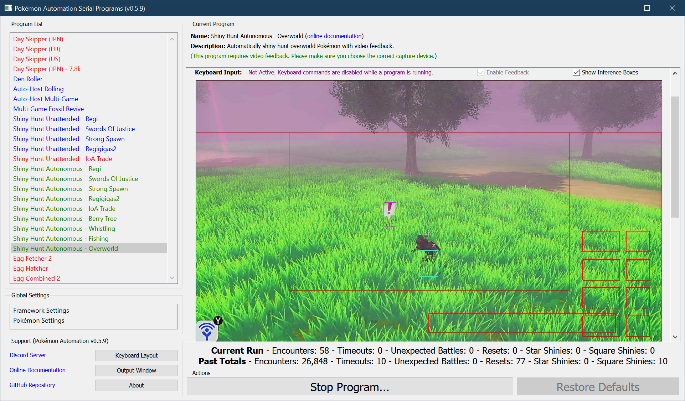
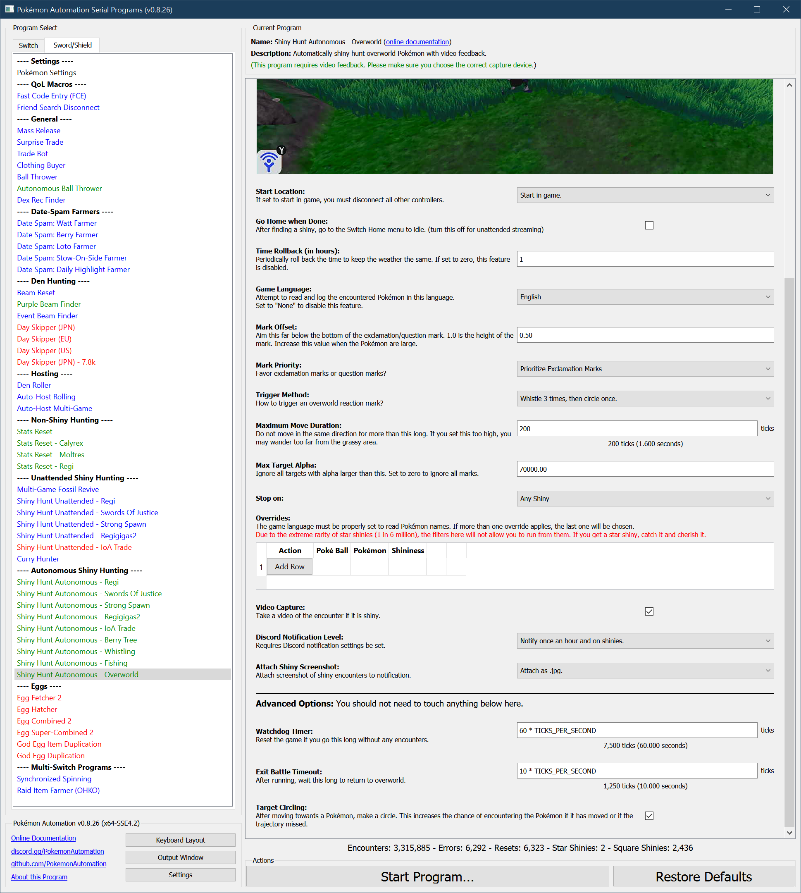

# Shiny Hunt (Autonomous) - Overworld

## Program Description

This is the "overworld encounter bot". It is the fastest and most advanced of the autonomous encounter bots that this package currently has.

This program will randomly seek out and encounter overworld Pokémon until it finds a shiny.

[Demo Video.mov (Ralts)](https://cdn.discordapp.com/attachments/755635697737531544/828071762595807282/2021-04-03_19-50-51.mp4)

[Demo Video.mov (Authentic Sinistea)](https://cdn.discordapp.com/attachments/780505858613837835/842199538440732672/Shiny_Authentic_Sinistea.mp4)

### Setup of Settings

1. Screen size: Must be 100% within the Switch settings
2. Video Resolution: 1280 x 720 or higher in program settings
   > Shiny detection is not reliable at low resolutions.
   > If playing in an Asian language, your video resolution should be 1080p. Text recognition is more accurate at higher resolutions.
3. Text Speed: Fast
4. Vertical and Horizontal camera controls are both ***Regular***. Do not set either one to inverted.
5. Casual mode: Off
6. System time: Un-synced

### Setup of Party
1. Your lead Pokémon is not following you around. (Applies to Isle of Armor and Crown Tundra)
2. Your lead Pokémon must not be shiny. (This will cause false positive detection)

   > **Recommended for Performance:**
   > - Have the Shiny Charm. This triples the chance to find a shiny.
   > - Your lead Pokémon does not have high happiness.
   > - Your lead Pokémon does not have an ability that activates upon entry to battle.
   > - Get rid of all the nearby strong spawns. They tend to pull you away from the grassy area.

### Instructions

1. You are standing in a grassy area with overworld spawns.
   * You must be zoomed out to maximize the view. (Needed for accurate trajectory calculation)
   * You are not on your bike. (Needed for correct trajectory movement)
2. Save.
3. Return to overworld (not inside the menu).
4. Start the program in game or the [Change Grip/Order Menu](https://github.com/PokemonAutomation/Microcontroller/blob/master/Wiki/Programs/NintendoSwitch/ChangeGripOrderMenu.md) depending on which option you choose.

### Default Program Settings

- No calibration is needed. This program uses the capture card to detect a shiny from its animation.
- When a shiny is encountered, this program will save a video of the encounter.
- This program will keep track of encounter statistics.
- If the program gets stuck, it will reset the game. Thus putting you where you last saved.

## Encounter Type Recommendations:

By default, the program is configured to randomly target everything. Here are some recommendations if you are trying to hunt something specific.

| Encounter Type | Example Pkmn | Mark Priority | Trigger Method |
| --- | --- | --- | --- |
| Grass (Random) |   |  `Exclamation Marks Only (Ignore Question Marks)` | `Circle 3 times, then whistle 3 times.` |
| Overworld (Non-fleeing) |   | `Question Marks Only (Ignore Exclamation Marks)` | `Whistle 3 times, then circle once.` or `Circle 3 times, then whistle 3 times.` |
| Overworld (Fleeing) | Ralts - reacts with '!', then flees | `Prioritize Exclamation Marks` | `Whistle 3 times, then circle once.` |
| Overworld (No Reaction) | Hattrem - walks up to you, but no reaction mark | `Question Marks Only (Ignore Exclamation Marks)` | `Circle 3 times, then whistle 3 times.` |
| "Fan Favorite" | Sinistea (Old Cemetery) | `No Preference` | `Circle 3 times, then whistle 3 times.` |
| "Fan Favorite"" | Sinistea (Glimwood*) | `No Preference` | `Horizontal Line Only`, `Max Target Alpha = 0` |

*Needs to be in this specific location: 

> **Notes:**
> Trigger Methods `Whistle Only` and `Circle Only` are generally not recommended. Though the options are there if you want to experiment.
> - `Whistle Only` will get stuck in a large grassy area if there are no Pokémon near you.
> - `Whistle Only` combined with `Exclamation Marks Only (Ignore Question Marks)` will get stuck if the Pokémon walk up to you, but don't attack.
> - `Circle Only` will get stuck if you manage to get just outside of the grassy area. Normally, whistling will trigger a mark reaction to pull you back to the grass.

## Options

This program uses [**Tolerate System Update Menu (fast)**](/Wiki/Programs/NintendoSwitch/FrameworkSettings.md#tolerate-system-update-menu-fast) to bypass the system update window.

There is no option to search only for a square shiny. Nearly all shinies are square and only 15/65536 are star. Therefore it is infeasible to hunt for star shiny.

### Go Home when Done:

After finding a shiny, go to the Switch Home to idle. Turn this off for unattended streaming so that your viewers can see the shiny.

### Game Language:

If set to a language, the program will attempt to read the name of each Pokémon you encounter and log it.

If you are playing in an Asian language (Japanese, Korean, Chinese), set your video resolution to 1080p or higher. These languages are difficult to accurately read with text recognition at low resolutions.

### Mark Offset:

Aim this far below the bottom of the exclamation/question mark. 1.0 is the height of the mark. Increase this value when the Pokémon are large.

### Mark Priority:

Prefer exclamation marks or question marks?
- Exclamation Marks Only (Ignore Question Marks)
- Prioritize Exclamation Marks
- No Preference
- Prioritize Question Marks
- Question Marks Only (Ignore Exclamation Marks)

### Trigger Method:

How do you want to trigger Pokémon to react?
- Whistle Only
- Whistle 3 times, then circle once.
- Circle 3 times, then whistle once.
- Circle Only

### Maximum Move Duration:

Do not move in the same direction for more than this long. If you set this too high, you may wander too far from the grassy area.

### Watchdog Timer:

Reset the game if you go this long without any encounters. This allows the program to recover if it gets stuck.

Be aware that upon reset, all existing spawned overworld Pokémon will have the same stats from before. Thus they will be repeat encounters.

### Time Rollback:

Every this many hours, rollback the time by this many hours. This keeps the time constant to prevent the weather from changing. It also allows you to target time-specific marks. Set this to zero to disable this feature.

## Advanced Settings:
These are advanced settings. You shouldn't need to touch these unless something isn't working and you're trying to debug it yourself.

### Exit Battle Timeout:

After running, wait this long to return to the overworld. The program will resume before this time if it detects that that the battle has ended.

### Target Circling:

After moving towards a Pokémon, make a circle. This increases the chance of encountering the Pokémon if it has moved or if the trajectory missed.

**Discord Server:** 

