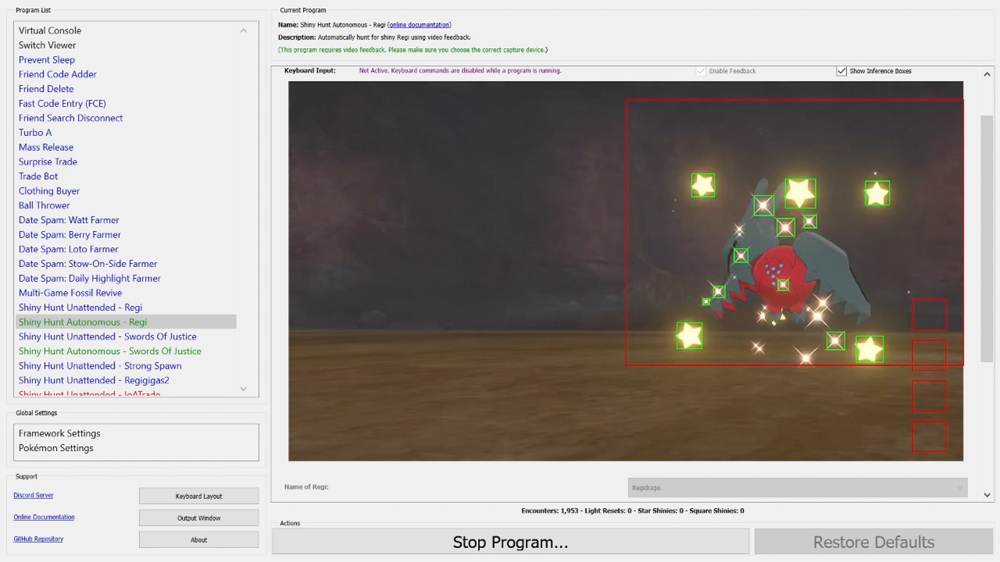
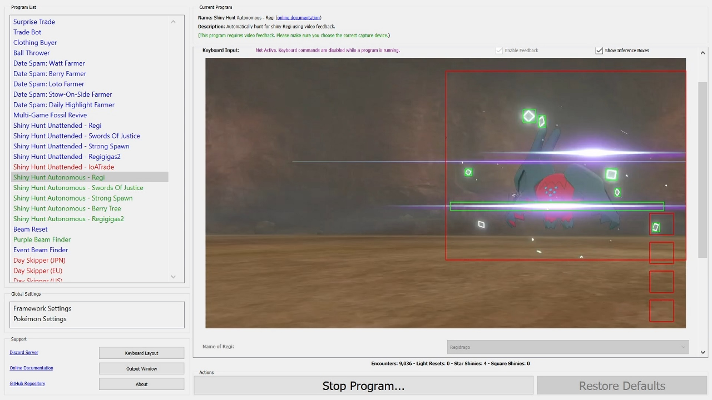
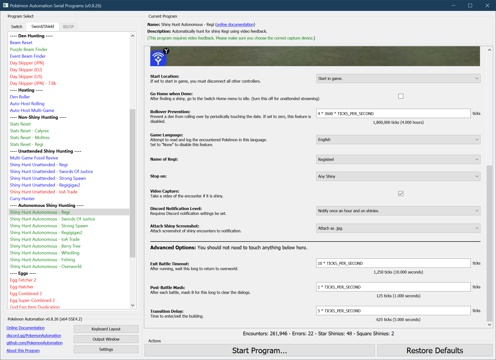

# Shiny Hunt (Autonomous) - Regi

**Related Programs:**
- **Microcontroller:** [Shiny Hunt: Regi](https://github.com/PokemonAutomation/Microcontroller/blob/master/Wiki/Programs/PokemonSwSh/ShinyHunt-Regi.md)
- **Microcontroller:** [Shiny Hunt Unattended: Regi](https://github.com/PokemonAutomation/Microcontroller/blob/master/Wiki/Programs/PokemonSwSh/ShinyHuntUnattended-Regi.md)
- **Computer Control:** [Shiny Hunt Unattended: Regi](https://github.com/PokemonAutomation/ComputerControl/blob/master/Wiki/Programs/PokemonSwSh/ShinyHuntUnattended-Regi.md)
- **Computer Control:** [Shiny Hunt Autonomous: Regi](https://github.com/PokemonAutomation/ComputerControl/blob/master/Wiki/Programs/PokemonSwSh/ShinyHuntAutonomous-Regi.md) (this program)

## Program Description

This is the autonomous version of [ShinyHuntUnattended-Regi](ShinyHuntUnattended-Regi.md).

This program will automatically hunt for a shiny Regi golem and automatically stop on a shiny. It requires video feedback and has these advantages over the unattended version of this program:
- No calibration is needed. This program will detect a shiny from its animation.
- When a shiny is encountered, this program will save a video of the encounter.
- This program will distinguish star shinies from square shinies.
- There is an option to hunt only for squares and run from all stars.
- Autonomous programs are faster than their unattended counterparts since they use feedback instead of timed waits.
- This program will keep track of encounter statistics.
- Light corrections are now on-demand instead of periodic. This program will detect when the floor lights are wrong and will do the correction only when needed.

**Demo Videos:**
- [Star.mov](https://cdn.discordapp.com/attachments/755635697737531544/821048280187928616/2021-03-15_10-31-35.mp4)
- [Square.mov](https://cdn.discordapp.com/attachments/755635697737531544/824087881119301672/2021-03-23_20-06-38.mp4)

### Setup of Settings

1. Screen size: Must be 100% within the Switch settings
2. Video Resolution: 1280 x 720 or higher in program settings
   > Shiny detection is not reliable at low resolutions.
3. Text Speed: Fast
4. Casual mode: Off
5. System time: Un-synced
6. In-Game Badges: Must have all 8 badges cannot catch the Regi

### Setup of Party
1. Your lead Pokémon must be able to run away. (Faster or holding Smoke Ball)
2. Your lead Pokémon must not be shiny. (This will cause false positive detection)

   > **Recommended for Performance:**
   > - Your lead Pokémon does not have high happiness.
   > - Your lead Pokémon does not have an ability that activates upon entry to battle.
   > Note: The Shiny Charm does not work on the Regis.

### Instructions

1. Check there are no lights activated.
2. Stand in front of the statue.
3. Save.
4. Return to overworld (not inside the menu).
5. Start the program in game or the [Change Grip/Order Menu](https://github.com/PokemonAutomation/Microcontroller/blob/master/Wiki/Programs/NintendoSwitch/ChangeGripOrderMenu.md) depending on which option you choose.

   > **If hunting for Regieleki or Regidrago, you must be locked into your choice.**
   >    1. Light the floor with your choice.
   >    2. Interact with the statue.
   >    3. Run from the battle.
   >    4. Follow instructions 1-5 above.

### Default Program Settings

- No calibration is needed. This program uses the capture card to detect a shiny from its animation.
- When a shiny is encountered, this program will save a video of the encounter.
- Default settings are to stop on any shiny. If you wish to search for a square Regi, check the box in the settings to only stop on square.
- This program will keep track of encounter statistics.
- If the program gets stuck, it will exit and re-enter the building.

## Options

This program uses [**Tolerate System Update Menu (fast)**](/Wiki/Programs/NintendoSwitch/FrameworkSettings.md#tolerate-system-update-menu-fast) to bypass the system update window.

### Go Home when Done:

After finding a shiny, go to the Switch Home to idle. Turn this off for unattended streaming so that your viewers can see the shiny.

### Require Square:

The option will make the program run from star shinies and stop only on a square shiny. It will still record videos of all shinies.

### Regi:

This is what you're resetting for. Pick from: `Regirock`, `Regice`, `Registeel`, `Regieleki`, and `Regidrago`.

### Rollover Prevention:

This is useful if your game is holding a den and you do not want an unintentional date-skip to destroy it.

Prevent the den from rolling over by periodically touching the date at this interval. Set this value to zero to disable the feature.

## Advanced Settings:
These are advanced settings. You shouldn't need to touch these unless something isn't working and you're trying to debug it yourself.

### Exit Battle Timeout:

After running, wait this long to return to the overworld. The program will resume before this time if it detects that that the battle has ended.

### Transition Delay:

The time needed to enter and exit the building during a correction.

**Discord Server:** 

