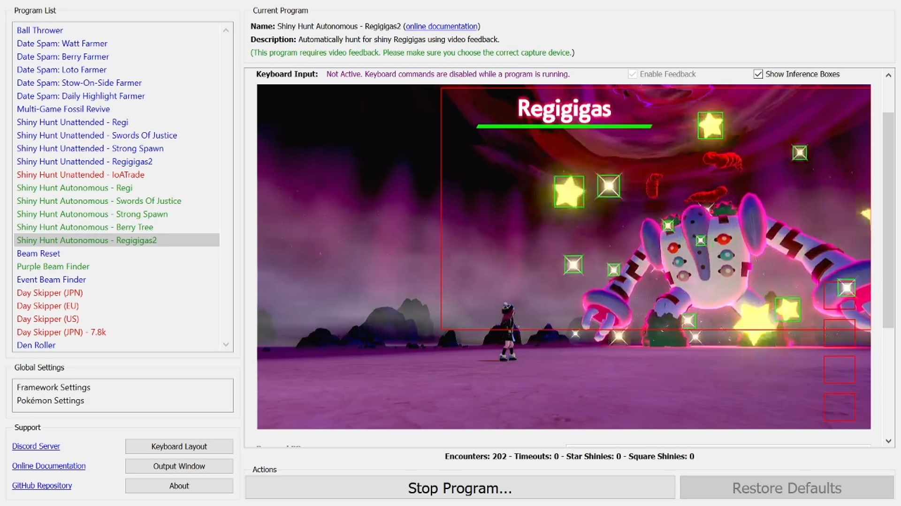
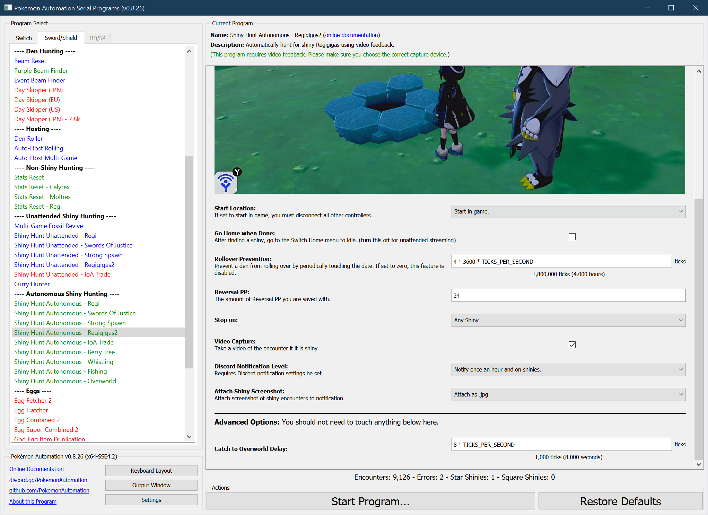

# Shiny Hunt (Autonomous) - Regigigas 2

**Related Programs:**
- [Shiny Hunt Unattended: Regigigas2](https://github.com/PokemonAutomation/ComputerControl/blob/master/Wiki/Programs/PokemonSwSh/ShinyHuntUnattended-Regigigas2.md)
- [Shiny Hunt Autonomous: Regigigas2](https://github.com/PokemonAutomation/ComputerControl/blob/master/Wiki/Programs/PokemonSwSh/ShinyHuntAutonomous-Regigigas2.md) (this program)

## Program Description

This is the autonomous version of [ShinyHuntUnattended-Regigigas2](ShinyHuntUnattended-Regigigas2.md).

This program will automatically hunt for Regigigas and automatically stop on a shiny. It fully utilizes video feedback and has these advantages over the unattended version of this program:
- No calibration is needed. This program will detect a shiny from its animation.
- When a shiny is encountered, this program will save a video of the encounter.
- This program will distinguish star shinies from square shinies.
- There is an option to hunt only for squares and run from all stars.
- Autonomous programs are faster than their unattended counterparts since they use feedback instead of timed waits.
- This program will keep track of encounter statistics.
- This program will detect error situations and automatically reset the game.

[Demo Video.mov](https://cdn.discordapp.com/attachments/755635697737531544/822702343606632458/2021-03-20_00-22-46.mp4)

### Setup of Settings

1. Screen size: Must be 100% within the Switch settings
2. Video Resolution: 1280 x 720 or higher in program settings
   > Shiny detection is not reliable at low resolutions.
3. Text Speed: Fast
4. Casual mode: Off
5. System time: Un-synced

### Setup of Party
1. Your lead Pokémon must not be shiny. (this will cause false positive detections)
2. *The first move on your lead Pokémon must be able to OHKO the Regigigas. (see below)*
   > **As of this writing, there is only one known way to ensure a OHKO on Regigigas:**
   > 1. Your Pokémon is fighting type (for STAB).
   > 2. Your Pokémon has only 1 HP. (base power 200) Use the move Endure to help get to 1 HP.
   > 3. Your Pokémon is holding a Choice Band.
   > 4. The move being used is Reversal.
   > 5. Your Pokémon has a very high attack stat. (high base stat + 252 EVs + 31 IV + beneficial nature)

Here is an example of a lead Pokémon that is properly setup to guarantee a OHKO on Regigigas.

 

(The position of the move "Reversal" should be in the 1st slot instead of the 2nd as shown in these pictures.)

   > **Recommended for Performance:**
   > - Battle animations are off.
   > - Your lead Pokémon does not have high happiness.
   > - Your lead Pokémon does not have an ability that activates upon entry to battle.
   > - The first move on your lead Pokémon (Reversal) is fully PP up'ed to 24 PP.

### Instructions

1. Stand in front of the Regigigas den.
2. The `REVERSAL_PP` parameter must be set to no more than the amount of PP of your second move.
3. Save. 
4. Close the menu (if not already closed).
5. Start the program in game or the [Change Grip/Order Menu](https://github.com/PokemonAutomation/Microcontroller/blob/master/Wiki/Programs/NintendoSwitch/ChangeGripOrderMenu.md) depending on which option you choose.

### Default Program Settings

 - No calibration is needed. This program uses the capture card to detect a shiny from its animation.
 - When a shiny is encountered, this program will save a video of the encounter.
 - Default settings are to stop on any shiny. If you wish to search for a square Regigigas, check the box in the settings to only stop on square.
 - This program will keep track of encounter statistics.
 - If the program gets stuck, it will exit and re-enter the building.

## Options

This program uses [**Tolerate System Update Menu (fast)**](/Wiki/Programs/NintendoSwitch/FrameworkSettings.md#tolerate-system-update-menu-fast) to bypass the system update window.

### Go Home when Done:

After finding a shiny, go to the Switch Home to idle. Turn this off for unattended streaming so that your viewers can see the shiny.

### Reversal PP:

This is the amount of PP of your attacking move. Reversal has 24 PP when fully PP up'ed.

### Require Square:

The option will make the program run from star shinies and stop only on a square shiny. It will still record videos of all shinies.

### Rollover Prevention:

This is useful if your game is holding a den and you do not want an unintentional date-skip to destroy it.

Prevent the den from rolling over by periodically touching the date at this interval. Set this value to zero to disable the feature.

## Advanced Settings:
These are advanced settings. You shouldn't need to touch these unless something isn't working and you're trying to debug it yourself.

### Catch to Overworld Delay:

The amount of time from when you choose not to catch Regigigas to when you return to the overworld.

## Credits

- **Author:** Kuroneko/Mysticial

**Discord Server:** 

