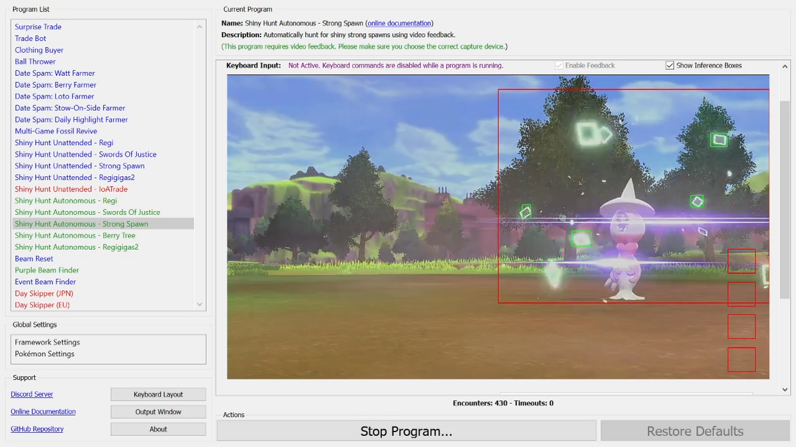

# Shiny Hunt (Autonomous) - Strong Spawn

**Related Programs:**
- **Microcontroller:** [Shiny Hunt Unattended: Strong Spawn](https://github.com/PokemonAutomation/Microcontroller/blob/master/Wiki/Programs/PokemonSwSh/ShinyHuntUnattended-StrongSpawn.md)
- **Computer Control:** [Shiny Hunt Unattended: Strong Spawn](https://github.com/PokemonAutomation/ComputerControl/blob/master/Wiki/Programs/PokemonSwSh/ShinyHuntUnattended-StrongSpawn.md)
- **Computer Control:** [Shiny Hunt Autonomous: Strong Spawn](https://github.com/PokemonAutomation/ComputerControl/blob/master/Wiki/Programs/PokemonSwSh/ShinyHuntAutonomous-StrongSpawn.md) (this program)

## Program Description

This is the autonomous version of [ShinyHuntUnattended-StrongSpawn](ShinyHuntUnattended-StrongSpawn.md).

This program will automatically hunt for a shiny strong spawn and automatically stop on a shiny. It fully utilizes video feedback and has these advantages over the unattended version of this program:
- No calibration is needed. This program will detect a shiny from its animation.
- When a shiny is encountered, this program will save a video of the encounter.
- This program will keep track of encounter statistics.

[Demo Video.mp4](https://cdn.discordapp.com/attachments/755635697737531544/822487995407532032/StrongSpawn.mp4)

### Setup of Settings

1. Screen size: Must be 100% within the Switch settings
2. Video Resolution: 1280 x 720 or higher in program settings
   > Shiny detection is not reliable at low resolutions.
3. Text Speed: Fast
4. Casual mode: Off
5. System time: Un-synced
6. Switch Date: Change the date to one that has the appropriate weather for your desired strong spawn.

### Setup of Party
1.  Your lead Pokémon must be able to run away. (faster or holding Smoke Ball)
2.  Your lead Pokémon must not be shiny. (this will cause false positive detection)
   > **Recommended for Performance:**
   > - Have the Shiny Charm. This triples the chance to find a shiny.
   > - Your lead Pokémon does not have high happiness.
   > - Your lead Pokémon does not have an ability that activates upon entry to battle.

### Run Program Instructions

> There are many ways to do this. The below is just an example.

1. Despawn the Pokémon by fighting it and running, defeating, or catching it.
2. Stand directly on the spawn spot for your desired Pokémon.
3. Activate the VS (Y-COMM) glitch.
4. Navigate to the Date and Time menu.
4. Change the date forward and backwards one day. (This forces a day skip while resetting the date.)
5. Save the game.
6. Close the game.
7. Start the program in the Switch home or the [Change Grip/Order Menu](https://github.com/PokemonAutomation/Microcontroller/blob/master/Wiki/Programs/NintendoSwitch/ChangeGripOrderMenu.md) depending on which option you choose.

## Options

This program uses [**Tolerate System Update Menu (fast)**](/Wiki/Programs/NintendoSwitch/FrameworkSettings.md#tolerate-system-update-menu-fast) to bypass the system update window.

There is no option to search only for a square shiny. Nearly all shinies are square and only 15/65536 are star. Therefore it is infeasible to hunt for star shiny.

### Go Home when Done:

After finding a shiny, go to the Switch Home to idle. Turn this off for unattended streaming so that your viewers can see the shiny.

### Time Rollback:

Every this many hours, rollback the time by this many hours. This keeps the time constant to prevent the weather from changing. It also allows you to target time-specific marks. Set this to zero to disable this feature.

## Troubleshooting

If you start the program and the target Pokémon does not pop-up below you:
1. Stop the program.
2. Move to where the Pokémon spawned.
3. Redo the steps in "Run Program Instructions".

**Discord Server:** 

