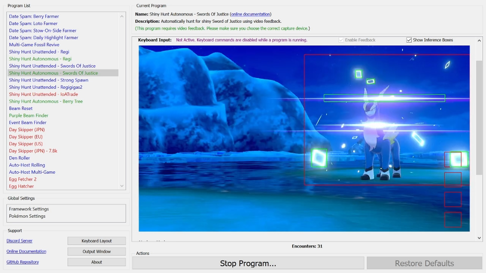
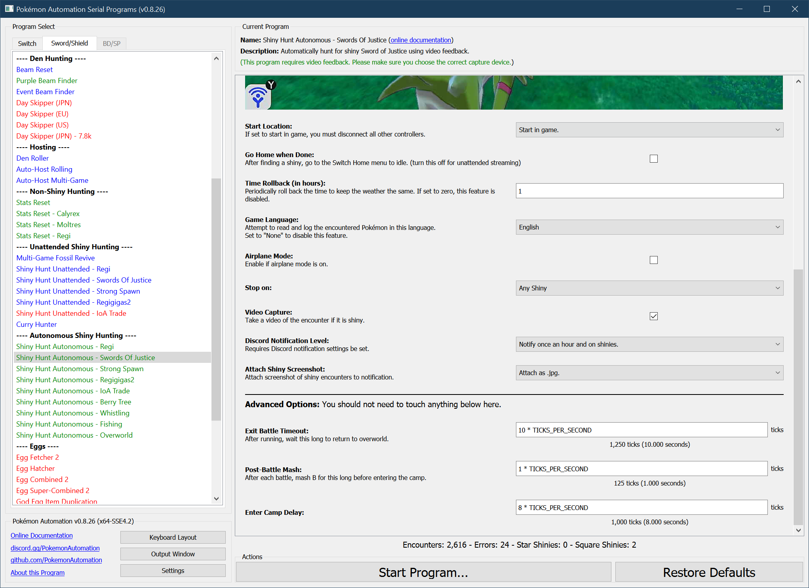

# Shiny Hunt (Autonomous) - Swords of Justice

**Related Programs:**
- **Microcontroller:** [Shiny Hunt: Swords of Justice](https://github.com/PokemonAutomation/Microcontroller/blob/master/Wiki/Programs/PokemonSwSh/ShinyHunt-SwordsOfJustice.md)
- **Microcontroller:** [Shiny Hunt Unattended: Swords of Justice](https://github.com/PokemonAutomation/Microcontroller/blob/master/Wiki/Programs/PokemonSwSh/ShinyHuntUnattended-SwordsOfJustice.md)
- **Computer Control:** [Shiny Hunt Unattended: Swords of Justice](https://github.com/PokemonAutomation/ComputerControl/blob/master/Wiki/Programs/PokemonSwSh/ShinyHuntUnattended-SwordsOfJustice.md)
- **Computer Control:** [Shiny Hunt Autonomous: Swords of Justice](https://github.com/PokemonAutomation/ComputerControl/blob/master/Wiki/Programs/PokemonSwSh/ShinyHuntAutonomous-SwordsOfJustice.md) (this program)

## Program Description

This is the autonomous version of [ShinyHuntUnattended-SwordsOfJustice](ShinyHuntUnattended-SwordsOfJustice.md).

This program will automatically hunt for a shiny Sword of Justice and automatically stop on a shiny. It fully utilizes video feedback and has these advantages over the unattended version of this program:
- No calibration is needed. This program will detect a shiny from its animation.
- When a shiny is encountered, this program will save a video of the encounter.
- This program will keep track of encounter statistics.

[Demo Video.mp4](https://cdn.discordapp.com/attachments/755635697737531544/822268782910636062/2021-03-18_19-38-31.mp4)

### Setup of Settings

1. Screen size: Must be 100% within the Switch settings
2. Video Resolution: 1280 x 720 or higher in program settings
   > Shiny detection is not reliable at low resolutions.
3. Test Speed: Fast
4. Casual mode: Off
5. System time: Un-synced

### Setup of Party
1. Your lead Pokémon must be faster than the Sword of Justice.
2. Your lead Pokémon must not be shiny. (this will cause false positive detections)
3. You must have no Pokémon in your party with max happiness. This can add delays in the camp.

   > **Recommended for Performance:**
   > - Have the Shiny Charm. This triples the chance to find a shiny.
   > - Your lead Pokémon does not have high happiness.
   > - Your lead Pokémon does not have an ability that activates upon entry to battle.

### Instructions

1. You must have previously defeated or ran away from the Sword of Justice so that it is no longer present.
2. Stand exactly on the spawn point of the Sword of Justice.
2. You must be offline.
3. Open the menu and put the cursor over the "Pokémon Camp" option.
4. Hit "B" to close the menu.
5. You must be in the overworld. (not inside the menu)
6. Start the program in game or the [Change Grip/Order Menu](https://github.com/PokemonAutomation/Microcontroller/blob/master/Wiki/Programs/NintendoSwitch/ChangeGripOrderMenu.md) depending on which option you choose.

### Default Program Settings

When a shiny is found, the program will save a video of the encounter.

## Options

This program uses [**Tolerate System Update Menu (fast)**](/Wiki/Programs/NintendoSwitch/FrameworkSettings.md#tolerate-system-update-menu-fast) to bypass the system update window.

There is no option to search only for a square shiny. Nearly all shinies are square and only 15/65536 are star. Therefore it is infeasible to hunt for star shiny.

### Go Home when Done:

After finding a shiny, go to the Switch Home to idle. Turn this off for unattended streaming so that your viewers can see the shiny.

### Airplane Mode:

If you need to run the program in airplane mode, set this to true. It will slow down the program by a couple seconds.

### Time Rollback:

Every this many hours, rollback the time by this many hours. This keeps the time constant to prevent the weather from changing. It also allows you to target time-specific marks. Set this to zero to disable this feature.

## Advanced Settings:
These are advanced settings. You shouldn't need to touch these unless something isn't working and you're trying to debug it yourself.

### Exit Battle Timeout:

After running, wait this long to return to the overworld. The program will resume before this time if it detects that that the battle has ended.

### Enter Camp Delay:

Wait this long after entering camp before you leave.

**Discord Server:** 

