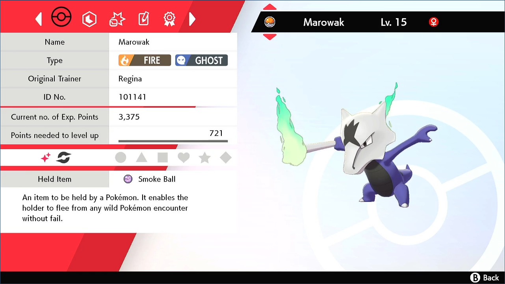
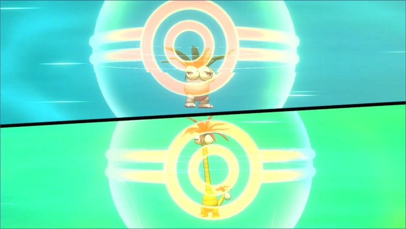
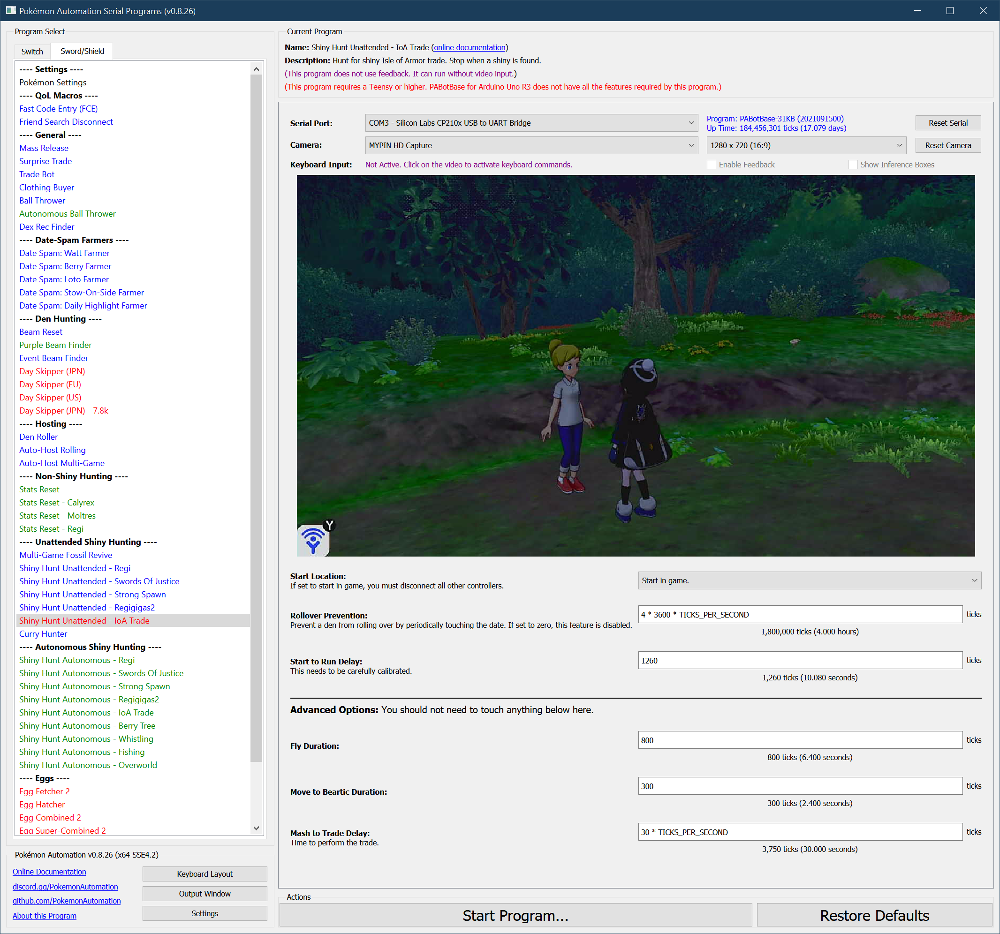

# Shiny Hunt (Unattended) - Isle of Armor Trade

**Related Programs:**
- **Microcontroller:** [Shiny Hunt Unattended: IoA Trade](https://github.com/PokemonAutomation/Microcontroller/blob/master/Wiki/Programs/PokemonSwSh/ShinyHuntUnattended-IoATrade.md)
- **Computer Control:** [Shiny Hunt Unattended: IoA Trade](https://github.com/PokemonAutomation/ComputerControl/blob/master/Wiki/Programs/PokemonSwSh/ShinyHuntUnattended-IoATrade.md) (this program)
- **Computer Control:** [Shiny Hunt Autonomous: IoA Trade](https://github.com/PokemonAutomation/ComputerControl/blob/master/Wiki/Programs/PokemonSwSh/ShinyHuntAutonomous-IoATrade.md)

The "Unattended" versions are functionally identical between the microcontroller and computer-control versions.

The last one on the list is the most advanced. It can automatically detect the shiny, stop on it, and notify the user.

## Program Description

Soft-reset for shiny Isle of Armor foreign form trades.

[Please read the appendix to understand how unattended shiny-hunting programs work.](https://github.com/PokemonAutomation/Microcontroller/blob/master/Wiki/Programs/PokemonSwSh/UnattendedShinyHunting.md)

> In all seriousness, this (along with Regigigas) should not be the first unattended shiny-hunting program that you choose to use. Both programs are very absurd and are only possible by abusing a large number of exploits. 

This program does one encounter every ~2 minutes. This leads to 5.5 day odds for a shiny. If you intend to square hunt with this program, average time is 3 months on one Switch. Therefore, this program will be a test of patience.

> _**Warning, this program may require calibration. The default settings are not guaranteed to work on your Switch. Read the instructions here carefully and be patient. Hardly anybody gets it right the first time.**_

This program works by performing a trade and then forcing an encounter with the Beartic on Route 10.

## Calibration

Before you continue, first read the appendix on unattended shiny-hunting calibration to better understand how the process works.

Section: [Unattended Shiny-Hunting Calibration](https://github.com/PokemonAutomation/Microcontroller/blob/master/Wiki/Programs/PokemonSwSh/UnattendedShinyHunting.md#calibrating-unattended-shiny-hunting)

**Calibrating the Run-Away time:**
The variable that controls the critical delay for this program is **"Start to Run Delay"**.
- If neither Pokémon is shiny, the LEDs will turn on ***0.5 – 1.5 seconds AFTER*** the battle menu appears. The program will run from the Beartic.
- If either Pokémon is shiny, the LEDs will turn on ***0.5 – 1.0 seconds BEFORE*** the battle menu appears. The program will not run and will instead trap  itself in the summary of your Pokémon.

Make only small changes at a time, no more than +/- 50 ticks at a time. Most Switches will have a working value somewhere between 1200 and 1300. Each tick is 8 milliseconds. (125 ticks per second)

Because of the nature of this program, you will not be able to use a shin lead to test shiny calibration. You must use the method of subtracting 250 ticks.

**Calibrating the Fly Duration:**

To complicate things even further, there is a second delay which may need to be calibrated for the program to work correctly, **"Fly Duration"**.

This controls how long it takes to fly to Route 10. This delay can vary a lot from Switch to Switch and whether your game is physical or digital.

If you find that your character does not move towards the Beartic soon after landing and the Beartic wanders too far from its spawn location, you will need to reduce this time. If you modify this value, you may need to recalibrate **"Start to Run Delay"**.

### Setup of Settings

1. Text Speed: Fast
2. Casual mode: Off
3. System time: Un-synced
4. Airplane mode: Off
5. The game save has been online at least once before.
6. The fly spot on Route 10 must be activated.
7. The Beartic on Route 10 must be active. (not despawned due to a prior encounter)
8. Menu icons are in their default locations.
   1. The Pokédex must be in the upper-left corner.
   2. The Pokémon option must be in the 1st row, 2nd from the left. 
   3. The Town Map must be in the 2nd row on the far left.

### Setup of Party

1. The Pokémon that you will be trading away must be in the first party slot.
2. The Pokémon in your second party slot must be holding a Smoke Ball.

### Instructions

1. Open the menu and place the cursor over the "Pokédex" option.
2. Press "B" to return to the overworld.
3. Stand in front of the lady who will do the trade.
4. Get on your bike.
5. Save.
6. Start the program in game or the [Change Grip/Order Menu](https://github.com/PokemonAutomation/Microcontroller/blob/master/Wiki/Programs/NintendoSwitch/ChangeGripOrderMenu.md) depending on which option you choose.

### Default Program Settings

When correctly calibrated:
- If neither Pokémon is shiny, the program will run from the Beartic and reset for the next attempt.
- If either the traded Pokémon or the Beartic is shiny, the program will lock itself in the Pokémon summary.

> With Shiny Charm, 75% of the shiny locks will be on a shiny Beartic. The remaining 25% will be for the traded Pokémon. Therefore, this program is more efficient without Shiny Charm.

Once started, the program will do the following:
1. Perform the trade.
2. Go into your Pokémon summary to move the Smoke Ball from the 2nd Pokémon to the lead Pokémon.
3. Fly to Route 10.
4. Bike to the right to encounter the Beartic.
5. If neither Pokémon is shiny, it will run. If either is shiny, it will lock in the summary.
6. Perform a conditional soft-reset.
7. Repeat steps 1-6.

> If the program locks on a shiny Beartic, you do not have to throw it away by resetting. The Isle of Armor trades can be repeated. You just need to day skip to reroll and find Regina again until you she offers you the same trade.
> 
> If you get a Shiny trade (or you decide to keep a shiny Beartic instead), the Beartic will respawn after a day skip.

On a shiny trade, it will appear shiny in the trade itself.

## Options

This program uses [**Tolerate System Update Menu (fast)**](/Wiki/Programs/NintendoSwitch/FrameworkSettings.md#tolerate-system-update-menu-fast) to bypass the system update window.

### Start to Run Delay:

This is the delay from when stop moving toward the Beartic to when you run away. This is the critical parameter that needs to be properly calibrated.

### Rollover Prevention:

This is useful if your game is holding a den and you do not want an unintentional date-skip to destroy it.

Prevent the den from rolling over by periodically touching the date at this interval. Set this value to zero to disable the feature.

## Advanced Settings:

These are advanced settings. You shouldn't need to touch these unless something isn't working and you're trying to debug it yourself.

### Fly Duration:

This is the time it takes to fly to Route 10. This number may need to be calibrated if you spend too much time standing after flying such that the Beartic moves away from the spawn spot.

### Move Duration:

This is how long to move towards the Beartic after landing on Route 10.

### Mash to Trade Delay:

This is how long from when you start the trade to when the trade ends. You shouldn't need to change this.

**Discord Server:** 

