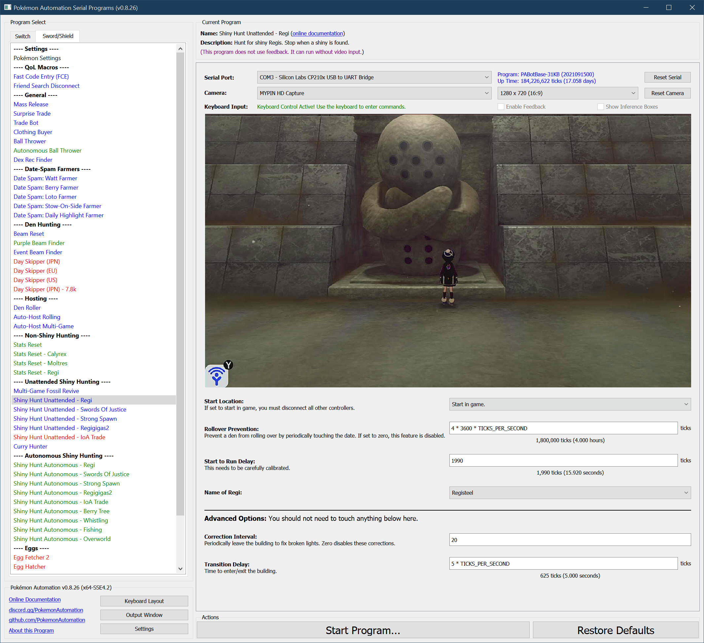

# Shiny Hunt (Unattended) - Regi

**Related Programs:**
- **Microcontroller:** [Shiny Hunt: Regi](https://github.com/PokemonAutomation/Microcontroller/blob/master/Wiki/Programs/PokemonSwSh/ShinyHunt-Regi.md)
- **Microcontroller:** [Shiny Hunt Unattended: Regi](https://github.com/PokemonAutomation/Microcontroller/blob/master/Wiki/Programs/PokemonSwSh/ShinyHuntUnattended-Regi.md)
- **Computer Control:** [Shiny Hunt Unattended: Regi](https://github.com/PokemonAutomation/ComputerControl/blob/master/Wiki/Programs/PokemonSwSh/ShinyHuntUnattended-Regi.md) (this program)
- **Computer Control:** [Shiny Hunt Autonomous: Regi](https://github.com/PokemonAutomation/ComputerControl/blob/master/Wiki/Programs/PokemonSwSh/ShinyHuntAutonomous-Regi.md)

The "Unattended" versions are functionally identical between the microcontroller and computer-control versions.

The last one on the list is the most advanced. It can detect shinies, distinguish stars from squares, stop on them, and notify the user.

## Program Description

Hunt for a shiny Regi golem.

[Please read the appendix to understand how unattended shiny-hunting programs work.](https://github.com/PokemonAutomation/Microcontroller/blob/master/Wiki/Programs/PokemonSwSh/UnattendedShinyHunting.md)

When correctly utilized, this program will stop on a shiny thus allowing you to let it run unattended.

> Note that the Shiny Charm does not work on the Regis, thus the average running time to a shiny is about 50 hours.
> 
> ***Warning, this program requires calibration. The default settings are not guaranteed to work on your Switch. Read the instructions here carefully and be patient. Hardly anybody gets it right the first time.***

This Regi program involves the (error prone) process of solving the light puzzle. To counter these errors, the program will periodically leave and reenter the building to reset the lights.

## Calibration:

Before you do any extended run, it is important to check your calibration (next section). _**Do not just fire up this program and expect it to work. Way too many people are overly eager and skip calibration just to end up wasting many hours from locking on false positives or running from shinies.**_

The variable that controls the critical delay for this program is **"Start to Run Delay"**.
- When the encounter is not shiny, the LEDs should turn on ***0.5 – 1.5*** seconds AFTER the battle menu appears. The program will run away from the battle.
- When the encounter is shiny, the LEDs should turn on ***0.5 - 1.0*** seconds BEFORE the battle menu appears. The program will not run away and will instead trap itself in the summary of your Pokémon.

Make only small changes at a time, no more than +/- 50 ticks at a time. Most Switches will have a working value somewhere between 1950 and 2050. Each tick is 8 milliseconds. (125 ticks per second)

### Setup of Settings

1. Text Speed: Fast
2. Casual mode: Off
3. System time: Un-synced
4. You must have 7 or more badges or you cannot catch the Regi.
5. You must be offline.
6. You must turn off your lead Pokémon following you. Following will cause happiness to increase enough to shake in battle. You can do this by talking to the boy in Freezington.

### Setup of Party

1. Your lead Pokémon is not shiny.
2. Your lead Pokémon does not have an ability that activates upon entry to battle.
Your lead Pokémon must be able to run away. (faster or holding Smoke Ball)
3. Your lead Pokémon must not have high happiness.
   1. The in-battle shaking and dialog adds timing variation.

### Instructions

> For Regieleki and Regidrago, you must be locked into your choice. (No extra prompt talking to statue.)

1. Stand in front the statue with no lights activated.
2. Check that you are in the overworld (not inside the menu).
3. Start the program in game or the [Change Grip/Order Menu](https://github.com/PokemonAutomation/Microcontroller/blob/master/Wiki/Programs/NintendoSwitch/ChangeGripOrderMenu.md) depending on which option you choose.

   > Notes:
   > - Regice is nearly the same color shiny and non-shiny. The only difference is the shade of the blue, therefore it will be difficult to tell what the program traps on is a shiny. Take a screenshot of a non-shiny Regice on the Switch before you go unattended. That way when it traps, you will have a screenshot on your Switch to compare the shade of blue in the exact same lighting conditions.
   > - Pay attention to the Pokérus status of your party. This program involves a large number of encounters without any resetting. Thus the chance of getting Pokérus from the wild is actually quite high. If you want your Pokémon untouched, keep them safely in the box. 4 day skips will cure Pokérus from your party.

### Default Program Settings

When correctly calibrated:
- If the encounter is not shiny, the program will run from the battle and move on to the next encounter.
- If the encounter is shiny, the program will trap itself inside the Pokémon menu. This allows you to manually back out and fight the shiny Pokémon.

## Options

This program uses [**Tolerate System Update Menu (fast)**](/Wiki/Programs/NintendoSwitch/FrameworkSettings.md#tolerate-system-update-menu-fast) to bypass the system update window.

### Start to Run Delay:

This is the delay from the last A press on the statue to when you run from the battle. This is the critical parameter that needs to be properly calibrated.

### Regi to Reset For:

This is what you’re resetting for. Pick from: `Regirock`, `Regice`, `Registeel`, `Regieleki`, and `Regidrago`.

### Rollover Prevention:

This is useful if your game is holding a den and you do not want an unintentional date-skip to destroy it.

Prevent the den from rolling over by periodically touching the date at this interval. Set this value to zero to disable the feature.

## Advanced Settings:

These are advanced settings. You shouldn’t need to touch these unless something isn’t working and you’re trying to debug it yourself.

### Correction Interval:

The light puzzle is not 100% reliable. Sometimes it will miss lights. To counter that, the program will periodically leave and re-enter the building after this many encounters. Zero disables the corrections. If you disable corrections, the program will stop working when it misses a light and will not self-recover.

### Transition Delay:

The time needed to enter and exit the building during a correction.

**Discord Server:** 

