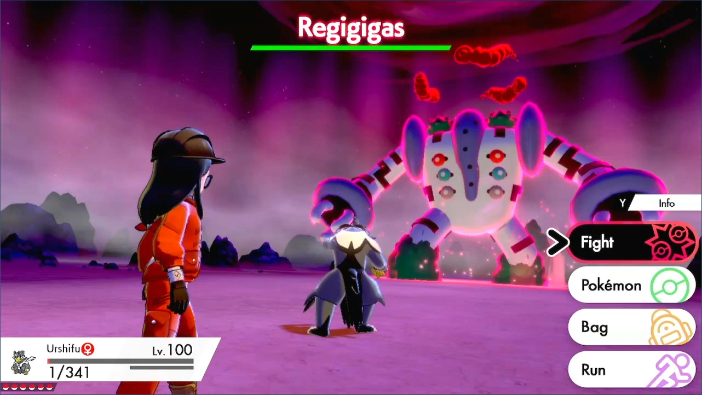
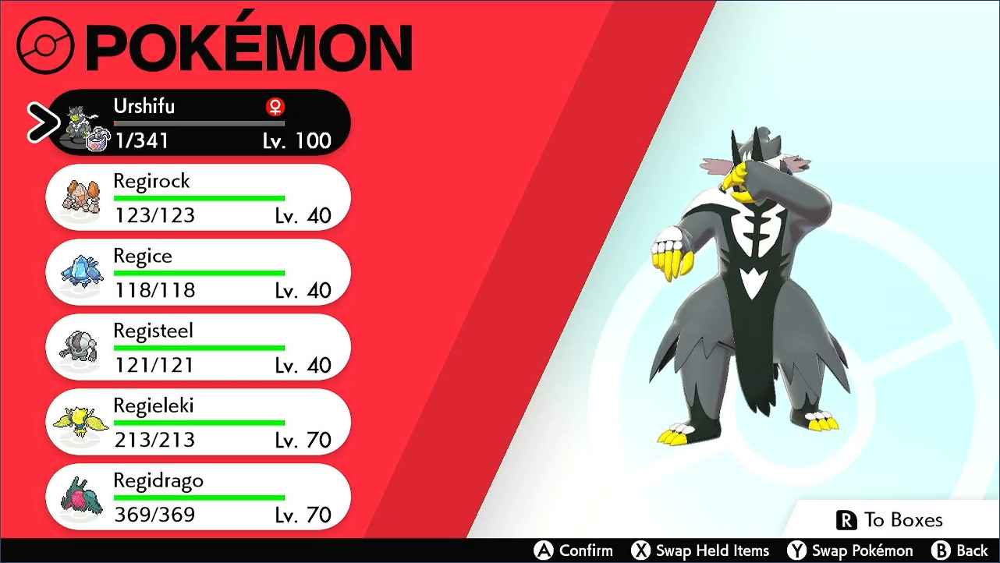
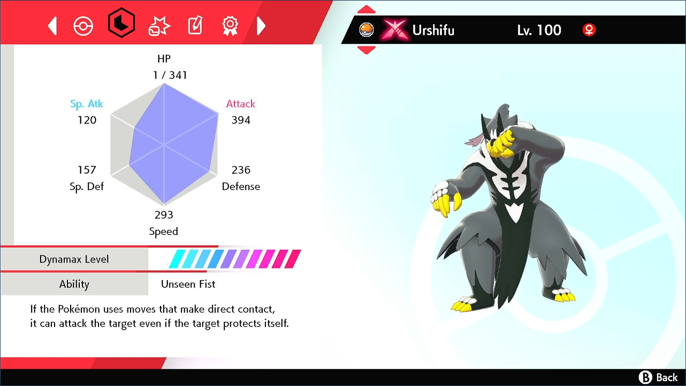
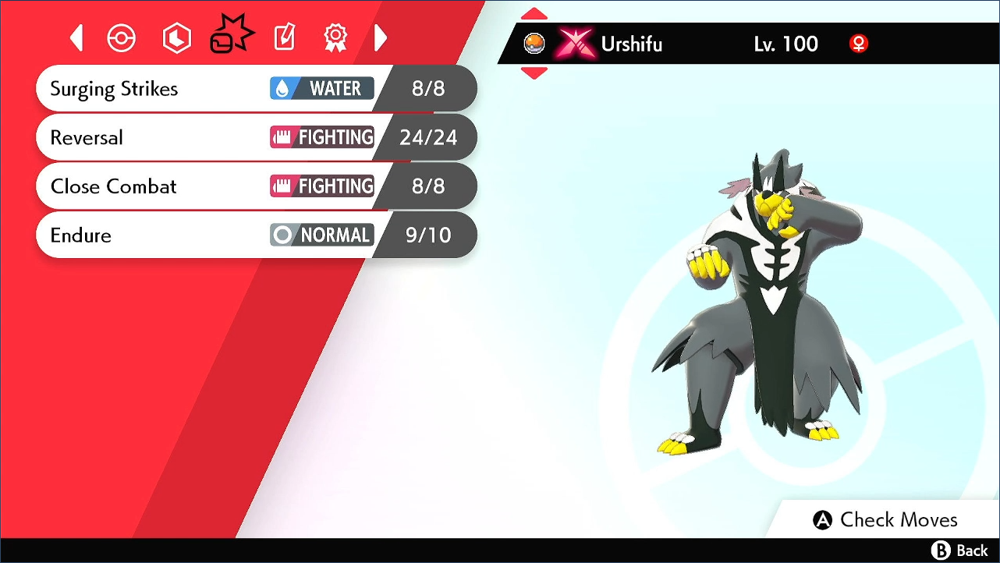
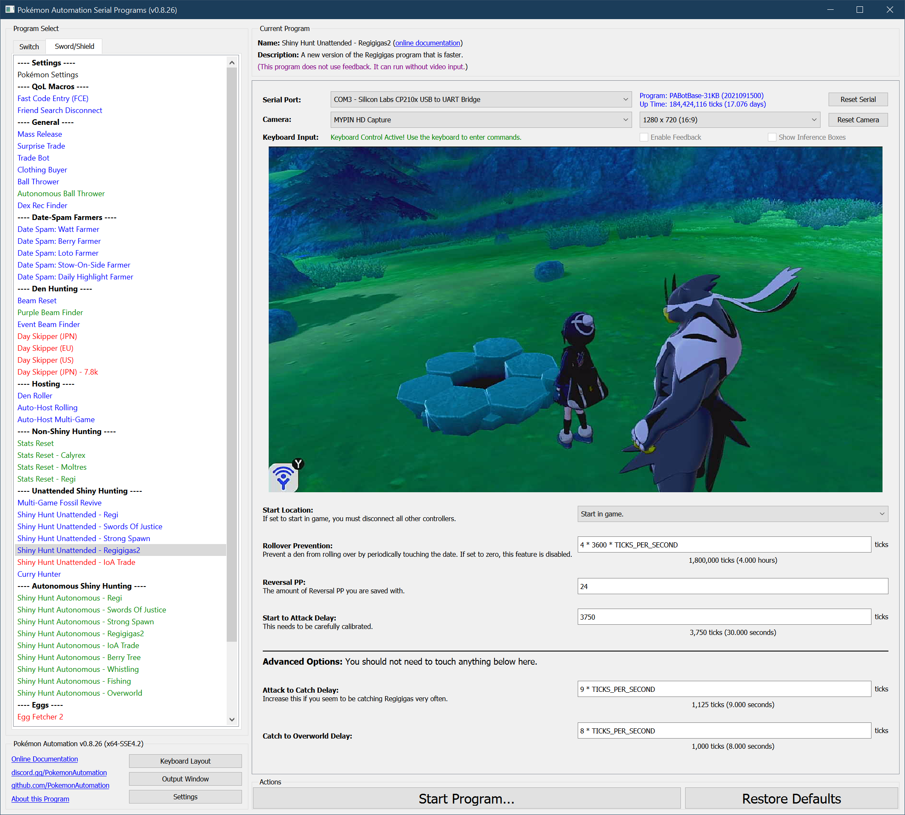

# Shiny Hunt (Unattended) - Regigigas 2 (deprecated)

***This program is deprecated and is no longer maintained. Please use [Shiny Hunt Autonomous: Regigigas2](https://github.com/PokemonAutomation/ComputerControl/blob/master/Wiki/Programs/PokemonSwSh/ShinyHuntAutonomous-Regigigas2.md) instead.***

-----

**Related Programs:**
- **Computer Control:** [Shiny Hunt Unattended: Regigigas2](https://github.com/PokemonAutomation/ComputerControl/blob/master/Wiki/Programs/PokemonSwSh/ShinyHuntUnattended-Regigigas2.md) (this program)
- **Computer Control:** [Shiny Hunt Autonomous: Regigigas2](https://github.com/PokemonAutomation/ComputerControl/blob/master/Wiki/Programs/PokemonSwSh/ShinyHuntAutonomous-Regigigas2.md)

The last one on the list is the most advanced. It can detect shinies, distinguish stars from squares, stop on them, and notify the user.

## Program Description

Soft-reset for shiny Regigigas.

> _**Warning, this program may require calibration. The default settings are not guaranteed to work on your Switch. Read the instructions here carefully and be patient. Hardly anybody gets it right the first time.**_

[Please read the appendix to understand how unattended shiny-hunting programs work.](https://github.com/PokemonAutomation/Microcontroller/blob/master/Wiki/Programs/PokemonSwSh/UnattendedShinyHunting.md)

This program uses a 1 HP lead that is able to OHKO the Regigigas using the move Reversal. Then it retries until it runs out of PP where it will do a soft-reset to restore the PP and continue.

## Calibration:

Before you continue, first read the appendix on unattended shiny-hunting calibration to better understand how the process works.

Section: [Unattended Shiny-Hunting Calibration](https://github.com/PokemonAutomation/Microcontroller/blob/master/Wiki/Programs/PokemonSwSh/UnattendedShinyHunting.md#calibrating-unattended-shiny-hunting)

The variable that controls the critical delay for this program is **"Start to Attack Delay"**.
- When the encounter is not shiny, the LEDs will turn on ***0.5 – 1.5 seconds AFTER*** the battle menu appears. The program will attack and kill Regigigas, then return to the front of the den for the next encounter.
- When the encounter is shiny, the LEDs will turn on ***0.5 – 1.0 seconds BEFORE*** the battle menu appears. The program will not attack and will instead trap itself in the summary of your Pokémon.

Make only small changes at a time, no more than +/- 50 ticks at a time. Most Switches will have a working value somewhere between 3650 and 3800. Each tick is 8 milliseconds. (125 ticks per second)

### Setup of Settings

1. Text Speed: Fast
2. Casual mode: Off
3. System time: Un-synced
4. Battle animations: Off
5. Airplane mode: Off
6. The game save has been online at least once before.

### Setup of Party

1. Your lead Pokémon must not have high happiness. The in-battle shaking and dialog adds timing variation.
2. Your lead Pokémon must be faster than Regigigas.
3. Your lead Pokémon is not shiny.
4. Your lead Pokémon does not have an ability that activates upon entry to battle.
5. The second move on your lead Pokémon (Reversal) is fully PP up'ed to 24 PP.
   1. The second move on your lead Pokémon must be able to OHKO the Regigigas. (see below)

> **As of this writing, there is only one known way to ensure a OHKO on Regigigas:**
> 1. Your Pokémon is fighting type (for STAB).
> 2. Your Pokémon has only 1 HP. (base power 200) Use the move Endure to help get to 1 HP.
> 3. Your Pokémon is holding a Choice Band.
> 4. The move being used is Reversal.
> 5. Your Pokémon has a very high attack stat. (high base stat + 252 EVs + 31 IV + beneficial nature)

Here is an example of a lead Pokémon that is properly setup to guarantee a OHKO on Regigigas.

 

### Instructions

1. You must be saved in front of the Regigigas den.
2. The `REVERSAL_PP` parameter must be set to no more than the amount of PP of your second move.
3. Check that you are in the overworld (not inside the menu).
4. Start the program in game or the [Change Grip/Order Menu](https://github.com/PokemonAutomation/Microcontroller/blob/master/Wiki/Programs/NintendoSwitch/ChangeGripOrderMenu.md) depending on which option you choose.

### Default Program Settings

When correctly calibrated:
- If the encounter is not shiny, the program will kill Regigigas, not catch it, and move on.
- If the encounter is shiny, the program will trap itself inside the Pokémon menu. This allows you to manually back out and fight the shiny Regigigas.

***

### Options

This program uses [**Tolerate System Update Menu (fast)**](/Wiki/Programs/NintendoSwitch/FrameworkSettings.md#tolerate-system-update-menu-fast) to bypass the system update window.

### Reversal PP:

This is the amount of PP of your attacking move. Reversal has 24 PP when fully PP up'ed.

### Start to Attack Delay:

This is the delay from when talk to the den to when you attack Regigigas. This is the critical parameter that needs to be properly calibrated.

### Rollover Prevention:

This is useful if your game is holding a den and you do not want an unintentional date-skip to destroy it.

Prevent the den from rolling over by periodically touching the date at this interval. Set this value to zero to disable the feature.

## Advanced Settings:

These are advanced settings. You shouldn't need to touch these unless something isn't working and you're trying to debug it yourself.

### Attack to Catch Delay:

The amount of time from when you attack Regigigas to when you can choose to catch or leave it.

### Catch to Overworld Delay:

The amount of time from when you choose not to catch Regigigas to when you return to the overworld.

## Credits

- **Author:** Kuroneko/Mysticial

**Discord Server:** 

