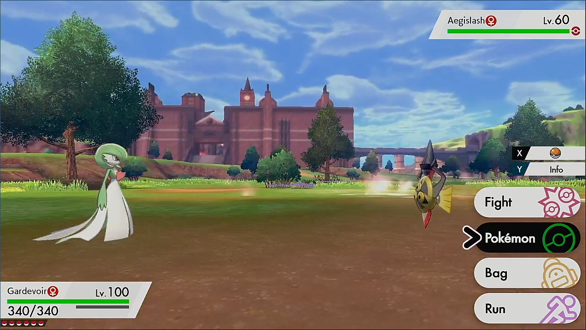
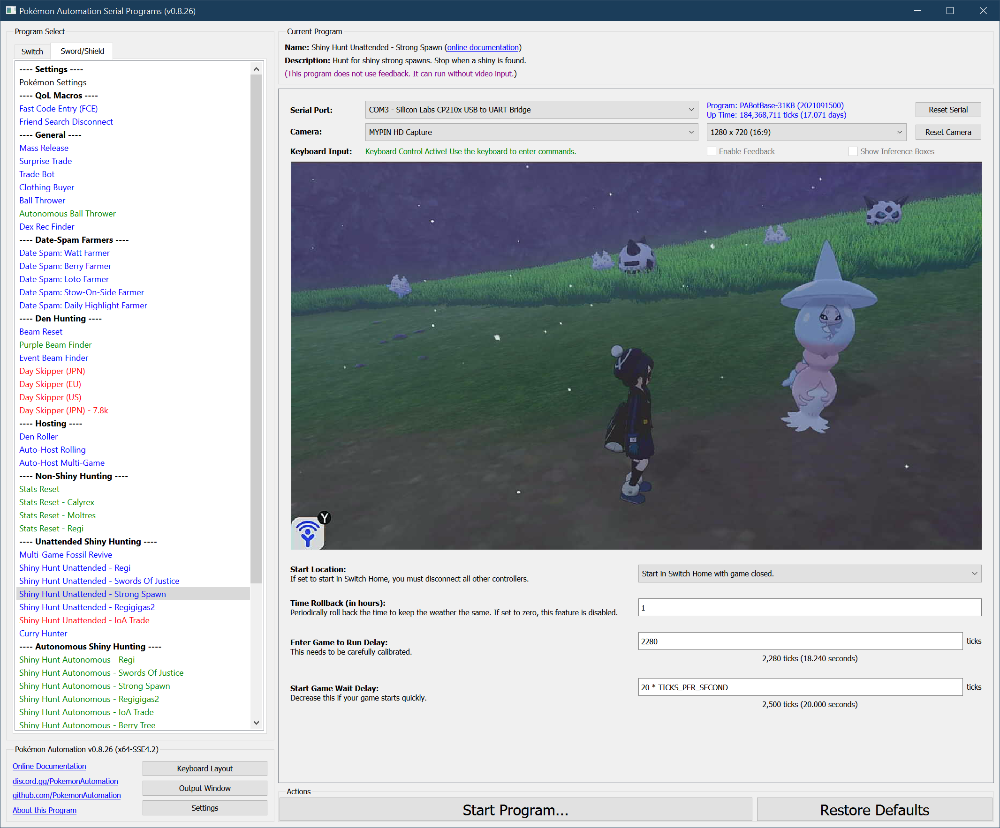

# Shiny Hunt (Unattended) - Strong Spawn (deprecated)

***This program is deprecated and is no longer maintained. Please use [Shiny Hunt Autonomous: Strong Spawn](https://github.com/PokemonAutomation/ComputerControl/blob/master/Wiki/Programs/PokemonSwSh/ShinyHuntAutonomous-StrongSpawn.md) instead.***

-----

**Related Programs:**
- [Shiny Hunt Unattended: Strong Spawn](https://github.com/PokemonAutomation/ComputerControl/blob/master/Wiki/Programs/PokemonSwSh/ShinyHuntUnattended-StrongSpawn.md) (this program)
- [Shiny Hunt Autonomous: Strong Spawn](https://github.com/PokemonAutomation/ComputerControl/blob/master/Wiki/Programs/PokemonSwSh/ShinyHuntAutonomous-StrongSpawn.md)

The last one on the list is the most advanced. It can detect shinies, distinguish stars from squares, stop on them, and notify the user.

## Program Description

Soft-reset for shiny strong spawns.

[Please read the appendix to understand how unattended shiny-hunting programs work.](https://github.com/PokemonAutomation/Microcontroller/blob/master/Wiki/Programs/PokemonSwSh/UnattendedShinyHunting.md)

> _**Warning, this program may require calibration. The default settings are not guaranteed to work on your Switch. Read the instructions here carefully and be patient. Hardly anybody gets it right the first time.**_
> 
> This program will only work on Pokémon with _non-activating abilities_ or if both abilities activate with the same delay. It will not work with Pokémon that have two abilities where only one activates upon battle entry. 

When correctly utilized, this program will stop on a shiny thus allowing you to let it run unattended. This program will also work on the Swords of Justice legendaries, but slower.

To read more about this method, search online for "Strong Spawn Shiny Hunting Method". We won't bother reiterating the mechanics of the method here.

## Calibration

Before you continue, first read the appendix on unattended shiny-hunting calibration to better understand how the process works. _**Do not just fire up this program and expect it to work. Way too many people are overly eager and skip calibration just to end up wasting many hours from locking on false positives or running from shinies.**_

Section: [Unattended Shiny-Hunting Calibration](https://github.com/PokemonAutomation/Microcontroller/blob/master/Wiki/Programs/PokemonSwSh/UnattendedShinyHunting.md#calibrating-unattended-shiny-hunting)

The variable that controls the critical delay for this program is **"Enter Game to Run Delay"**.
- When the encounter is not shiny, the LEDs will turn on ***0.5 – 1.5 seconds AFTER*** the battle menu appears. The program will run away from the battle.
- When the encounter is shiny, the LEDs will turn on ***0.5 -1.0 seconds BEFORE*** the battle menu appears. The program will not run away and will instead trap itself in the summary of your Pokémon.

Unlike the Regi and Sword of Justice programs, you will likely need to make large adjustments to the delay to make things work.
- Use a stopwatch to help you.
- Each tick is 8 milliseconds, and each second is 125 ticks.

Because you will get attacked the moment you enter the game, changing the lead will require repeating all the steps in "Setup Instructions". So heads up since this can get annoying after a while.

> Due to the large number of strong spawn possibilities with different weather and ability combinations, the default setting is unlikely to work. Therefore you are pretty much required to calibrate.

### Setup of Settings

1. Text Speed: Fast
2. Casual mode: Off
3. System time: Un-synced
4. Airplane mode: Off
5. The game save has been online at least once before.
6. Change the date to one that has the appropriate weather for your desired strong spawn.

> Have the shiny charm. It will reduce the average time to shiny from 68 hours to 23 hours.
> If you change the date to set the weather, be sure to change the date back before you catch the Pokémon. Otherwise, the catch date will be wrong.

> The speed of this program is heavily affected by how quickly the program can reset the game. By default, the soft-reset timings are very loose to ensure that they work on the most Switches. You can optimize this by adjusting the **"Start Game Wait Delay"** parameter.

### Setup of Party

1. Your lead Pokémon is not shiny.
2. Your lead Pokémon does not have an ability that activates upon entry to battle.
3. Your lead Pokémon must be able to run away. (faster or holding Smoke Ball)
4. Your lead Pokémon must not have high happiness. The in-battle shaking and dialog adds timing variation.

### Instructions

1. Despawn the Pokémon by fighting it and running, defeating, or catching it.
2. Stand directly on the spawn spot for your desired Pokémon.
3. Activate the VS (Y-COMM) glitch.
4. Change the date forward and backwards one day. (This forces a day skip while resetting the date.)
5. Save the game.
6. Close the game.
7. Start the program in the Switch home or the [Change Grip/Order Menu](https://github.com/PokemonAutomation/Microcontroller/blob/master/Wiki/Programs/NintendoSwitch/ChangeGripOrderMenu.md) depending on which option you choose.

> If done correctly, the program will start up the game and you will immediately get attacked by your desired strong spawn. If it is not-shiny, it runs away and resets the game. If it is shiny, it traps itself in the summary page.

### Default Program Settings

When correctly calibrated:
- If the encounter is not shiny, the program will run from the battle and move on to the next encounter.
- If the encounter is shiny, the program will trap itself inside the Pokémon menu. This allows you to manually back out and fight the shiny Pokémon.

## Options

This program uses [**Tolerate System Update Menu (fast)**](/Wiki/Programs/NintendoSwitch/FrameworkSettings.md#tolerate-system-update-menu-fast) to bypass the system update window.

### Enter Game to Run Delay:

This is the delay from when you enter the game to when you run from the encounter. This is the critical parameter that needs to be properly calibrated.

### Time Rollback:

Every this many hours, rollback the time by this many hours. This keeps the time constant to prevent the weather from changing. It also allows you to target time-specific marks. Set this to zero to disable this feature.

## Advanced Settings:

These are advanced settings. You shouldn't need to touch these unless something isn't working and you're trying to debug it yourself.

### Start Game Wait Delay:

After starting the game, wait this long before press A to actually enter the game. By default, this is set very high to ensure that the program works. You can try reducing this to make resetting faster.

## Credits

- **Author:** Kuroneko/Mysticial

**Discord Server:** 

