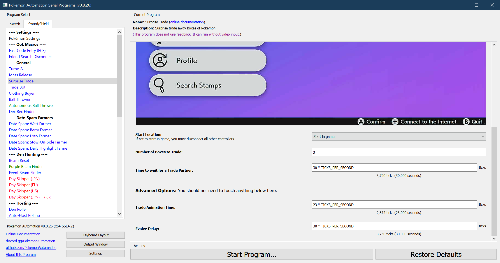

# Surprise Trade

**Related Programs:**
- **Microcontroller:** [Surprise Trade](https://github.com/PokemonAutomation/Microcontroller/blob/master/Wiki/Programs/PokemonSwSh/SurpriseTrade.md)
- **Computer Control:** [Surprise Trade](https://github.com/PokemonAutomation/ComputerControl/blob/master/Wiki/Programs/PokemonSwSh/SurpriseTrade.md) (this program)

The microcontroller and computer-control versions of this program are functionally identical.

## Program Description

SurpriseTrade will surprise trade entire boxes of Pokémon. The main use case is gathering trainer IDs for Loto farming and to farm hacked Pokémon+items surprise trades.

This program is similar to brianuuuSonic's BoxSurpriseTrade, but is also tolerant to errors when changing boxes.

### Setup of Settings

1. Text Speed: Fast
2. Casual mode: Off
3. Nicknaming needs to be off. (in case of a trade evolution)
4. If you are trading online, make sure you have a strong internet connection.

> If you wish to trade online, be connected to the internet before you start the program. Thus you will need to be fast when starting the program or you will be disconnected.

### Instructions

1. You must be in the overworld (not in the menu).
2. Check there is nothing in front of you that can be interacted with.
3. Backed yourself into a corner where you cannot travel down or right.
4. Your location should be safe from getting attacked by wild Pokémon.
5. Start the program in game or the [Change Grip/Order Menu](https://github.com/PokemonAutomation/Microcontroller/blob/master/Wiki/Programs/NintendoSwitch/ChangeGripOrderMenu.md) depending on which option you choose.

### Box Setup

1. Place boxes of Pokémon to be traded consecutively.
   - The boxes do not need to be full. Empty slots are safely skipped, but you will leave the partner waiting for a long time before disconnecting them without trading anything.
2. You must be on the first box.
3. Do not have any untradable Pokémon in these boxes. (no fused Pokémon)

> It goes without saying that this is a very dangerous program. Don't run this program unattended unless the game is completely free of Pokémon you want to keep.

### Default Program Settings

Once started, this program will trade the specified number of boxes consecutively starting from the current box.

When the program reaches the end of a box, it will pause for a longer period before moving the next box. This is to ensure that any errors from a preceding trade will have cleared out.

> **Known Corner Cases:**
> - If a box slot is empty, it will be safely skipped.
> - If a trade takes too long, the program will self-recover.*
> - If no trading partner is found, the program will self-recover.*
> - If a trade results in a new Pokédex entry, the program will self-recover.*
> - If a trade results in an evolution, the program will self-recover.*
> - If a trade results in an evolution and a new move, the program should recover*, but it may take more than one loop.
> - This program will tolerate the above errors even at the end of a box.
> 
> *In these cases, self-recovery will mean skipping the next trade.
> 
> **Untested Corner Cases:**
> - Untradable Pokémon: eggs, fused, illegal, etc...
> - You get disconnected from the internet while the program is running.

## Options

This program uses [**Tolerate System Update Menu (fast)**](/Wiki/Programs/NintendoSwitch/FrameworkSettings.md#tolerate-system-update-menu-fast) to bypass the system update window.

Most of the options here are self-explanatory.

**Discord Server:** 

