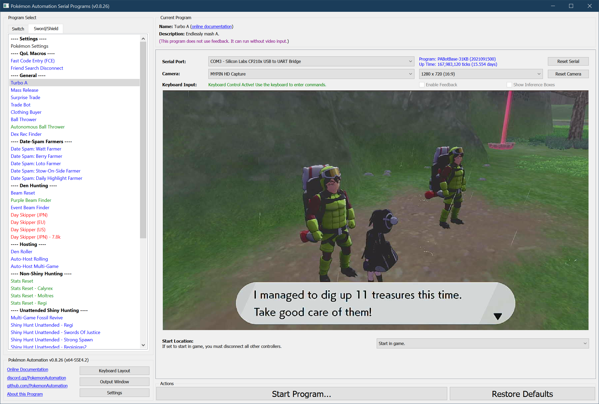

# Nintendo Switch: Turbo A

**Related Programs:**
- **Microcontroller:** [TurboA](https://github.com/PokemonAutomation/Microcontroller/blob/master/Wiki/Programs/NintendoSwitch/TurboA.md) (this program)
- **Computer Control:** [Turbo A](https://github.com/PokemonAutomation/ComputerControl/blob/master/Wiki/Programs/PokemonSwSh/TurboA.md)
- **Computer Control:** [Turbo Button](https://github.com/PokemonAutomation/ComputerControl/blob/master/Wiki/Programs/NintendoSwitch/TurboButton.md)

This program is deprecated for computer-control. Use [Turbo Button](/Wiki/Programs/NintendoSwitch/TurboButton.md) instead.

## Program Description

TurboA does exactly what its name implies - it endlessly presses A. The purpose of this program is to grind the Digging Duo and Cram-o-matic.

### Setup of Settings

1. Casual mode: Off

### Instructions

1. You are standing in front of what you want to mash A in front of.
2. Start the program in game or the [Change Grip/Order Menu](/Wiki/Programs/NintendoSwitch/ChangeGripOrderMenu.md) depending on which option you choose.

### Default Program Settings

Once the program starts, it will enter the game and start mashing A at approximately 14 times/second. 
Stand in front of either the Digging Duo. For the Cram-o-matic, make sure you have already selected your ingredients. When running this on the Cram-o-matic, you need to keep an eye to make sure you stop the program when you run out of ingredients. Otherwise, it will keep churning through different items depending on what you have next in your inventory.

> Useful Tips:
> - It takes about 16 hours and 3 million watts to dig the common fossils from 0 -> 960+.
> - Rare fossils are 1/5’th the rarity of the common fossils.

***

## Options

This program uses [`TOLERATE_SYSTEM_UPDATE_MENU_FAST`](FrameworkSettings.md#tolerate-system-update-menu-fast) to bypass the system update window.

This program has no program-specific configuration options.

