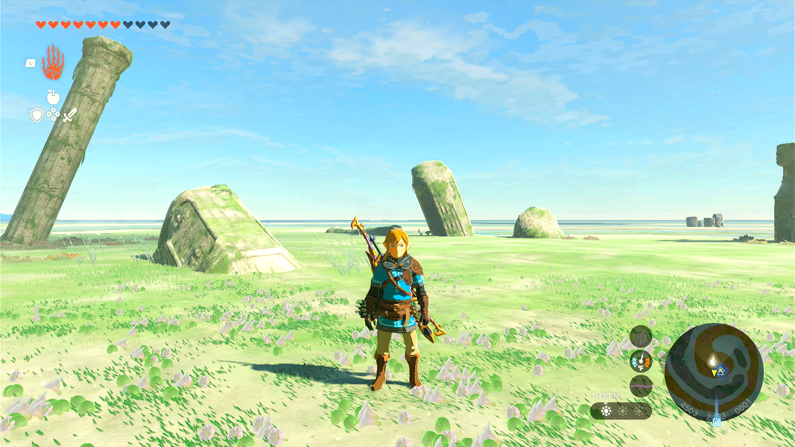
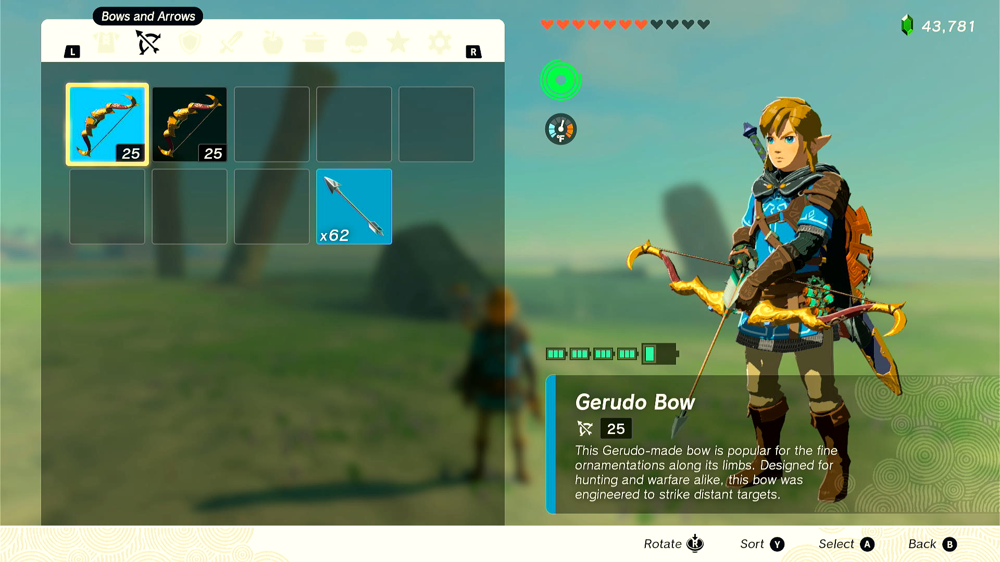

# Tears of the Kingdom: Bow Item Duper

This program is written for The Legend of Zelda: Tears of the Kingdom. The program is still within the Pokémon Automation program. It does not currently require video feedback.

## Program Description

Farm duplicating items in Tears of the Kingdom through the "equip to bow, drop bow, equip new bow, exit and reenter menu quickly" glitch. (For details on the glitch, see this [YouTube video by AustinJohnPlays](https://www.youtube.com/watch?v=foDughls8u0).)

This program will perform the button presses for the glitch very quickly and repeat it for a specified number of attempts.

**Warning**: There is some instability with this program. Even when properly calibrated, duplications are not guaranteed (and calibration can change even between items that will be duped). More research is going into best locations and bows, but users have found consistent results outside shrines with two identical bows.

## Settings

On your Switch, no particular settings need to be set. However, make sure your button mappings are set to the default.

## Setup

This program will dupe one item at a time. It is **necessary that you have at least two of the item you want to dupe** to run this more than once. You can set the number to one to get two in your inventory, but you must then re-sort your items and go through the instructions again.

## Instructions

1. Have two identical bows in your inventory and equip the first one. 
	> You *can* have multiple bows, but your last two bows must be on the same row. It is easier to just drop your additional bows and retrieve them after duping.
2. Make sure the area is clear around you, don't let enemies interrupt you.
3. Using the Fuse menu (pulling out your bow, holding D-Pad Up), make sure you are on a sorting that is static ("By type" works best).
4. While in the Fuse menu, select the item that you want to duplicate so that Link will fuse it to an Arrow. This will set the menu to return here once the glitch starts.
5. Put away the bow and face the camera.
6. Enter the menu, navigate to the Bow listing, make sure your equipped bow is in the first slot (swap bows if necessary), put the cursor over the equipped bow, and exit the menu.
7. Start the program

Note, you can only hold 999 of any given item. Additionally, your duplication will not be 100%, but you can still get a high success rate.

Here is what your menu should look like before starting the glitch:

## Troubleshooting

If your duplications are not stable, you will need to calibrate the "Menu Delay" option in the program. It is set to "15" by default, which should work for most folks. **For this glitch to work, the menu must be exited and entered within 3 game ticks which is almost instantenous**, so you have to keep it fairly tight. However, the program can get into an irrecoverable state if it is too tight, so don't make it too small.

If you're finding that Link is whistling and causing the program to enter that irrecoverable state, **increase the menu delay option**.

If you're finding that the duplications aren't happening frequently enough, **decrease the menu delay option**. 

There are two identifiers to know if the duplication happened. Both must be present. (1) after closing and reopening the menu, if Link has the item attached to an arrow on the right side of the screen. (2) if the bows end up stacked on top of each other when Link turns around to pick them up.

## Options

### Duplication Attempts

The number of times the program should attempt duplication.

### Menu Delay

An adjustable delay for exiting and reentering the menu (where the glitch really happens). This should not typically be lower than 5 or greater than 25. See Troubleshooting above for more details.

## Credits

- **Original Macro Author:** koboldtime#2248
- **Program Author and Documentation Writer:** denvoros#0001

**Discord Server:** 

