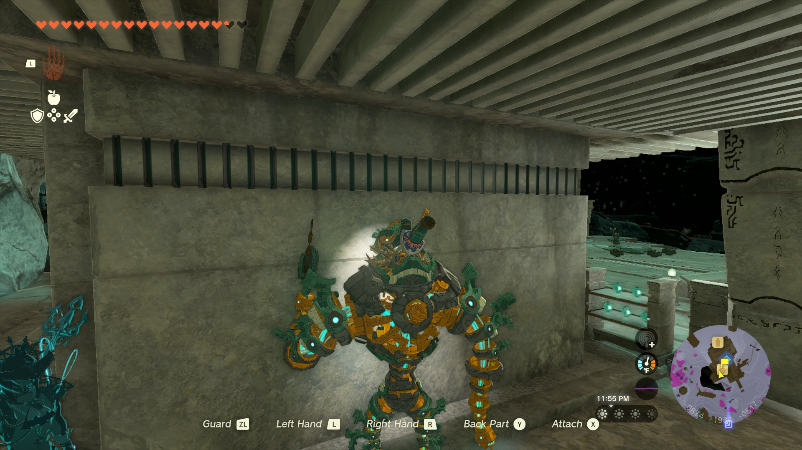

# Mineru Item Duper

This program is for The Legend of Zelda: Tears of the Kingdom. The program is still within the Pokémon Automation program. It does not require video feedback.

**Version 1.1 or 1.1.1 of the game is required.** The glitch this program uses does not work in version 1.0 or versions 1.1.2 and above.

## Program Description

Farm items by duplicating them in Tears of the Kingdom. This works by holding items and pressing sort + back at the same time while technically airborne within Mineru.

## Settings

1. Swap jump controls: Disabled

## Instructions

1. Warp to the Great Abandoned Central Mine in the depths.
    - If you are duping Zonai devices, stand next to a wall, as pictured above.
    - If you are duping materials, do not stand next to a wall. 
2. If any Sages are adjacent to you, disable them to prevent accidental ability use.
3. Open the menu and navigate to the materials tab. Select the item that you want to duplicate. Close the menu.
4. Start the program in-game.

## Notes

You may use bombs and other explosives. They do not fall far enough to explode.

## Options

### Duplication Amount

The total number of items to create via duplication.

### Is Zonai Device

Whether or not you are duplicating a Zonai device, or just a normal material.

## Credits

- **Author:** snotyak
- **Inspiration:** kichithewolf

**Discord Server:** 

