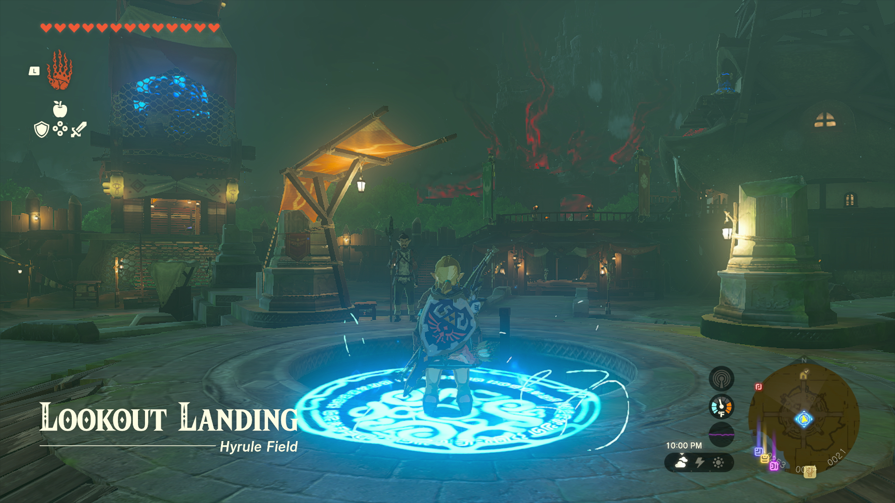

# Paraglide Item Duper

This program is for The Legend of Zelda: Tears of the Kingdom. The program is still within the Pokémon Automation program. It does not require video feedback.

**Version 1.1 or 1.1.1 of the game is required.** The glitch this program uses does not work in version 1.0. This document will be updated when future versions of the game release.

## Program Description

Farm items by duplicating them in Tears of the Kingdom. This works by holding items and pressing sort + back at the same time while paragliding. Based on this [video](https://youtu.be/t9bl4_UbxNk).

## Settings

1. Swap jump controls: Disabled

## Setup

1. A warp point has been placed using the Travel Medallion directly opposite the ladder to the Emergency Shelter in Lookout Landing. (See above image.)
   > Angle facing slightly to the left of the ladder. This will prevent accidently talking to the guard on the right at the bottom.
2. On the Purah Pad (minus button menu), the Map tab is selected. Additionally, the zoom level is set to the default. (Zoom all the way in and then zoom out by one level.)
   > Clear the map of stickers/icons around the warp point.
3. Unequip any metal weapons/armor in case there is a thunderstorm.

## Instructions

1. Fast travel to the warp point created in the setup.
2. Open the menu and navigate to the materials tab. Select the item that you want to duplicate. Close the menu.
3. Start the program in-game.

## Notes

Do not attempt use this program with bombs or anything explosive. Use the [Bow Item Duper](BowItemDuper.md) instead.

This works even if you have less than 5 of an item, but is more consistent with 5. Consider duplicating manually until you have at least 5 of any item.

Some items may bounce more than others, so all duplicates are not always picked up. For example, large batteries sometimes roll away.

## Options

### Duplication Attempts

The number of times the program should attempt duplication.

### Loading time

Adjustable delay for the load screen after warping back to the travel medallion. Adjust this to match the loading time of your game. This is dependent on your switch model and game setup, as digital copies will load faster. The default of 3125 ticks (25 seconds) was set using an OLED switch and a physical copy of the game.

## Credits

- **Author:** kichithewolf

**Discord Server:** 

