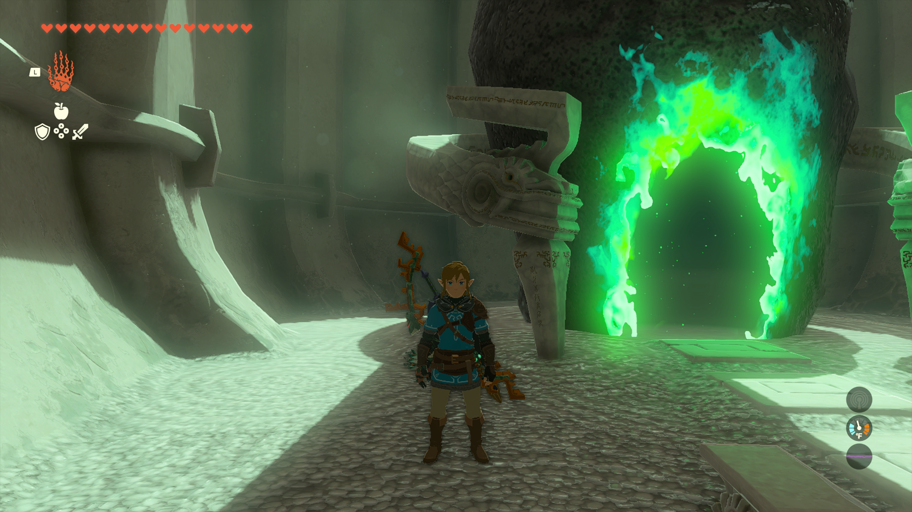

# Shield Surf Item Duper

This program is for The Legend of Zelda: Tears of the Kingdom. The program is still within the Pokémon Automation program. It does not require video feedback.

**Version 1.1 or 1.1.1 of the game is required.** The glitch this program uses does not work in version 1.0 or versions 1.1.2 and above.

## Program Description

Farm items by duplicating them in Tears of the Kingdom. This works by holding items and pressing sort + back at the same time while shield surfing. Based on this [video](https://youtu.be/t9bl4_UbxNk).

## Settings

1. Swap jump controls: Disabled

## Instructions

1. Stand on the sand in a shrine or under a lightroot.
2. Open the menu and navigate to the materials tab. Select the item that you want to duplicate. Close the menu.
3. Start the program in-game.

As this is performed on sand, your shield will not lose durability. Additionally, both starting locations are safe from Blood Moons.

## Notes

If standing under a lightroot, disable any Sages you have to prevent accidental ability use.

## Options

### Duplication Attempts

The number of times the program should attempt duplication.

## Credits

- **Author:** kichithewolf

**Discord Server:** 

