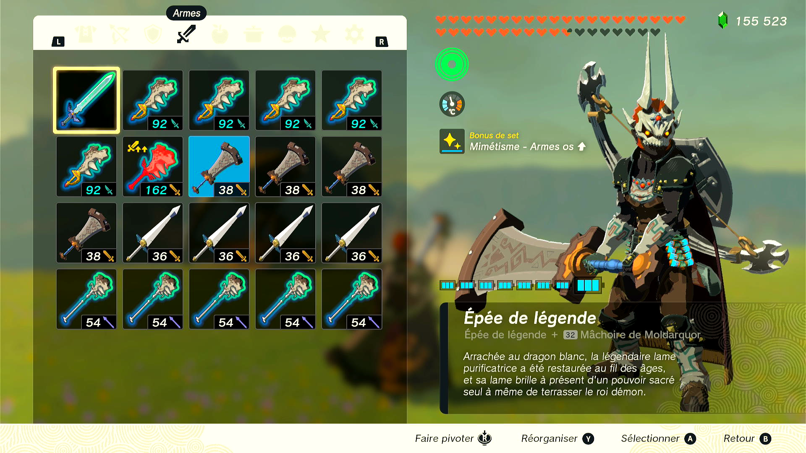
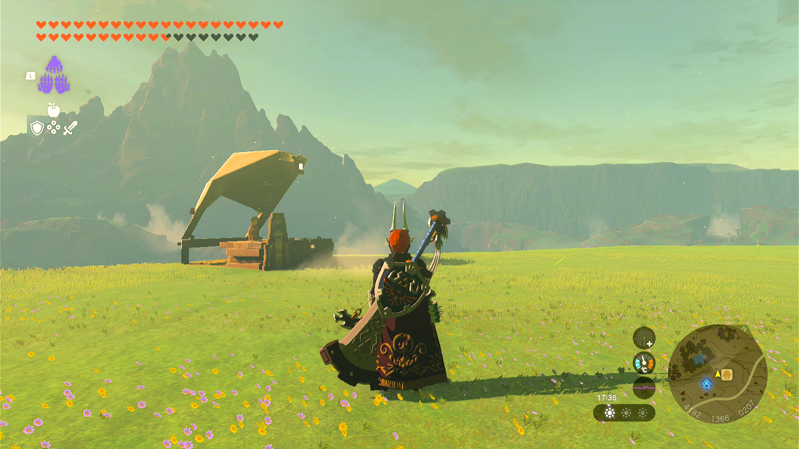

# Shield Surf Item Duper

This program is for The Legend of Zelda: Tears of the Kingdom. The program is still within the Pokémon Automation program. It does not require video feedback.

**Version 1.0 to 1.1.1 of the game is required.** The glitch this program uses does not work in versions 1.1.2 and above.

## Program Description

Duplicate weapons (Bows, Shields, Swords) via a glitch as seen in this [video](https://youtu.be/im64NgGSQd4).

## Instructions

1. Stand somewhere far away from NPC and if possible without red moon (it will break the program).
2. Open the menu and navigate to the tab where you want to duplicate a weapon from (Bows, Shields, Swords).
3. Equip the weapon you want to duplicate
4. Make sure there is a weapon on the next slot (to the right)
5. Exit the menu.
6. Start the program

## Options

### Duplication Attempts

The number of times the program should attempt duplication.

### Menu change button presses

How many button presses are required to go from option menu to weapon menu (bow = 7, shield = 6, sword = 5).

### Right button presses

How many dpad right button presses are required to go from the left-most slot to the one you want to dupe.

### Down button presses

How many dpad down button presses are required to go from the top-most slot to the one you want to dupe.

## Credits

- **Author:** pifopi

**Discord Server:** 

