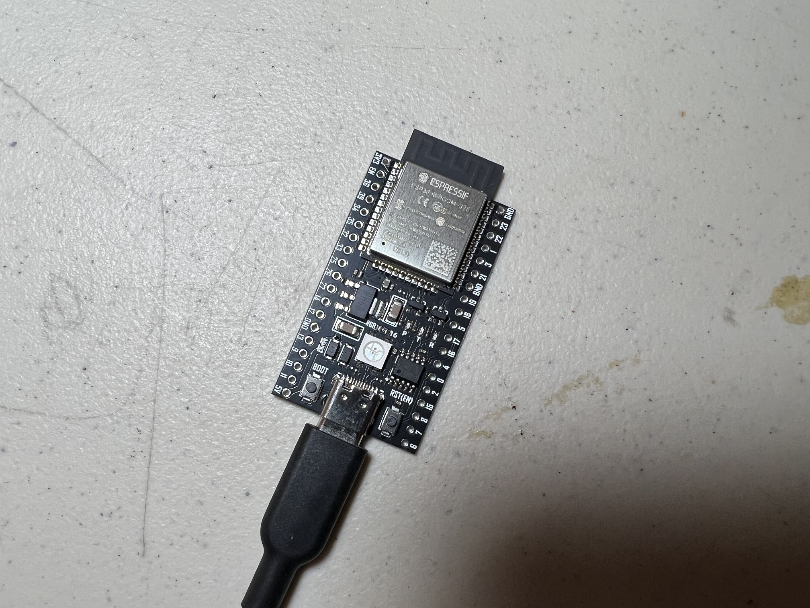

# Controller List

This is a full list of controllers that we currently support.

| | **Controller Type** | **Supported Controllers** | **Guides** |
| --- | --- | ------------------------------------------------------------------------ | --- |
|  | ESP32-S3 | Switch 1: Wired Controller (ETA: v0.56.x)  Switch 2: Wired Controller (compatible with Switch 1) | [Guide (Windows)](Controllers/Controller-ESP32-S3.md) |
|  | ESP32-WROOM | Switch 1: Wireless Pro Controller Switch 1: Left Joycon Switch 1: Right Joycon  (does not work on Switch 2) | [Guide (Windows)](Controllers/Controller-ESP32-WROOM.md) [Guide (Mac)](Controllers/Controller-ESP32-WROOM-MacOS.md) |
|  | Arduino Uno R3 Arduino Leonardo Teensy 2.0 Teensy++ 2.0 Pro Micro | Switch 2: Wired Controller (compatible with Switch 1) | [Arduino Uno R3](Controllers/Controller-ArduinoUnoR3.md) [Arduino Leonardo](Controllers/Controller-ArduinoLeonardo.md) [Teensy(++) 2.0 (Mini-Grabbers)](Controllers/Controller-Teensy2-MiniGrabbers.md) [Teensy(++) 2.0 (Hammer Headers)](Controllers/Controller-Teensy2-HammerHeaders.md) [Pro Micro (Mini-Grabbers)](Controllers/Controller-ProMicro-MiniGrabber.md) [Pro Micro (Hammer Headers)](Controllers/Controller-ProMicro-HammerHeaders.md) |
|  | sys-botbase 2/3 | Switch 1: Wired Pro Controller | [sys-botbase](Controllers/Controller-sys-botbase.md) |

**Discord Server:** 

