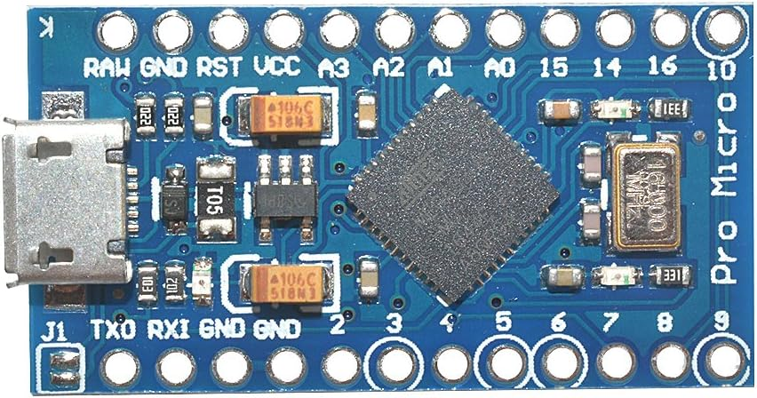
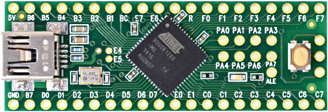

# Controller List

This is a full list of devices and controllers that we currently support.

## Setups/Devices

This table lists all the setups that we have along with the controllers that they support.

| | **Device Type** | **Supported Controllers** | **Guides** |
| --- | --- | ------------------------------------------------------------------------ | --- |
|  | ESP32-S3 | Switch 1: Wired Controller Switch 2: Wired Controller (compatible with Switch 1) | [Guide (Windows)](Controllers/Controller-ESP32-S3.md) |
|  | ESP32-WROOM | Switch 1: Wireless Pro Controller Switch 1: Left Joycon Switch 1: Right Joycon | [Guide (Windows)](Controllers/Controller-ESP32-WROOM.md) [Guide (Mac)](Controllers/Controller-ESP32-WROOM-MacOS.md) |
|  | CFW: sys-botbase 2/3 | Switch 1: Wired Pro Controller | [sys-botbase](Controllers/Controller-sys-botbase.md) |
|  | Arduino Uno R3 | Switch 2: Wired Controller (compatible with Switch 1) | [Arduino Uno R3](Controllers/Controller-ArduinoUnoR3.md) |
|  | Arduino Leonardo | Switch 2: Wired Controller (compatible with Switch 1) | [Arduino Leonardo](Controllers/Controller-ArduinoLeonardo.md) |
|  | Pro Micro | Switch 2: Wired Controller (compatible with Switch 1) | [Pro Micro (Mini-Grabbers)](Controllers/Controller-ProMicro-MiniGrabbers.md) [Pro Micro (Hammer Headers)](Controllers/Controller-ProMicro-HammerHeaders.md) |
|  | Teensy 2.0 Teensy++ 2.0 | Switch 2: Wired Controller (compatible with Switch 1) | [Teensy(++) 2.0 (Mini-Grabbers)](Controllers/Controller-Teensy2-MiniGrabbers.md) [Teensy(++) 2.0 (Hammer Headers)](Controllers/Controller-Teensy2-HammerHeaders.md) |

## Device Types

A "device" is a microcontroller or development board that we will use to emulate a real game controller.

| Image | Description |
| --- | --- |
|  | **ESP32-WROOM** |
|  | **ESP32-S3** |
|  | **Arduino Uno R3**  Supported Controllers: - Switch 2: Wired controller  The Arduino Uno R3 is one of the original boards that spearheaded the Nintendo Switch automation community. However, it's ATmega16U2 AVR8 CPU is very weak with only 512 bytes of ram and 12KB of usable program memory.  This controller is only suitable for emulating the basic wired controllers. It doesn't even have enough memory to hold multiple controller implementations the way that some of the newer controllers can. |
|  | **Arduino Leonardo**  Supported Controllers: - Switch 2: Wired controller  The Arduino Leonardo uses an ATmega32U4 AVR8 CPU. It has significantly more ram and program memory at 2.5KB and 32KB respectively. This was the last addition to the AVR8 microcontroller line up and was chosen because it was easier to setup a serial connection than the Teensy or Pro Micro boards.  Being an AVR8 processor, it shares codebase with the Arduino Uno R3 and thus we only support a single wired controller type on it. |
|  | **Pro Micro**  Supported Controllers: - Switch 2: Wired controller  The Pro Micro uses an ATmega32U4 AVR8 CPU and is functionally the same as the Arduino Leonardo and Teensy 2.0. This was added to our lineup because it was the cheapest microcontroller of this type in volume. Thus it became the work horse for many people with multiple Switches. |
|  | **Teensy 2.0**  Supported Controllers: - Switch 2: Wired controller  The Arduino Uno R3 is one of the original boards that spearheaded the Nintendo Switch automation community.  The Teensy 2.0 uses an ATmega32U4 AVR8 CPU and is functionally the same as the Arduino Leonardo and Pro Micro. This (along with the Teensy++ 2.0) was by far the best board during the microcontroller-only automation era due to the easy-to-use button to put the board into flash mode. It began to fall out of use in the computer-control era due to the difficulty of setting up a serial connection on it. |
|  | **Teensy++ 2.0**  Supported Controllers: - Switch 2: Wired controller  The Teensy++ 2.0 is the same as the Teensy 2.0 with an upgraded AT90USB1286 CPU which has much more ram and program memory.  This extra ram and program memory was never put to use in this project. So it is functionally the same as the Teensy 2.0 along with all its advantages and drawbacks. |

## Controller Types

A "controller" (not to be confused with the microcontrollers above) refers to a game controller that will be emulated for the purpose of controlling the game console.

| Image | Description |
| --- | --- |
|  | **Switch 1: Wired Controller**  This is the standard 3rd party wired that most "officially licensed" controllers use. Most wired controllers from Horipad and PowerA fall into this category.  This controller type only supports the standard buttons/joystick and do not support rumble or gyro. It also does not support custom colors in its icon when connected to the Switch.  These use the standard 8-byte HID report type with 14 buttons, a dpad, and two joysticks with 8-bit precision. |
|  | **Switch 2: Wired Controller**  This is the same as the Switch 1 wired controller, except that they add the GL, GR, and C (gamechat) buttons for the Switch 2. This controller type is backwards compatible with the Switch 1 such that pressing the new buttons simply do nothing on the Switch 1.  These also use the standard 8-byte HID report type with 17 buttons, a dpad, and two joysticks with 8-bit precision. Due to the button field having only 16 bits, the 17'th button (the C button) instead uses an unused bit in the dpad byte. |
|  | **Switch 1: Wireless Pro Controller**  This is the official pro controller from Nintendo - connected wirelessly to the Switch.  At this time, this project does not support gyro, rumble, NFC, or console wake up. So in effect, it is functionally the same as the wired controller - though less stable due to wireless communication.  This uses Nintendo's proprietary 48-byte HID report 0x30.  **Switch 1: Wired Pro Controller**  This is the official pro controller connected to the Switch over USB.  Currently, the only implementation we have is sys-botbase. It does not use reports and instead, directly sets the controller state by writing to system memory. |
|  | **Switch 1: Left + Right Joycons**  These are the official joycons from Nintendo - connected wirelessly to the Switch.  At this time, this project does not support gyro, rumble, NFC, or console wake up.  This uses Nintendo's proprietary 48-byte HID report 0x30. |

## Controller Performance Classes

For the purposes of program compatibility, each setup/device + controller combination is placed into one of 3 performance categories:

- Wired
- Wireless
- sys-botbase 2

Programs that are speed-critical will have separate execution paths optimized for each performance category. (i.e. date spam, Fast Code Entry...)

### Wired:

Wired controllers are by far the most stable with a button timing accuracy of < 1ms (typically ~100us). It is not prone to random disconnects and can connect to the Switch from almost anywhere. This makes it the best suited for automation.

| **Device** | **Controller** |
| --- | --- |
| ESP32-S3 | Switch 1: Wired Controller Switch 2: Wired Controller |
| Arduino Uno R3 Arduino Leonardo Teensy 2.0 Teensy++ 2.0 Pro Micro | Switch 2: Wired Controller |
| sys-botbase 3 (sbb3) | Switch 1: Wired Pro Controller |

### Wireless:

Wireless controllers are less stable and usually have timing variation on the order of 2-10ms. While they are clean and easy to setup with no additional cabling, wireless controllers are generally less reliable since they are prone to random disconnects and high latencies from wireless interference. Nintendo's complicated (and proprietary) wireless protocol means that 3rd party implementations (including this project) are typically less than perfect and prone to compatibility issues.

The main issue with wireless is that it can only reliably connect to the Switch inside the grip menu. So if you get disconnected outside of the grip menu and are unable to reconnect, you will need another controller or physical access to navigate back to the grip menu to re-pair the controller. For this reason, wireless controllers are less suited for remotely controlled automation.

| **Device** | **Controller** |
| --- | --- |
| ESP32 | Switch 1: Wireless Pro Controller Switch 1: Left Joycon Switch 1: Right Joycon |

### sys-botbase 2:

This category exists simply because sys-botbase 2 (sbb2) is extremely unstable with timing variations upwards of 150ms along with massive throughput issues due to backpressure. As a result, many programs written for the above wired and wireless controllers do not work on sbb2.

With the launch of sys-botbase 3 (sbb3), this setup has been deprecated.

| **Device** | **Controller** |
| --- | --- |
| sys-botbase 2 (sbb2) | Switch 1: Wired Pro Controller |

**Discord Server:** 

