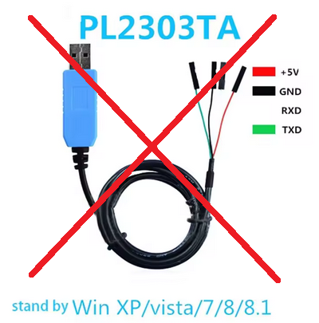
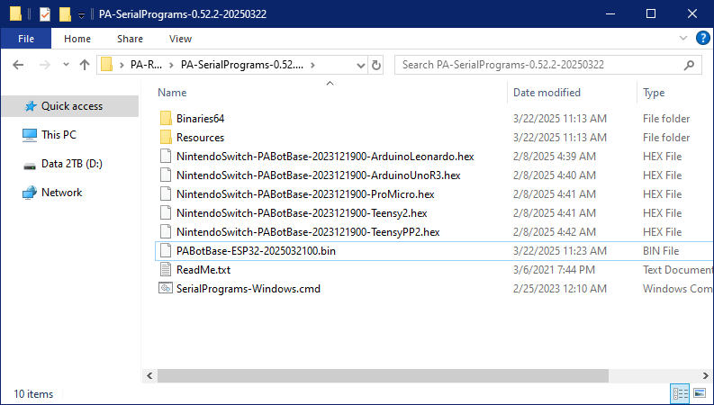

# Controller Setup: Arduino Leonardo

**Video tutorial:** Pokemon Automation Wired Setup with Arduino Leonardo: https://youtu.be/DFXZzWkOEMs

<hr>

The wired controller setup is the most difficult of the setups. Most of you who joined us prior to 2025 will be familiar with this setup.

This version of the wired controller setup uses the Arduino Leonardo. It is the easiest of the wired controllers to setup.

 

## Hardware Setup:

**Required Hardware (Full List):**
1. A regular [Nintendo Switch](../README.md#video-capture-card-the-computers-eyes) and its accessories (dock, power cable, HDMI cable). (You cannot use a Switch Lite.)
2. A [computer](../README.md#the-computer-the-player) running x64 Windows. (or another OS if you are able to set it up.)
3. A [video capture card](../README.md#video-capture-card-the-computers-eyes).
4. An [Arduino Leonardo](https://docs.arduino.cc/hardware/leonardo).
5. USB A to micro USB cable.
6. USB to Serial TTL (UART)
7. Male-Male Jumper Wires

#1-3 are part of the initial setup so you should have all of these already. #4-7 are specific to this controller setup.

**Estimated Total Cost (USD):** (not including computer and Nintendo Switch)
- **Single Setup:** $38 - $48
- **Bulk Purchase:** $33 per setup

### Recommended Purchase Links:

**Capture Card:** [See previous section.](../README.md#video-capture-card-the-computers-eyes)

**Arduino Leonardo:**
  - https://www.digikey.com/en/products/detail/arduino/A000057/3476353
  - https://www.amazon.com/dp/B008A36R2Y
  - https://www.amazon.com/dp/B0786LJQ8K

Ensure the Arduino Leonardo comes with headers (the black squares sticking out at the top and bottom of the board, with a holes in them, as seen in the image above).
You can get either the official Arduino Leonardo, or unofficial Leonardo clones. e.g. KEYESTUDIO

**USB A to micro USB cable:**
  - https://www.digikey.com/en/products/detail/cvilux-usa/DH-20M50057/13177527
  - https://www.amazon.com/dp/B07CZHV9VF/

It may already come with your Arduino.
You need a Micro-USB male to USB-A cable and it must support data-transfer (not just power delivery).

**USB to Serial TTL (UART):**

There are many options here. The one we recommend (for ease of use) is the Adafruit model:
  - https://www.adafruit.com/product/954
  - https://www.digikey.com/en/products/detail/adafruit-industries-llc/954/7064488
  - https://www.amazon.com/dp/B00DJUHGHI/


Or you can search for "CP2102" and you'll get tons of hits from various brands/sellers that look like these:

 

**Important:**

**DO NOT get cables with the Prolific controllers. e.g. PL2303 or any other model number.** They are cheap, do not work, and they are explicitly blocked in the program. **They often look deceptively similar to the Adafruit UART, but they are not the same.** If you buy outside of this link, verify it does not use PL controllers. If you buy it anyway, you will be wasting your time and money. **YOU HAVE BEEN WARNED!**




**Male-Male Jumper Wires:**
  - https://www.digikey.com/en/products/detail/twin-industries/TW-MP-10/2116120
  - https://www.amazon.com/dp/B07S1NGQR1

If purchasing the items from this list, you will need Male to Male Jumper wires.
**WARNING:** If you do ***not*** buy Hardware from this list, you will need to evaluate what you purchased for the correct type of Jumper Wire. e.g. Female-Male jumper wires may be needed instead.


### Hardware Assembly:

Once you have your hardware, you need to make some connections between your UART cables and the Leonardo. Use the jumper wires you bought to connect the two.

**Step 1: Connect UART to the Leonardo**

Make the following connections:
| **UART pin** | **Adafruit UART Wire Color** | **Arduino Leonardo pin** |
| --- | --- | --- |
| TX | Green | RX <- 0 (pin0) |
| RX | White | TX -> 1 (pin1) |
| GND | Black | GND (any one is fine) |
| VCC | Red | Leave unconnected |

> **If you did **not** buy the Adafruit UART, your wire colors will be different!** Refer to your UART's manual or board for the correct pins. Often, with CP210x modules, the pin type is written on the board itself. Also, note that the color of the jumper wires do not matter.


**Step 2: Download QMK Toolbox**

A few QMK versions are known to work. e.g. 0.1.1, 0.2.2, 0.3.1, 0.3.3. Other versions may not work (e.g. 0.3.2 does not work).

Download [QMK Toolbox](https://github.com/qmk/qmk_toolbox/releases). Ensure you download a version known to work. e.g. 0.3.3.

You want the file `qmk_toolbox.exe`. You'll find it under `Assets`, under the version number that you choose (e.g. 0.3.3).

**Step 3: Flash PABotBase into your Device.**

The root folder of the SerialPrograms package should have a set of .hex files for each of the different devices.



1. Run the QMK Toolbox program that you downloaded in PART 2.
2. Open the .hex named `NintendoSwitch-PABotBase-xxxxxxxxx-ArduinoLeonardo.hex`.
3. Change the MCU to `atmega32u4`.
4. Check the "Auto-Flash" box.


5. Plug the Leonardo into your computer.
6. Press the reset button.


The QMK program will now flash the program to the Leonardo and show a bunch of logging.
Afterwards, the 3 LEDs on the Leonardo should flash in unison for 5 seconds before turning off.


7. Unplug the Leonardo from your computer.

**Step 4:**

1. Turn on your Switch and dock it.
2. Connect your Arduino Leonardo to the Switch's dock.
3. Connect the UART to your computer.

At this point, your final setup should look like this:


## Software Setup:

Continue to: [Wired Controller (AVR8) Software Setup](Controller-Software-AVR8.md).

## Common errors with QMK toolbox
| Error | Solution |
| --- | --- |
| .NET error | First, ensure the drivers are installed (Tools -> Install Drivers). If this fails, try using a different version of QMK toolbox. See below for versions known to work. |
| "Flash complete", but no logging is shown | Unplug and replug the microcontroller into the computer and try flashing again. Try different USB ports. Try a different version of QMK toolbox. See below for versions known to work. |
| "COM port not found!" | Same as the issue where you get "Flash complete", but no logging, try unplugging and replugging the microcontroller into the computer and try different USB ports. Also, double check that the USB cable supports data transfer |

**Versions of QMK toolbox known to work:**
- 0.1.1
- 0.2.2
- 0.3.1
- 0.3.3

**General Troubleshooting tips**
- Try different USB ports.
- Try a different USB cable (ensure it supports data transfer).
- Try a different version of QMK toolbox.
- If using QMK toolbox, ensure all drivers are installed.

If all else fails, you can try flashing the hex file directly with avrdude. See the section below for instructions (Flashing the .hex directly with avrdude).

## Flashing the .hex directly with avrdude

1. Download avrdude
    - Download `avrdude-v7.3-windows-x64.zip` from [here](https://github.com/avrdudes/avrdude/releases). (other versions of avrdude may also work)
    - Unzip the folder
2. Open command prompt and change directory to the folder that contains `avrdude.exe`
   - To open command prompt: Press Windows key + R. Type `cmd` in the Run command box. Press `Enter`.
   - To change directory, type into the console:

   `cd "<path to the folder that contains avrdude.exe>"`

   - For example:

   `cd "C:\Users\Public\Pokemon\avrdude-v7.3-windows-x64"`

   - To confirm that this was done properly, type `avrdude` into the console. You should see the avrdude version number, as well as a list of options available.

   

3. Confirm your microcontroller's COM port.
    - Open Device Manager: Right click Start button -> Click "Device Manager"
    - Ensure hidden devices are shown: Click "View" in the toolbar -> "Show hidden devices"
    - Ensure the Leonardo is plugged into your computer and click the Leonardo's reset button. It should then show up in the Device Manager under `Ports (COM & LPT)`, as `USB Serial Device (COM#)`. Often, the Leonardo will then disconnect itself after a few seconds, and it will be greyed out in the list. However, if "Show hidden devices" is enabled, you should still be able to see the device and its COM port number.
    - In this example, the COM port for my Leonardo is COM3.

    

4. Flash the hex file with avrdude
   - Ensure the Leonardo is plugged into your computer and click the Leonardo's reset button. For a few seconds, it will no longer be greyed out in the Device manager. This means it's connected to your computer.

    

   - While the Leonardo is connected for those few seconds, type/paste the following command into the console:

    `avrdude.exe -p atmega32u4 -c avr109 -U flash:w:"<path to hex file>":i -P COM<number for COM port>`

   - For example:

   `avrdude.exe -p atmega32u4 -c avr109 -U flash:w:"C:\Users\Public\Pokemon\NintendoSwitch-TurboA-ArduinoLeonardo.hex":i -P COM3`

   - Note: The Leonardo only stays connected for a few seconds, so I recommend typing the command ahead of time in something like Notepad, then pasting the command into the console when you're ready.


If flashed successfully, it should look something like this:

```
C:\Users\Public\Pokemon\avrdude-v7.3-windows-x64>avrdude.exe -p atmega32u4 -c avr109 -U flash:w:"C:\Users\Public\Pokemon\NintendoSwitch-TurboA-ArduinoLeonardo.hex":i -P COM3

Connecting to programmer: .
Found programmer: Id = "CATERIN"; type = S
    Software Version = 1.0; No Hardware Version given.
Programmer supports auto addr increment.
Programmer supports buffered memory access with buffersize=128 bytes.

Programmer supports the following devices:
    Device code: 0x44

avrdude.exe: AVR device initialized and ready to accept instructions

Reading | ################################################## | 100% 0.00s

avrdude.exe: Device signature = 0x1e9587
avrdude.exe: NOTE: FLASH memory has been specified, an erase cycle will be performed
             To disable this feature, specify the -D option.
avrdude.exe: erasing chip
avrdude.exe: reading input file "C:\Users\Public\Pokemon\NintendoSwitch-TurboA-ArduinoLeonardo.hex"
avrdude.exe: writing flash (7858 bytes):

Writing | ################################################## | 100% 0.75s

avrdude.exe: 7858 bytes of flash written
avrdude.exe: verifying flash memory against C:\Users\Public\Pokemon\NintendoSwitch-TurboA-ArduinoLeonardo.hex:
avrdude.exe: load data flash data from input file C:\Users\Public\Pokemon\NintendoSwitch-TurboA-ArduinoLeonardo.hex:
avrdude.exe: input file C:\Users\Public\Pokemon\NintendoSwitch-TurboA-ArduinoLeonardo.hex contains 7858 bytes
avrdude.exe: reading on-chip flash data:

Reading | ################################################## | 100% 0.19s

avrdude.exe: verifying ...
avrdude.exe: 7858 bytes of flash verified

avrdude.exe: safemode: Fuses OK

avrdude.exe done.  Thank you.
```

### Troubleshooting

| Error | Solution |
| --- | --- |
| ArduinoLeonardo.hex is not readable: No such file or directory | Double check that you typed your file path to the .hex file correctly. Ensure there aren't any extra spaces that shouldn't be there. |
| cannot open port \\\\.\COM#: The system cannot find the file specified. | Make sure you typed in the correct COM port number. Also, make sure the Leonardo is plugged in and detectable by the Device Manager. If not, click the Leonardo's reset button |


<hr>

**Discord Server:** 

**Credits:**
- Kuroneko/Mysticial
- jw

[](https://discord.gg/cQ4gWxN)


