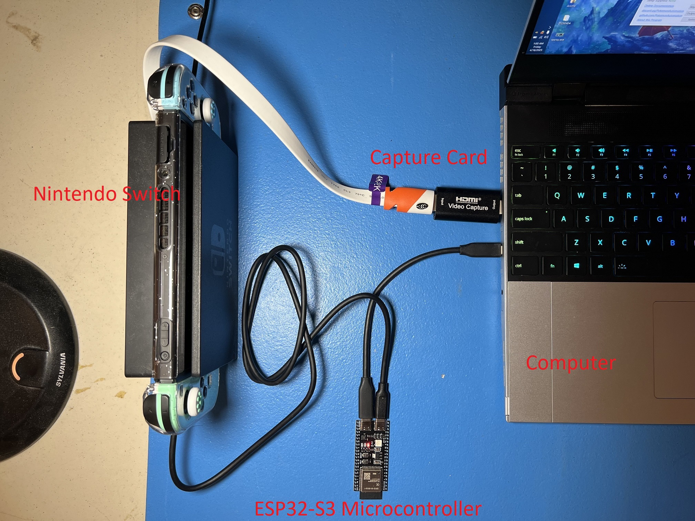
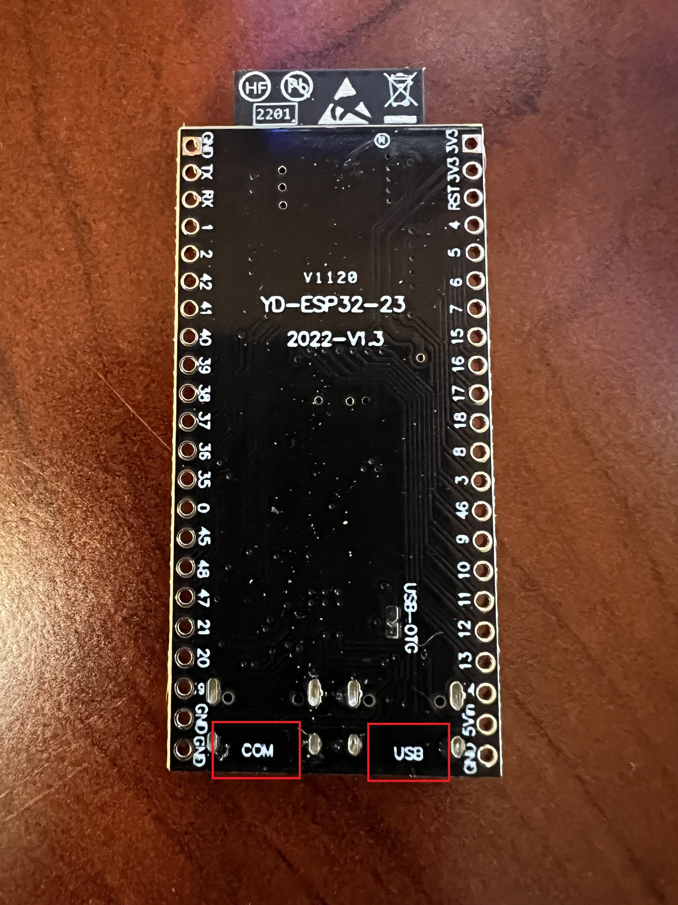
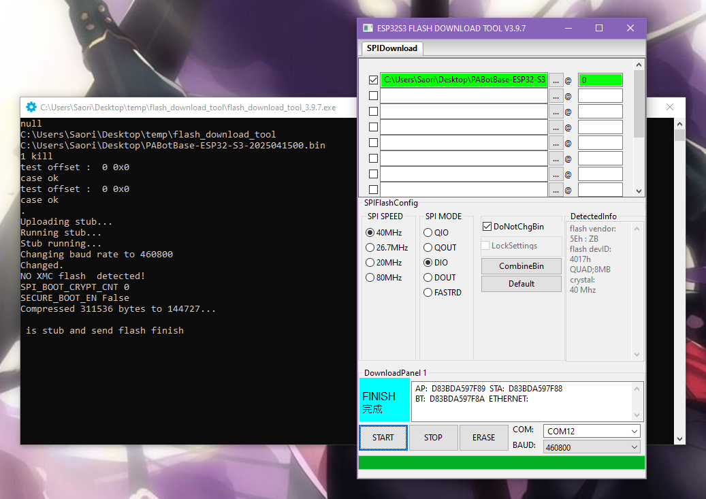
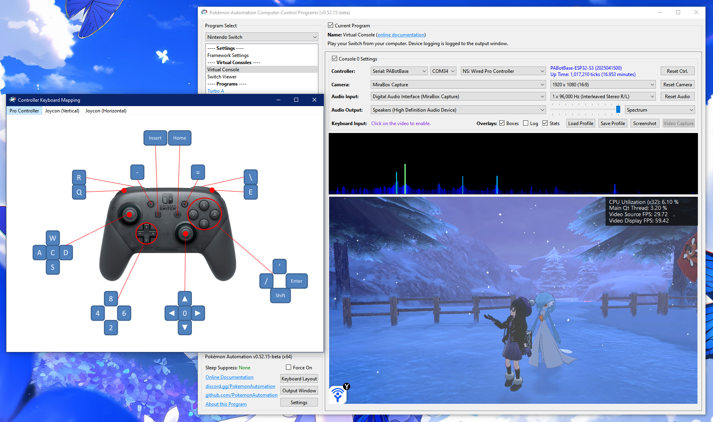

# Controller Setup: ESP32-S3

**Video tutorial:** Pokemon Automation Wired setup with ESP32-S3: https://youtu.be/ezBuwk48z8w

This is the brand new wired controller setup that is much easier to do than the old AVR8 ones using Arduino or Teensy. This is the recommended controller for new and existing users alike as it is the only easy-to-setup controller that works on the Switch 2.

If you are setting up a wired controller setup for the first time, we recommend this option.

 

Note that ESP32 and ESP32-S3 are different controllers made by the same company (Espressif).
 - ESP32 (aka ESP32-WROOM) is used for the wireless controller setup.
 - ESP32-S3 is used for this wired setup.

While the ESP32-S3 supports Bluetooth, it only supports Bluetooth LE. It does not support Bluetooth Classic as required by the Nintendo Switch. Therefore, it cannot be used for a wireless setup the same way the ESP32 can. However, the ESP32-S3 has 2 USB ports. Thus it can connect to both the computer and the Switch for a new setup that eliminates the need to manually wire up a UART as was required by the Arduino/Teensy setups.

## Hardware Setup:

**Required Hardware (Full List):**
1. A regular [Nintendo Switch](../README.md#video-capture-card-the-computers-eyes) and its accessories (dock, power cable, HDMI cable). (You cannot use a Switch Lite.)
2. A [computer](../README.md#the-computer-the-player) running x64 Windows. (or another OS if you are able to set it up.)
3. A [video capture card](../README.md#video-capture-card-the-computers-eyes).
4. An ESP32-S3 microcontroller.
5. Two USB-C cables. One connects the ESP32-S3 to the computer while the other connects it to the Switch.

#1-3 are part of the initial setup so you should have all of these already.

**Estimated Total Cost (USD):** (not including computer and Nintendo Switch)
- **Single Setup:** $25 - $35
- **Bulk Purchase:** ~$18 per setup

**Important:** There are many variants of the ESP32 microcontroller. Only the ESP32-S3 will work. So you must get that specific model. (e.g. Don't get the ESP32-WROOM, or ESP32-S2-WROOM, or ESP32-C2, etc.)

### Recommended Purchase Links:

**Capture Card:** [See previous section.](../README.md#video-capture-card-the-computers-eyes)

**ESP32-S3 Microcontroller:**

| **Quantity** | **Price / Unit** | **Shopping Link** |
| --- | --- | --- |
| 1 (no pins) | $9 / unit | https://www.amazon.com/gp/product/B0BVVGNBB3/ |
| 3 (no pins) | $6 / unit | https://www.amazon.com/gp/product/B0C9H7Y66W/ |

Even though these are all made in China, AliExpress isn't much cheaper. (~$6/unit in bulk)

**Important:**

The ESP32-S3 exists in two variants: 1 USB or 2 USBs. You must get a model that has 2 USB ports on it. 

We recommend getting ones without pins since you don't need them. Having the pins is a liability for accidentally shorting out and damaging the board.

**USB Cables:**
- USB-C -> USB-A: https://www.amazon.com/Charging-Durable-Station-Compatible-Samsung/dp/B08LL1SVZD
- USB-C -> USB-C: https://www.amazon.com/3-Pack-Charging-Braided-iPhone-Samsung/dp/B0D222QDF1

Pick the ones that are appropriate for your computer and Switch dock.

### Hardware Assembly:

Unlike the ESP32 wireless setup, there are two USB ports. They are not interchangable so you must connect the right ones to the right places.

1. Turn your ESP32-S3 over to the back side. Next to each of the two USB ports, you will see the labels "USB" and "COM" (or "UART" and "OTG"). These identify which port is which.
2. Connect the "USB"/"OTG" side to your Nintendo Switch.
3. Connect the "COM"/"UART" side to your computer.

And that's it! One extra cable compared to the ESP32 wireless setup, but still much simpler than the Arduino/Teensy setups. The "COM" port is the built-in UART that eliminates the need to manually wire up an external UART.

## Software Setup

### Step 0: Getting Ready

Make sure you have everything else setup so that it looks like this:

If not, you should go back to the [general setup guide](../README.md) and start over.

### Step 1: Install UART drivers (potentially)

Depending on exactly which ESP32-S3 model you bought, you may need to install UART drivers.

Open up Device Manager and look for ESP32-S3 under "Ports". If you don't see it, then you might not the correct driver installed. Or try a different USB port.

If you need drivers, it will either be CH340 or CP210x, depending on what ESP32-S3 model you have. If you don't know which one you have, install both.

Install the appropriate driver for it:
- CP210x: https://www.silabs.com/documents/public/software/CP210x_Windows_Drivers.zip
- CH340: https://www.arduined.eu/ch340-windows-10-driver-download/

Only do this step if you do not see ESP32-S3 show up in device manager as a serial (COM) device.

### Step 2: Flash the firmware to the ESP32.

**Flash the ESP32:**

1. Download the Espressif flash utility: https://dl.espressif.com/public/flash_download_tool.zip
2. Unzip, then run `flash_download_tool_3.9.7.exe` (version number may vary)
3. When you see the following menu, select "ESP32-S3", "Develop", and "UART". Then hit OK.

4. You will then be prompted with this complicated window. Fill everything as follows:
   - Check the box for the first entry, at the top left.
   - For the first entry, click on the `...` and browse for `PABotBase-ESP32-S3-2025032100.bin` in the serial programs download folder. (version number may vary)
   - The right-most box should be a zero.
   - **The top row should now be green** (see image below). If not, ensure that the top left checkbox is checked.
   - At the bottom right corner, select the COM port of your ESP32-S3.
   - Change "BAUD" to 460800.

5. Click Start and it should flash the PABotBase firmware to your ESP32-S3.

If everything worked correctly, you should see a green progress bar like this. If you see that it gets stuck printing out `...` and never makes progress, see [troubleshooting](#unable-to-flash-the-esp32-s3-stuck-on-).

6. Reboot your ESP32-S3. You can do this either by:
   - Pressing either the `EN` or `RESET` button on the ESP32-S3.
   - Unplugging both USB cables and plugging them back in.

### Step 3: Connect the ESP32-S3 to the Computer Control program

1. At the top for the "Controller" option, click the dropdown and select `Serial: PABotBase` (should be on this since this is the default)
2. In the next dropdown, select your serial device. On Windows it will be something like `COM3`.

If you don't see the device in the dropdown, you probably need to refresh it (especially if you kept the program open since Step 0). You can refresh the list by clicking "Reset Ctrl".

If everything worked correctly, it will look like this:

### Step 4: Navigate your Switch to where it will accept a new controller.

The ESP32-S3 behaves like a real wired controller. So it can only connect if your Switch is ready for it.

Places where the Switch will accept a new controller:
1. The grip menu.
2. The Switch home or settings.
3. In a game when no other controllers are connected.

### Step 5: Test the connection

You can control your Switch from the keyboard. Click on the video display to activate the keyboard controls. Then try pressing some buttons. You can view the keyboard -> controller mapping by clicking on the "keyboard layout" at the bottom left corner of the program.

We recommend familiarizing yourself with the keyboard controls as this is the preferred way to control your Switch while setting up to run a program. In effect you can play your Switch from your computer. While it's not as nice as using a native controller, it is good enough to easily setup programs - especially if you're doing this remotely where you do not have physical access to the Switch.

The default layout is the standard WASD setup for FPS games on the most common QWERTY keyboard layout. If you don't like it or you have a different keyboard layout, you can change the key mappings in the "Framework Settings" panel at the top of the program list to the left.

### Step 6: You are done!

If keyboard commands are working (along with video and audio), you are done!

Try clicking on other programs on the sidebar. You will find that all of them are "virtual consoles" that will accept keyboard commands. At the top of every program is a link to the wiki that explains how to setup and use that program.

Continue on to [Finishing Up](../README.md#step-4-finishing-up)!

## Troubleshooting:

### Unable to flash the ESP32-S3. (stuck on `...`)

If you see that it gets stuck printing out `...` and never makes progress, try one of these:

**Solution 1:**
  1. Start the flash such that it is printing out `...`
  2. Press and hold the `BOOT` button on the ESP32-S3.
  3. Release the `BOOT` button when you see the green bar make progress.
     
**Solution 2:**
  1. Start the flash such that it is printing out `...`
  2. Press and hold the `RESET` (EN) button.
  3. Press and hold the `BOOT` button.
  4. Release the `RESET` (EN) button.
  5. Release the `BOOT` button.

If neither solution works:
 - Try a different USB port on your computer.
 - Try putting a USB2 hub between the computer and the ESP32-S3.
 - Make sure the correct USB port on the ESP32-S3 is connected to the computer. Connect the "COM"/"UART" side to your computer. The ports may be labeled on the board's underside. The port labeled as "OTG" should not be connected to your computer.

If nothing works, you are not alone! This is a common problem with ESP32 boards.
 - Further reading: https://www.reddit.com/r/esp32/comments/11awl5h/a_fatal_error_occurred_failed_to_connect_to_esp32/
 - Come to [our Discord](https://discord.gg/cQ4gWxN) for help.

### Unable to flash the ESP32-S3: `no log file output`
- Try switching the USB cable. Make sure it supports data transfer, not just power delivery.
   - When plugging in the ESP32, the device should show up in `Device Manger`, under Ports.

### Problem with flashing ESP32-S3: Download tool shows `FINISH`, but no green progress bar appeared.`
Ensure the top left checkbox is checked. The top row should be green. Ensure the correct COM is selected, and BAUD is set to 460800. Then try flashing again.

### Unable to connect to the ESP32-S3. e.g. stuck on `Connecting...`

If you are unable to connect to the ESP32 in step 2 it means the ESP32-S3 either isn't booting up properly, or it isn't properly flashed. 

Try the following:
 - Ensure you have reset the device. Try disconnecting all cables to the ESP32-S3 device, then reconnect them.
 - Ensure the USB cables are connected to the correct ports on the ESP32-S3. The two ports are NOT interchangeable. See [Hardware Assembly](#hardware-assembly) above.
 - Try different USB cables and different USB ports. Sometimes it will not flash properly over certain USB ports.
 - If this still fails, review [step 1](#step-1-flash-the-firmware-to-the-esp32) above (Flash the firmware to the ESP32) and ensure that you flashed the firmware properly onto the device.
    - When flashing, ensure that the top left checkbox is checked. The top row should be green.
    - Make sure the correct USB port on the ESP32-S3 is connected to the computer. Connect the "COM"/"UART" side to your computer. The ports may be labeled on the board's underside. The port labeled as "OTG" should not be connected to your computer.
  
### Unable to connect to the Switch. e.g. "Connected: No - Ready: No"
Likely an issue with the connection from the ESP32-S3 to the Switch. 
- Try a different USB cable that connects the ESP32-S3 to the Switch; make sure it supports data transfer.
- Try a different USB port on the Switch dock.

### Keyboard controls don't work.

If you find that you're unable to get any button presses to show up on the Switch (keyboard controls don't work and programs aren't doing anything), it's likely that the ESP32-S3 is not connected to the Switch.

There can be many causes of this:
1. You're inside a game that only allows one controller and the ESP32-S3 is not the primary controller because there's another controller connected to it. In this case, disconnect that other controller.
2. The Switch is bugged out and won't accept any wired controller. Try redocking your Switch, entering/exiting sleep mode, or rebooting it completely.

**Credits:**
- Kuroneko/Mysticial
- jw
- kichithewolf

**Discord Server:** 

