# Controller Setup: ESP32-WROOM (MacOS)

### ***Note: This setup is currently does not work on the Switch 2. We hope to fix this in the future.***

This setup uses an ESP32 microcontroller to emulate a wireless controller. It can emulate both left and right joycons as well as the wireless pro controller. Since this covers all the controller types, an ESP32 will be able to run nearly our entire repertoire of programs for the Nintendo Switch.

The USB port plugs into the computer which is how the program will control it. At the other end is an antenna that supports Bluetooth which is how it will fake itself as a joycon or a wireless pro controller to the Switch.

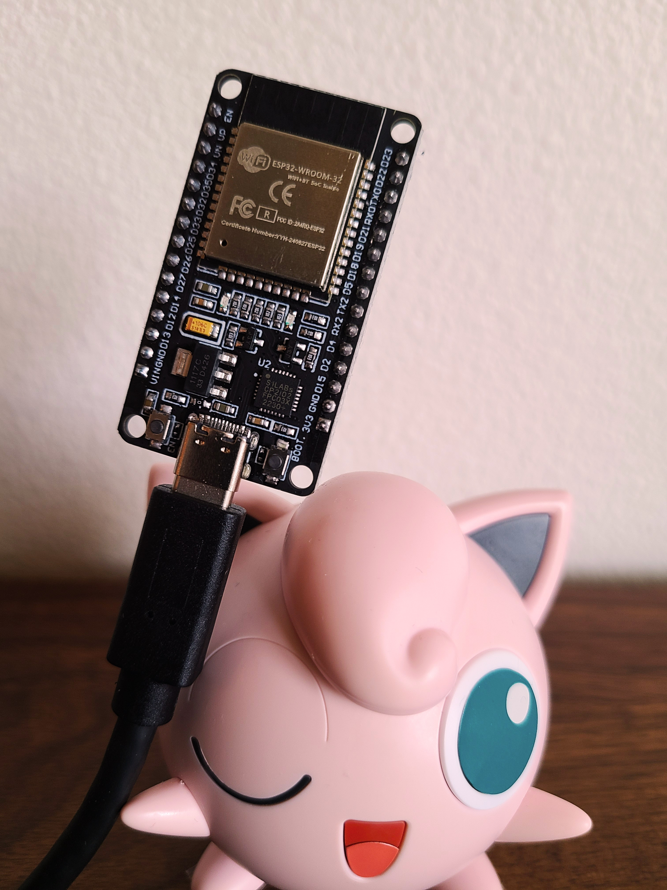 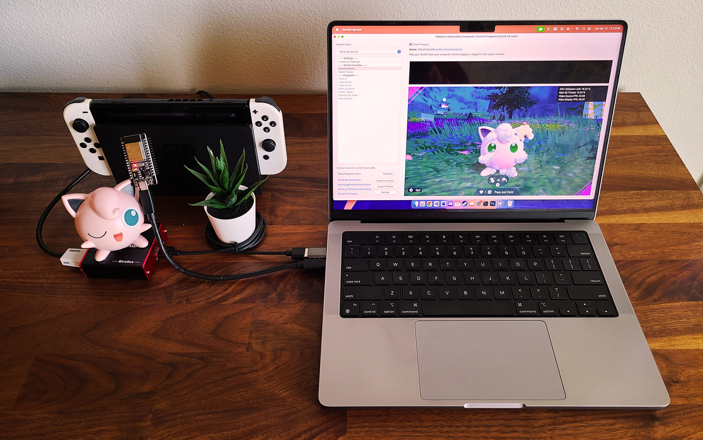

## Hardware Setup:

**Required Hardware (Full List):**
1. A regular [Nintendo Switch](../README.md#video-capture-card-the-computers-eyes) and its accessories (dock, power cable, HDMI cable). (You cannot use a Switch Lite.)
2. A [computer](../README.md#the-computer-the-player) running MacOS
3. A [video capture card](../README.md#video-capture-card-the-computers-eyes).
4. An ESP32-WROOM-32 microcontroller.
5. A micro-USB or USB-C to USB-A cable or dongle. Needs to connect your ESP32 to your computer. ESP32 can have either micro-USB or USB-C, so find out what you have before buying the cable for it.

#1-3 are part of the initial setup so you should have all of these already.

**Estimated Total Cost (USD):** (not including computer and Nintendo Switch)
- **Single Setup:** $25 - $35
- **Bulk Purchase:** ~$17 per setup

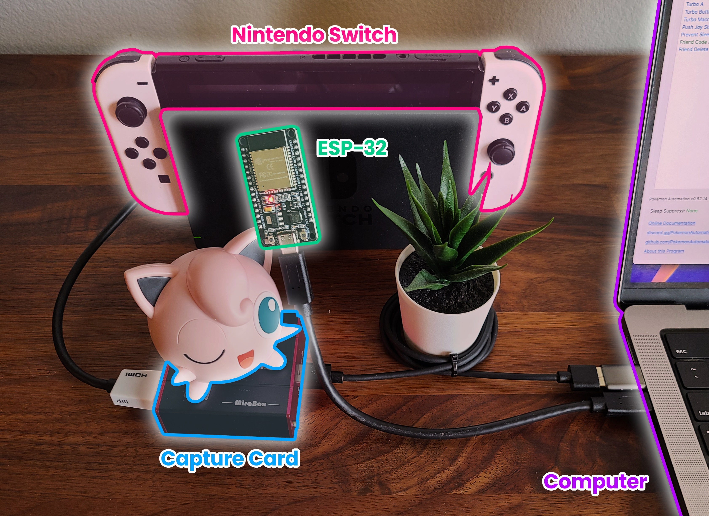

**Important:** There are many variants of the ESP32 microcontroller. The ESP32-WROOM is the only one that works here. So you must get that specific model. (e.g. Don't get the ESP32-S3-WROOM, or ESP32-S2-WROOM, or ESP32-C2, etc.)


### Recommended Purchase Links:

**Capture Card:** [See previous section.](../README.md#video-capture-card-the-computers-eyes)

**ESP32-WROOM-32 Microcontroller:**

For Beginners

| **Quantity** | **Price / Unit** | **USB Type** | **UART Type** | **Shopping Link** |
| --- | --- | --- | --- | --- |
| 1 (with pins) | $8 / unit | USB-C | CP2102  | https://www.amazon.com/gp/product/B0DG8JFY3C |
| 2 (with pins) | $6.50 / unit | Micro-USB | CP2102  | https://www.amazon.com/gp/product/B09XDMVS9N |
| 2 (no pins) | $9 / unit | USB-C | CH340  | https://www.amazon.com/gp/product/B0D6BH4K9B |

For Experienced users

| **Quantity** | **Price / Unit** | **USB Type** | **UART Type** | **Shopping Link** |
| --- | --- | --- | --- | --- |
| 3 (no pins) | $5.67 / unit | Micro-USB | CP2104 | https://www.amazon.com/gp/product/B09C5RDZ8G |
| 8 (no pins) | $5 / unit | Micro-USB | CP2104 | https://www.amazon.com/gp/product/B08MFCC4SR |
| many | ~$3 / unit | various | various | https://www.aliexpress.us/item/3256807120332765.html<br>AliExpress is generally the cheapest in bulk.<br>But you need to know what you're buying. |

**Important:**
If you pick a model that's not in this list, make sure it has a built-in antenna. The ESP32-WROOM-32U and ESP32-WROOM-32UE models do not have a built-in antenna and require you to attach one.

If you're not experienced with electronics, we recommend buying one with both the Reset/EN and Boot/IO0 buttons, because it makes it easier to troubleshoot certain issues. All of the boards listed in the "For Beginners" section should have both the Reset and Boot buttons. The D1 mini boards (listed under "For Experienced users") are cheaper and smaller, but they only have a single Reset button, which can make it harder to troubleshoot certain issues.

We recommend getting ones without pins since you don't need them (though they are more expensive). Having the pins is a liability for accidentally shorting out and damaging the board.

Most likely you will end up buying a pack of at least 2 or 3 since they don't get any cheaper in single quantity. This is great if you want to automate multiple Switches.

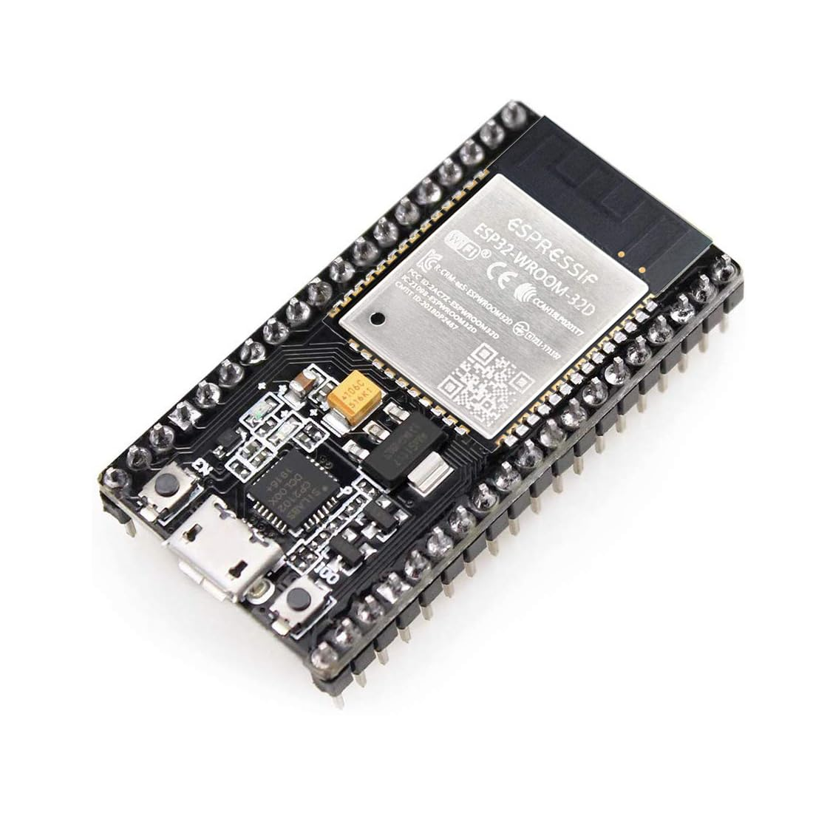   

**A micro-USB or USB-C to USB-A cable:**
- Micro-USB -> USB-A Cable: https://www.amazon.com/Android-Compatible-Smartphones-Charging-Stations/dp/B095JZSHXQ
- Micro-USB -> USB-A Dongle: https://www.amazon.com/gp/product/B09FXJD61Z
- USB-C -> USB-A: https://www.amazon.com/Charging-Durable-Station-Compatible-Samsung/dp/B08LL1SVZD

Different ESP32 models have different USBs on them. Make sure you buy the one that matches your model.

### Hardware Assembly:

Should be pretty self-explanatory:

1. Connect the ESP32 to your computer using the USB cable.
2. Place the ESP32 near your Switch. (within 3ft line-of-sight for maximum stability)

And that's it!


## Software Setup

### Step 0: Getting Ready

Make sure you have everything else setup so that it looks like this:


If not, you should go back to the [general setup guide](../README.md) and start over.

### Step 1: Install UART drivers

Depending on exactly which ESP32 model you bought, it will have either an CH340 or a CP210x. (If you recognize these model #s from the wired controller setup, they are the same thing!)

Install the appropriate driver for it:
- CP210x: https://www.silabs.com/documents/public/software/Mac_OSX_VCP_Driver.zip
- CH340: https://cdn.sparkfun.com/assets/learn_tutorials/8/4/4/CH341SER_MAC.ZIP

If you don't know which one you have, install both.

Alternatively, the CP210X driver can be installed via brew:
```
brew install --cask silicon-labs-vcp-driver
```

Open up System Information and look for it under USB → USB Device Tree. If you don't see it, then maybe these above drivers are not correct. Or try a different USB port.

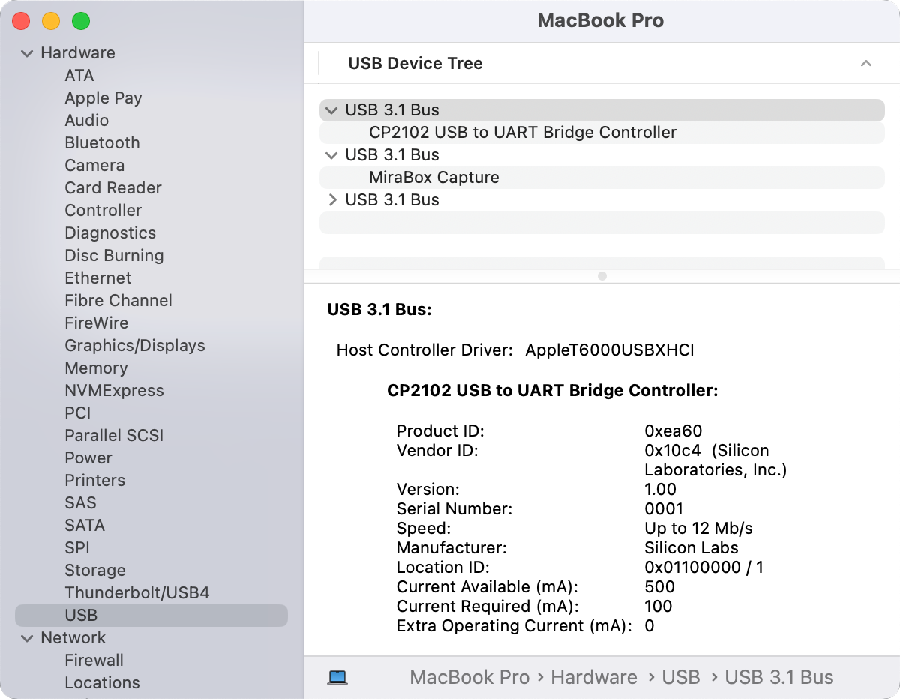

### Step 2: Get ESP-32 PABotBase Firmware.
Download the latest version of PABotBase-ESP32 from [here](https://github.com/PokemonAutomation/AutoBuildRelease/releases). If you have the ESP32-S3 variant, download the corresponding ESP32-S3 binary.

> Make sure to download the PABotBase that's part of the same release as your SerialPrograms

### Step 3: Flash the firmware to the ESP32.

**Flash the ESP32:**
1. On Google Chrome or Microsoft Edge, visit https://espressif.github.io/esptool-js/
2. Under `Program`, you may keep the `Baudrate` at the default of 921600.
3. Click `Connect`.
4. Select your ESP32 device in the pop-up. Click `Connect`.
   
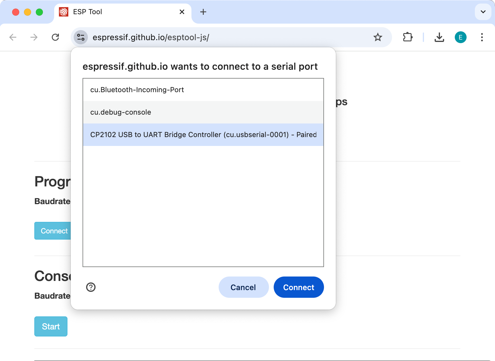

5. Under `Flash Address`, set the text box to 0x0 (instead of the default 0x1000)
6. Click `Choose File`: Select the firmware file (`PABotBase-ESP32-<version>.bin`), then click `Open` to choose the file.
7. Click `Program`.

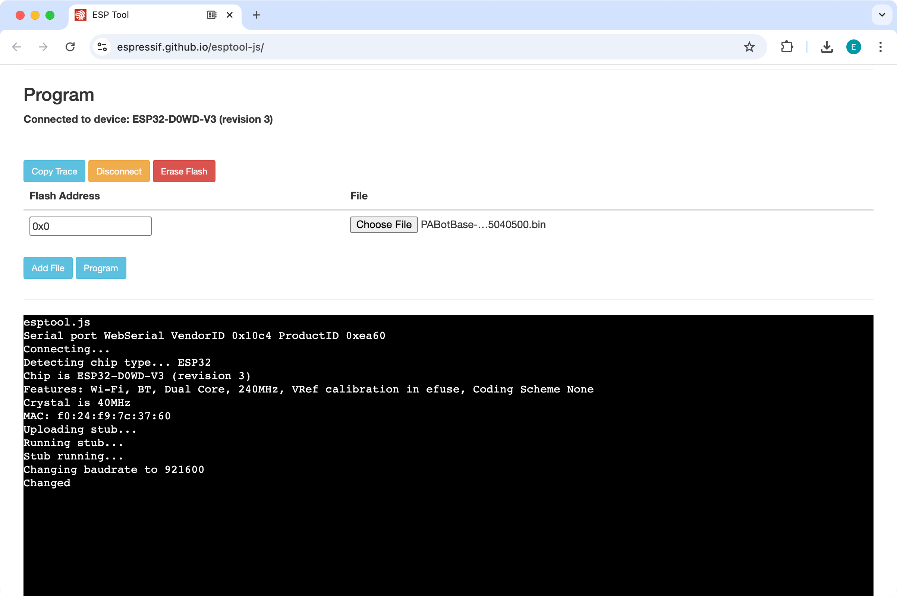

8. Click `Program`.

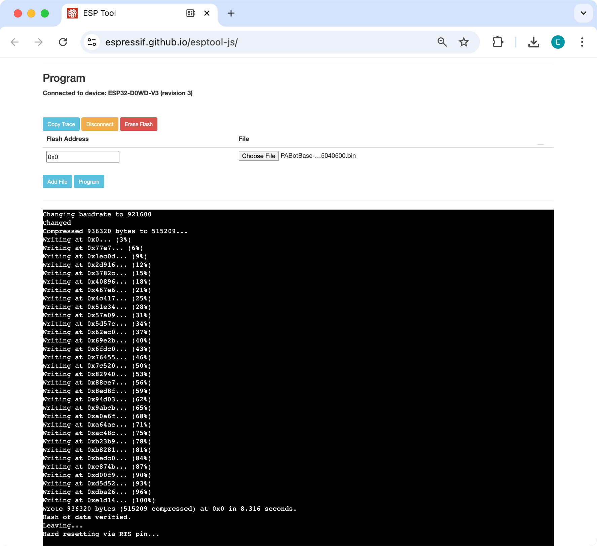

9. Wait for the program to flash. If successful, you should see the following in the console:
```
Hash of data verified.
Leaving...
Hard resetting via RTS pin...
```
> If instead, you get the error: `Error: Invalid head of packet (0x80): Possible serial noise or corruption.`. Then refresh the page, restart at step 2, but try changing the baudrate to 115200.

10. Click `Disconnect` to unmount

### Step 4: Navigate to the Grip Menu

The Grip menu is the only place where the ESP32 can connect to the Switch. 

To get there from the Switch Home screen: `Controllers` (button next to the Settings gear) -> `Change Grip/Order`


### Step 5: Connect the ESP32 to the Computer Control program

1. At the top for the "Controller" option, click the dropdown and select `Serial: PABotBase` (should be on this since this is the default)
2. In the next dropdown, select your serial device. On Mac it will be something like `cu.usbserial-#`.

If you don't see the device in the dropdown, you probably need to refresh it (especially if you kept the program open since Step 0). You can refresh the list by clicking "Reset Ctrl".

If everything worked correctly, it will look like this:

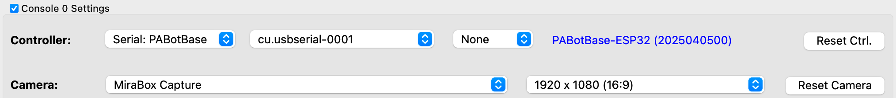

Both the wired and wireless setups use serial ports. The program can distinguish them when it connects to it.

If you see neither, then see [troubleshooting](#troubleshooting).

### Step 5: Connect the ESP32 to the Switch

In the 3rd dropdown, choose "Switch: Wireless Pro Controller".

After 5 seconds, you should see a controller pop-up in the Grip menu on the Switch. If the controller doesn't show up, then press the `EN` or `RESET` button on the ESP32 board, and wait another 5 seconds. Alternatively, unplug/replug the ESP32.

The controller colors are randomized and should match the color icons in the status indicator. This helps to distinguish controllers if you have multiple of them. You can change the colors in the `Nintendo Switch -> Framework Settings` menu.

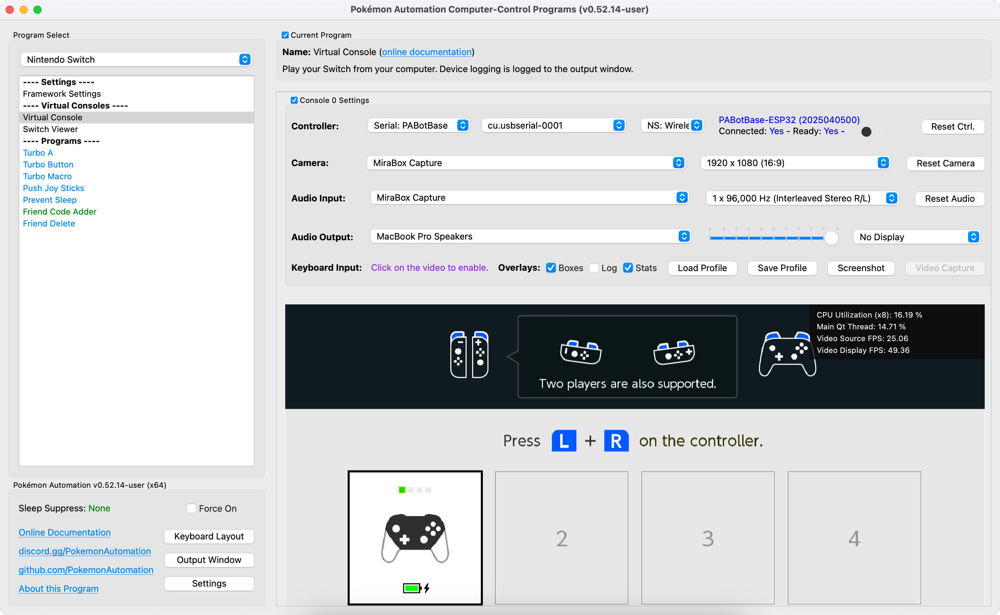


### Step 6: Test the connection

You can control your Switch from the keyboard. Click on the video display to activate the keyboard controls. Then try pressing some buttons. You can view the keyboard -> controller mapping by clicking on the "keyboard layout" at the bottom left corner of the program.

We recommend familiarizing yourself with the keyboard controls as this is the preferred way to control your Switch while setting up to run a program. Each controller type has a different keyboard mapping. By default, the joystick (left joystick for Pro Controller) is mapped to the usual WASD setup that's used in FPS games. For joycons, there are two sets of mappings (using different keys) that will serve both vertical and sideways orientations.

Overall, the idea here is that you can play your Switch from your computer. While it's not as nice as using a native controller, it is good enough to easily setup programs - especially if you're doing this remotely where you do not have physical access to the Switch.

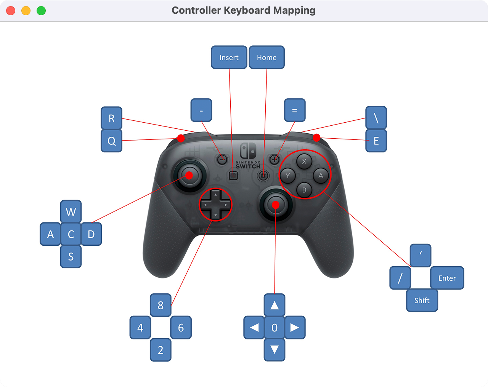

**Controller Types:**

You will notice that there are 4 controller options:
- None
- Pro Controller
- Left Joycon
- Right Joycon

"None" simply idles the ESP32 so it isn't trying to connect to a Switch. The others tell the ESP32 to act as that controller respectively. Every time you press "Reset Ctrl" or change the controller type, it will disconnect from your Switch and try to reconnect using the new controller type. So you will need to be in the Grip menu or it will stay disconnected. (important if you are accessing remotely!)

Changing programs (or even closing the application entirely) will not disconnect the ESP32 from the Switch. When you load a program and connect to the ESP32, it will automatically continue its previous connection to the Switch (and change the controller dropdown accordingly). So you can remotely control your Switch if you are careful enough.

If you intend to do a lot of remote access, we recommend that you use a wired setup as a wired controller can connect to the Switch from anywhere and take control.

**Connecting as Joycon:**

When you connect as a joycon, it will behave like a normal joycon. It doesn't immediately connect and wants you to either pair with a 2nd joycon or press SL+SR to put it into horizontal mode

For the right joycon, you can press the Home button to immediately leave the grip menu. This will let you easily start LGPE programs which use the right joycon. The left joycon doesn't have this option and will require you to either pair with a right joycon or to enter horizontal mode. There are currently no programs that use the left joycon.

To enter horizontal mode, you can press SL+SR on the keyboard controls by pressing F1 and F3 at the same time. This will let you exit the grip menu and enter a game like LGPE that requires a joycon. But keep in mind that this will also rotate the controls by 90 degrees (IOW, confusing). Check the keyboard mapping for both vertical and horizontal joycon orientations.

*You cannot easily pair two ESP32 joycons anyway since you need to press L+R on them simultaneously and the keyboard controls don't allow you simultaneously press buttons on different controllers. However, you can easily pair an ESP32 joycon with a real joycon.

### Step 7: You are done!

If keyboard commands are working (along with video and audio), you are done!

Try clicking on other programs on the sidebar. You will find that all of them are "virtual consoles" that will accept keyboard commands. At the top of every program is a link to the wiki that explains how to setup and use that program.

Continue on to [Finishing Up](../README.md#step-4-finishing-up)!


## Troubleshooting:

### Unable to flash the ESP32. (stuck on `...`)

Try one of these:

**Solution 1:**
  1. Start the flash
  2. Press and hold the `BOOT` button on the ESP32.
  3. Release the `BOOT` button when you see the green bar make progress.
     
**Solution 2:**
  1. Start the flash
  2. Press and hold the `RESET` (EN) button.
  3. Press and hold the `BOOT` button.
  4. Release the `RESET` (EN) button.
  5. Release the `BOOT` button.

If your ESP32 doesn't have a `BOOT` button (such as the D1 mini ESP32), you can achieve the same thing by shorting the `IO0` and `GND` pins/holes.

If neither solution works:
 - Try a different USB port.
 - Try putting a USB2 hub between the computer and the ESP32.

If nothing works, you are not alone! This is a common problem with ESP32 boards.
 - Further reading: https://www.reddit.com/r/esp32/comments/11awl5h/a_fatal_error_occurred_failed_to_connect_to_esp32/
 - Come to [our Discord](https://discord.gg/cQ4gWxN) for help.

### Unable to flash the ESP32: Device not found
 - Try switching the USB cable. Make sure it supports data transfer, not just power delivery.
    - When plugging in the ESP32, the device should show up in `System Information`, under Hardware > USB.

### Unable to connect to the ESP32.

If you are unable to connect to the ESP32 in step 4, it means the ESP32 either isn't booting up properly, or it isn't properly flashed. You may also try disconnecting and reconnecting the ESP32 device. If this still fails, review step 2 above and ensure that you flashed the firmware properly onto the device.


### ESP32 fails to connect to Switch.

If in step 5, you are unable to connect to the Switch, (controller never shows up), here are some things to check:

- Is it close enough to the Switch? (these are wireless devices after all)
- Is the Switch in airplane mode?
- Is it already paired with a different Switch?
- There are reports of CFW ldm-mitm interfering with the ESP32. (This is a bug which we have yet to investigate.)

### Wireless Interference with Multiple ESP32s.

If you have multiple ESP32s, spread them out to reduce wireless interference.

As tempting as it may be, do not do this:

 

It is as cute as it is stupid, and it will give you problems. We tried it so you don't have to!


<hr>

**Credits:**
- Gimikyu/Ericzklm
- Kuroneko/Mysticial
- jw
- kichithewolf

**Discord Server:** 

[](https://discord.gg/cQ4gWxN)


