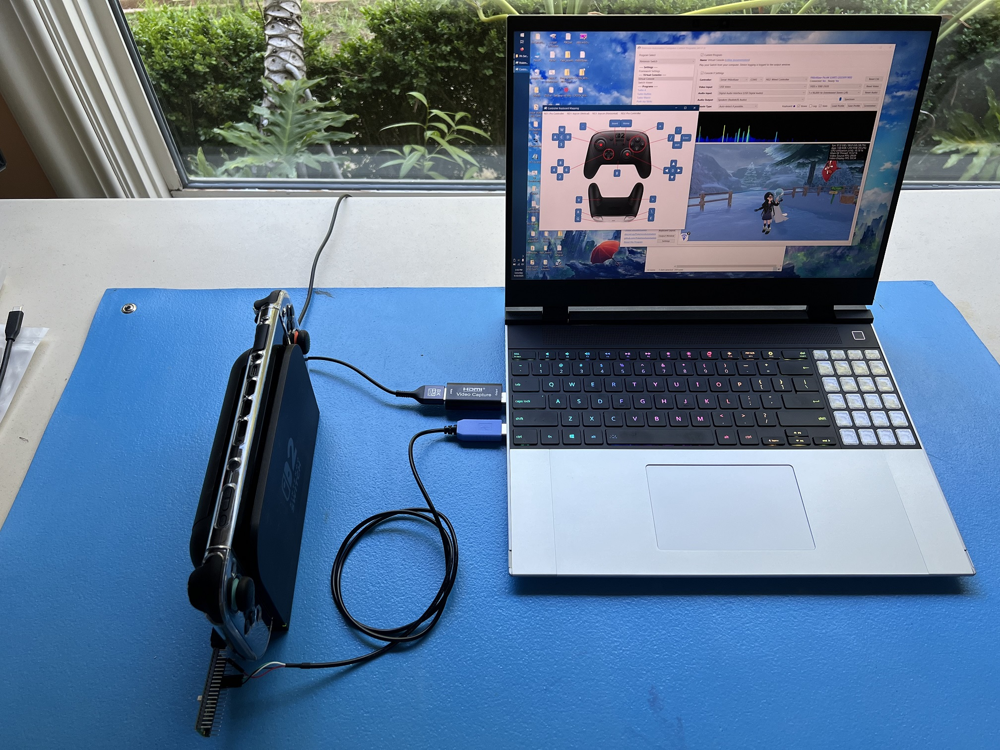
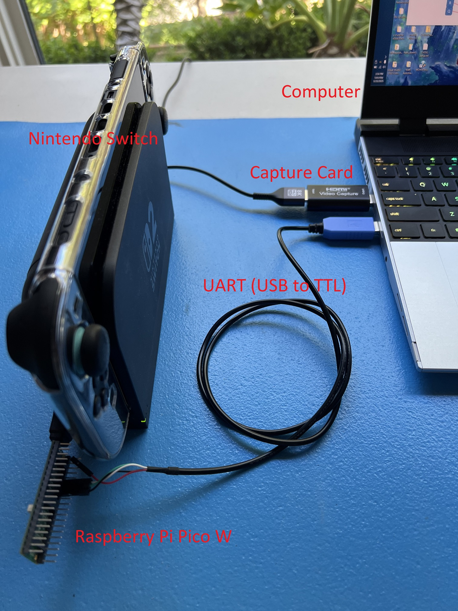
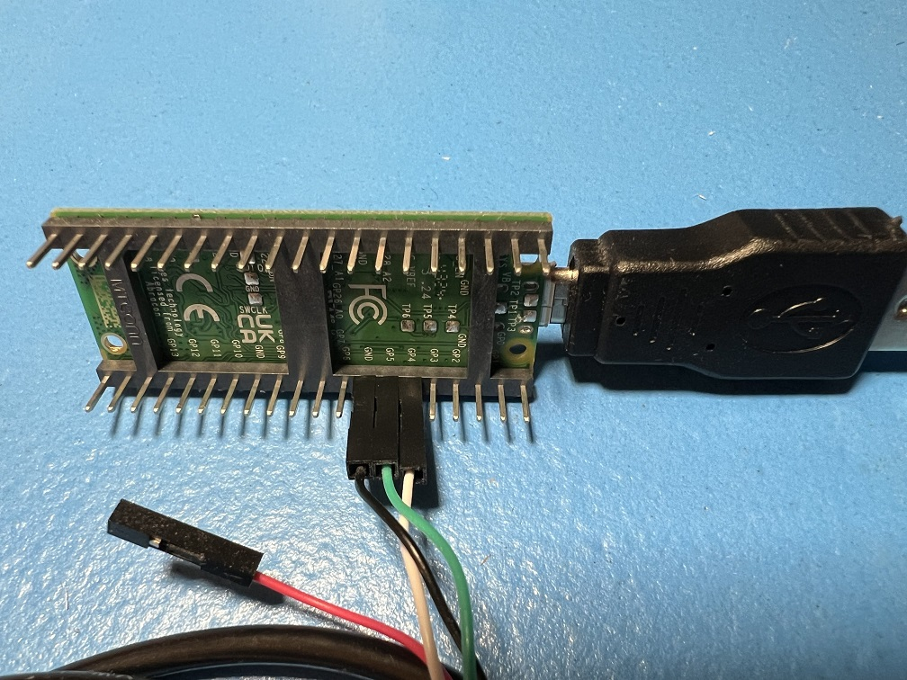
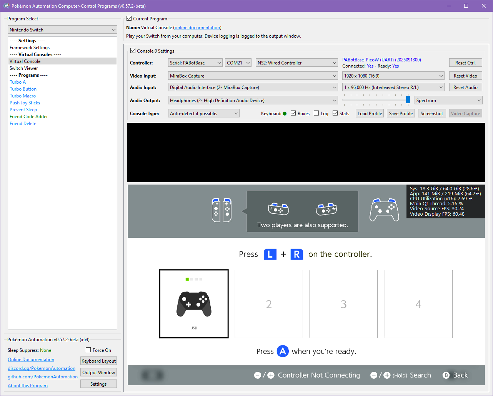

# Raspberry Pi: Pico W and Pico 2 W (UART Mode)

The Raspberry Pi Pico W (and Pico 2 W) is the easiest setup to get up and running (even easier than the ESP32). Thus, it is ideal for new users who just want to try out this project without getting too deep.

There is no difference between the Pico W and the Pico 2 W for this project. Either will work. The Pico 2 is newer and $1 more expensive.

There are two operating modes of the Pico W family:

| **Mode** | **Connections** | **Controller Support** | **Setup Difficulty** |
| --- | --- | --- | --- |
| [USB Mode](Controller-PicoW-USB.md) | 1. Pico W's USB port -> Computer | Wireless controllers only: - Switch 1: Wireless Pro Controller - Switch 1: Left Joycon - Switch 1: Right Joycon | Very Easy |
| **UART Mode (this guide)** | 1. Pico W's USB port -> Switch 2. Pico W's pins 6/7/8 -> External UART 3. External UART -> Computer | Both wireless and wired: - HID: Keyboard - Switch 1: Wired Controller - Switch 2: Wired Controller - Switch 1: Wireless Pro Controller - Switch 1: Left Joycon - Switch 1: Right Joycon | More Difficult |

This is the harder version of the Pico W setup. If you haven't already, we recommend following the guide for [USB mode](Controller-PicoW-USB.md) first.

In UART mode, the line of communication between the Pico W and the computer is moved to an external UART instead of using the USB port. This frees up the USB port to be plugged into the Switch as a wired controller.

This is the most versatile setup as it supports every single controller in this project - both wired and wireless. 

 

## Hardware Setup:

**Required Hardware (Full List):**
1. A regular [Nintendo Switch](../README.md#video-capture-card-the-computers-eyes) and its accessories (dock, power cable, HDMI cable). (You cannot use a Switch Lite.)
2. A [computer](../README.md#the-computer-the-player) running x64 Windows. (or another OS if you are able to set it up.)
3. A [video capture card](../README.md#video-capture-card-the-computers-eyes).
4. A Raspberry Pi Pico W, Pico WH, Pico 2 W, or Pico 2 WH microcontroller.
5. A micro-USB to USB-A cable or dongle.
6. USB to Serial TTL (UART)

#1-5 is the same as the Pico W USB mode. #6 is the additional hardware that you will need.

**Estimated Total Cost (USD):** (not including computer and Nintendo Switch)

- **Single Setup:** $34 - $44
    - Capture Card: $10 - $20
    - Pico W (with pins): $12
    - USB Cable/Adapter: $2
    - UART: $10
- **Bulk Purchase:** ~$20 per setup
    - Capture Card: $10
    - Pico W (with pins): $7 each from Micro Center
    - USB Cable/Adapter: < $1 each from AliExpress
    - UART: $2 each from Amazon

### Recommended Purchase Links:

**Capture Card:** [See previous section.](../README.md#video-capture-card-the-computers-eyes)

**Pico W Microcontroller:**

| **Model** | **Quantity** | **Price / Unit** | **Shopping Link** |
| --- | --- | --- | --- |
| Pico WH | 1 (with pins) | $12 / unit | [https://www.amazon.com/gp/product/B0BHM95WCM](https://www.amazon.com/gp/product/B0BHM95WCM) |
| Pico WH | 2 (with pins) | $11 / unit | [https://www.amazon.com/gp/product/B0BHM7TH1C](https://www.amazon.com/gp/product/B0BHM7TH1C) |
| Pico 2 WH | 1 (with pins + cable) | $15 / unit | [https://www.amazon.com/gp/product/B0F4W9J5CC](https://www.amazon.com/gp/product/B0F4W9J5CC) |
| Pico 2 WH | 1 (with pins) | $14 / unit | [https://www.amazon.com/gp/product/B0FGVQPZP6](https://www.amazon.com/gp/product/B0FGVQPZP6) |
| Pico WH | 1 (with pins) | $7 / unit | [Micro Center](https://www.microcenter.com/product/650109/raspberry-pi-pico-wh-pico-wireless-with-headers-soldered) |
| Pico 2 WH | 1 (with pins) | $8 / unit | [Micro Center](https://www.microcenter.com/product/692334/raspberry-pi-pico-2w-with-header) |

You must get a Pico with "W" in its name. The "W" stands for "wireless". The Picos without the "W" lack the wireless module needed for the wireless connection! The "H" doesn't matter, though most of the boards with pins are also "H".

Here you will need the versions with pre-soldered pins in order to connect the UART. If you have other methods of connecting such as soldering or [press-fit/hammer headers](https://www.adafruit.com/product/5938), feel free to get the pinless ones and do your own thing.

**A micro-USB  cable:**
- Micro-USB -> USB-A Cable: https://www.amazon.com/Android-Compatible-Smartphones-Charging-Stations/dp/B095JZSHXQ
- Micro-USB -> USB-A Dongle: https://www.amazon.com/gp/product/B09FXJD61Z

**USB to Serial TTL (UART):**

There are many options here. The one we recommend (for ease of use) is the Adafruit model:
  - https://www.adafruit.com/product/954
  - https://www.digikey.com/en/products/detail/adafruit-industries-llc/954/7064488
  - https://www.amazon.com/dp/B00DJUHGHI/

Or you can search for "CP2102" and you'll get tons of hits from various brands/sellers that look like these:

 

**Important:**

**DO NOT get cables with the Prolific controllers. e.g. PL2303 or any other model number.** They are cheap, do not work, and they are explicitly blocked in the program. **They often look deceptively similar to the Adafruit UART, but they are not the same.** If you buy outside of this link, verify it does not use PL controllers. If you buy it anyway, you will be wasting your time and money. **YOU HAVE BEEN WARNED!**

### Hardware Assembly:

Make the following connections:
| **UART pin** | **Adafruit UART Wire Color** | **Pico W pin** |
| --- | --- | --- |
| RX | White | TX -> GP4 (pin 6) |
| TX | Green | RX <- GP5 (pin 7) |
| GND | Black | GND (pin 8, or any other GND pin) |
| VCC | Red | Leave unconnected |

> **If you did **not** buy the Adafruit UART, your wire colors will be different!** Refer to your UART's manual or board for the correct pins. Often, with CP210x modules, the pin type is written on the board itself. Also, note that the color of the jumper wires do not matter.

## Software Setup

### Step 0: Getting Ready

Make sure you have everything else setup so that it looks like this:

If not, you should go back to the [general setup guide](../README.md) and start over.

### Step 1: Flash the firmware to the Pico W.

1. Unplug the Pico W from your computer.
2. Press and hold the white `Bootsel` button.
3. Plug the Pico W back into your computer while holding the `Bootsel` button. You can now release the button.
4. Go to "This PC" and look for a storage device:
     - On the Pico W(H), it will be named `RPI-RP2`.
     - On the Pico 2 W(H), it will be named `RP2350`.
5. Drag and drop one of the following files into that storage device. Once the copy is done, the device will disappear.
     - Pico W(H): `PABotBase-Pico1W-2025092300.uf2` (version number may vary)
     - Pico 2 W(H): `PABotBase-Pico2W-2025092300.uf2` (version number may vary)

6. Unplug the Pico W's USB from your computer. Then plug it into your Switch.
7. Plug the UART into your computer.

### Step 2: Install UART drivers

If your computer doesn't recognize the UART as a COM port (serial device), you may ineed to install the UART drivers. If you brought the Adafruit UART in this guide, the driver you will need is this:
- CP210x: https://www.silabs.com/documents/public/software/CP210x_Windows_Drivers.zip

Open up Device Manager and look for it under "Serial Ports". If you don't see it, then maybe these above drivers are not correct. Or try a different USB port.

### Step 3: Navigate to the Grip Menu

The grip menu is the only place where a wireless controller can connect to the Switch. Wired controllers have more flexibility. But for simplicity, we'll go to the grip menu regardless.

To get there from the Switch Home screen: `Controllers` (button next to the Settings gear) -> `Change Grip/Order`

### Step 4: Connect the Pico W to the Computer Control program

1. At the top for the "Controller" option, click the dropdown and select `Serial: PABotBase` (should be on this since this is the default)
2. In the next dropdown, select your serial device. On Windows it will be something like `COM3`.

If you don't see the device in the dropdown, you probably need to refresh it (especially if you kept the program open since Step 0). You can refresh the list by clicking "Reset Ctrl".

If everything worked correctly, it will look like this:

If you see it stuck on `Connecting...`, try swapping the TX and RX lines between the Pico W and the UART. These are very commonly wrong!

### Step 5: Connect the Pico W to the Switch as a Wireless Controller

In the 3rd dropdown, choose "NS1: Wireless Pro Controller".

After a few seconds, you should see a controller pop-up in the Grip menu on the Switch. If not, try rebooting the Pico W by pressing the `Bootsel` button or be unplugging and replugging it.

The controller colors are randomized and should match the color icons in the status indicator. This helps to distinguish controllers if you have multiple of them. You can change the colors in the `Nintendo Switch -> Framework Settings` menu.

### Step 6: Connect the Pico W to the Switch as a Wired Controller

Now lets try a wired connection:
1. In the controller drop, choose "NS2: Wired Controller". Wait for it to show `Connected: Yes, Ready: Yes`.
2. Click the video feed to activate the keyboard controls. Then press ENTER on your keyboard.

You should now see a black controller show up.

Even though we used the grip menu here, wired controllers will connect from almost anywhere.

### Step 6: Test the connection

You can control your Switch from the keyboard. Click on the video display to activate the keyboard controls. Then try pressing some buttons. You can view the keyboard -> controller mapping by clicking on the "keyboard layout" at the bottom left corner of the program.

The default keyboard layout is the English QWERTY layout. If you have a different layout, you can change the mappings in `Nintendo Switch -> Framework Settings` and scroll down to the controller mapping tables.

We recommend familiarizing yourself with the keyboard controls as this is the preferred way to control your Switch while setting up to run a program. Each controller type has a different keyboard mapping. By default, the joystick (left joystick for Pro Controller) is mapped to the usual WASD setup that's used in FPS games. For joycons, there are two sets of mappings (using different keys) that will serve both vertical and sideways orientations.

Overall, the idea here is that you can play your Switch from your computer. While it's not as nice as using a native controller, it is good enough to easily setup programs - especially if you're doing this remotely where you do not have physical access to the Switch.

**Controller Types:**

You will notice that there are 7 controller options:
- None
- HID: Keyboard
- NS1: Wired Controller
- NS2: Wired Controller
- NS1: Wireless Pro Controller
- NS1: Left Joycon
- NS1: Right Joycon

"None" simply idles the Pico W and turns off its USB and antenna so it isn't trying to connect to a Switch. The others tell the Pico W to act as that controller respectively. Every time you press "Reset Ctrl" or change the controller type, it will disconnect from your Switch and try to reconnect using the new controller type.

If you are switching to a wireless controller, you will need to be in the grip menu for the connection to be successful. If not, you can just switch back to a wired controller to navigate there. This is the biggest advantage that the Pico W (UART mode) has over the ESP32!

**Connecting as a Joycon:**

When you connect as a joycon, it will behave like a normal joycon. It doesn't immediately connect and wants you to either pair with a 2nd joycon or press SL+SR to put it into horizontal mode.

For the right joycon, you can press the Home button to immediately leave the grip menu. This will let you easily start LGPE programs which use the right joycon. The left joycon doesn't have this option and will require you to either pair with a right joycon or to enter horizontal mode. There are currently no programs that use the left joycon.

To enter horizontal mode, you can press SL+SR on the keyboard controls by pressing F1 and F3 at the same time. This will let you exit the grip menu and enter a game like LGPE that requires a joycon. But keep in mind that this will also rotate the controls by 90 degrees (IOW, confusing). Check the keyboard mapping for both vertical and horizontal joycon orientations.

*You cannot easily pair two Pico W joycons anyway since you need to press L+R on them simultaneously and the keyboard controls don't allow you simultaneously press buttons on different controllers. However, you can easily pair a Pico W joycon with a real joycon.

### Step 7: You are done!

If keyboard commands are working (along with video and audio), you are done!

Try clicking on other programs on the sidebar. You will find that all of them are "virtual consoles" that will accept keyboard commands. At the top of every program is a link to the wiki that explains how to setup and use that program.

Continue on to [Finishing Up](../README.md#step-4-finishing-up)!

**Credits:**
- Kuroneko/Mysticial

**Discord Server:** 

