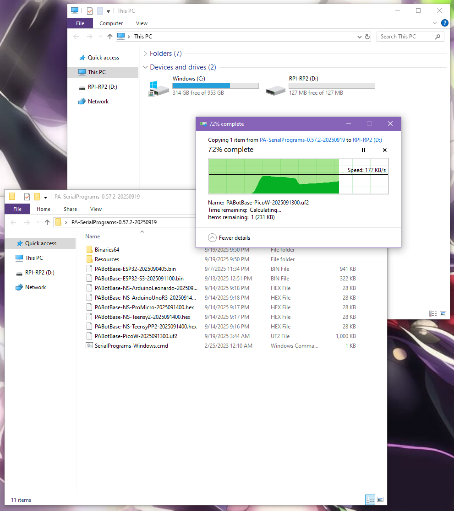
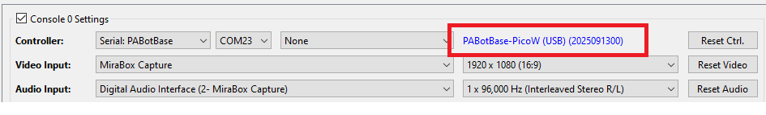

# Controller Setup: Raspberry Pi Pico W (USB Mode)

### ***This setup is still in development. It is not yet available to the public.***

The Raspberry Pi Pico W is different from the other boards in that it has two operating modes:
- USB Mode - easy (this guide)
- [UART Mode - hard](Controller-PicoW-UART.md)

The Pico W has a Bluetooth module that allows it to implement wireless controllers. It can emulate both left and right joycons as well as the wireless pro controller. Since this covers all the controller types, a Pico W will be able to run nearly our entire repertoire of programs for the Nintendo Switch.

The USB port plugs into the computer which is how the program will control it. At the other end is an antenna that supports Bluetooth which is how it will fake itself as a joycon or a wireless pro controller to the Switch.

In UART mode (not this guide), the Pico W will additionally support all the wired controllers as well.

 ***(insert image)***

## Hardware Setup:

**Required Hardware (Full List):**
1. A regular [Nintendo Switch](../README.md#video-capture-card-the-computers-eyes) and its accessories (dock, power cable, HDMI cable). (You cannot use a Switch Lite.)
2. A [computer](../README.md#the-computer-the-player) running x64 Windows. (or another OS if you are able to set it up.)
3. A [video capture card](../README.md#video-capture-card-the-computers-eyes).
4. A Raspberry Pi Pico W or Pico WH microcontroller.
5. A micro-USB to USB-A cable or dongle.

#1-3 are part of the initial setup so you should have all of these already.

**Estimated Total Cost (USD):** (not including computer and Nintendo Switch)
- **Single Setup:** $30 - $40
- **Bulk Purchase:** ~$18 per setup

***(insert image)***

### Recommended Purchase Links:

**Capture Card:** [See previous section.](../README.md#video-capture-card-the-computers-eyes)

**Pico W or Pico WH Microcontroller:**

| **Quantity** | **Price / Unit** | **Shopping Link** |
| --- | --- | --- |
| 1 (no pins) | $12 / unit | [https://www.amazon.com/gp/product/B0FJFLM9DW](https://www.amazon.com/gp/product/B0FJFLM9DW) |
| 2 (no pins) | $10 / unit | [https://www.amazon.com/gp/product/B0B72GV3K3/](https://www.amazon.com/gp/product/B0B72GV3K3/) |
| 1 (with pins) | $12 / unit | [https://www.amazon.com/gp/product/B0BHM95WCM](https://www.amazon.com/gp/product/B0BHM95WCM) |
| 2 (with pins) | $11 / unit | [https://www.amazon.com/gp/product/B0BHM7TH1C](https://www.amazon.com/gp/product/B0BHM7TH1C) |
| 1 (no pins) | $6 / unit | [Micro Center](https://www.microcenter.com/product/650108/raspberry-pi-pico-w) |
| 1 (with pins) | $7 / unit | [Micro Center](https://www.microcenter.com/product/650109/raspberry-pi-pico-wh-pico-wireless-with-headers-soldered) |

**Important:**

You must get either a Pico W or Pico WH. The Pico 2 W/WH is not compatible! The Pico and Pico H does not work because it has no wireless module.

**Pins vs. No Pins:**

Normally we advise against getting boards with pins since they get in the way. But the Pico W is different because the pins make it much easier to setup UART mode. We recommend reading the Pico W (UART) mode guide to help you decide.

**A micro-USB  cable:**
- Micro-USB -> USB-A Cable: https://www.amazon.com/Android-Compatible-Smartphones-Charging-Stations/dp/B095JZSHXQ
- Micro-USB -> USB-A Dongle: https://www.amazon.com/gp/product/B09FXJD61Z

### Hardware Assembly:

Should be pretty self-explanatory:

1. Connect the Pico W to your computer using the USB cable.
2. Place the Pico W near your Switch. (within 3ft line-of-sight for maximum stability)

And that's it!

## Software Setup

### Step 0: Getting Ready

Make sure you have everything else setup so that it looks like this:

If not, you should go back to the [general setup guide](../README.md) and start over.

### Step 1: Flash the firmware to the Pico W.

1. Unplug the Pico W from your computer.
2. Press and hold the white `Bootsel` button.
3. Plug the Pico W back into your computer while holding the `Bootsel` button. You can now release the button.
4. Go to "This PC" and look for a storage device named, "RPI-RP2".
5. Drag and drop the file `PABotBase-PicoW-2025091300.uf2` file into that storage device. (version number may vary) Once the copy is done, the device will disappear.

### Step 2: Navigate to the Grip Menu

The Grip menu is the only place where the Pico W can wirelessly connect to the Switch.

To get there from the Switch Home screen: `Controllers` (button next to the Settings gear) -> `Change Grip/Order`

### Step 3: Connect the Pico W to the Computer Control program

1. At the top for the "Controller" option, click the dropdown and select `Serial: PABotBase` (should be on this since this is the default)
2. In the next dropdown, select your serial device. On Windows it will be something like `COM3`.

If you don't see the device in the dropdown, you probably need to refresh it (especially if you kept the program open since Step 0). You can refresh the list by clicking "Reset Ctrl".

If everything worked correctly, it will look like this:

### Step 4: Connect the ESP32 to the Switch

In the 3rd dropdown, choose "NS1: Wireless Pro Controller".

After a few seconds, you should see a controller pop-up in the Grip menu on the Switch. If not, try rebooting the Pico W by pressing the `Bootsel` button or be unplugging and replugging it.

The controller colors are randomized and should match the color icons in the status indicator. This helps to distinguish controllers if you have multiple of them. You can change the colors in the `Nintendo Switch -> Framework Settings` menu.

### Step 6: Test the connection

You can control your Switch from the keyboard. Click on the video display to activate the keyboard controls. Then try pressing some buttons. You can view the keyboard -> controller mapping by clicking on the "keyboard layout" at the bottom left corner of the program.

We recommend familiarizing yourself with the keyboard controls as this is the preferred way to control your Switch while setting up to run a program. Each controller type has a different keyboard mapping. By default, the joystick (left joystick for Pro Controller) is mapped to the usual WASD setup that's used in FPS games. For joycons, there are two sets of mappings (using different keys) that will serve both vertical and sideways orientations.

Overall, the idea here is that you can play your Switch from your computer. While it's not as nice as using a native controller, it is good enough to easily setup programs - especially if you're doing this remotely where you do not have physical access to the Switch.

***(insert image)***

**Controller Types:**

You will notice that there are 4 controller options:
- None
- Pro Controller
- Left Joycon
- Right Joycon

"None" simply idles the Pico W and turns off its antenna so it isn't trying to connect to a Switch. The others tell the Pico W to act as that controller respectively. Every time you press "Reset Ctrl" or change the controller type, it will disconnect from your Switch and try to reconnect using the new controller type. So you will need to be in the Grip menu or it will stay disconnected. (important if you are accessing remotely!)

Changing programs (or even closing the application entirely) will not disconnect the Pico W from the Switch. When you load a program and connect to the Pico W, it will automatically continue its previous connection to the Switch (and change the controller dropdown accordingly). So you can remotely control your Switch if you are careful enough.

If you intend to do a lot of remote access, we recommend that you use a wired setup as a wired controller can connect to the Switch from anywhere and take control. The Pico W can do this, but only in UART mode.

**Connecting as Joycon:**

When you connect as a joycon, it will behave like a normal joycon. It doesn't immediately connect and wants you to either pair with a 2nd joycon or press SL+SR to put it into horizontal mode.

For the right joycon, you can press the Home button to immediately leave the grip menu. This will let you easily start LGPE programs which use the right joycon. The left joycon doesn't have this option and will require you to either pair with a right joycon or to enter horizontal mode. There are currently no programs that use the left joycon.

To enter horizontal mode, you can press SL+SR on the keyboard controls by pressing F1 and F3 at the same time. This will let you exit the grip menu and enter a game like LGPE that requires a joycon. But keep in mind that this will also rotate the controls by 90 degrees (IOW, confusing). Check the keyboard mapping for both vertical and horizontal joycon orientations.

*You cannot easily pair two Pico W joycons anyway since you need to press L+R on them simultaneously and the keyboard controls don't allow you simultaneously press buttons on different controllers. However, you can easily pair a Pico W joycon with a real joycon.

### Step 7: You are done!

If keyboard commands are working (along with video and audio), you are done!

Try clicking on other programs on the sidebar. You will find that all of them are "virtual consoles" that will accept keyboard commands. At the top of every program is a link to the wiki that explains how to setup and use that program.

Continue on to [Finishing Up](../README.md#step-4-finishing-up)!

## Troubleshooting:

### Wireless Interference with Multiple wireless devices.

This is the same with all the wireless controllers (ESP32, Pico W, etc...)
If you have multiple of them, spread them out to reduce wireless interference.

As tempting as it may be, do not do this:

 

It is as cute as it is stupid, and it will give you problems. We tried it so you don't have to!

**Credits:**
- Kuroneko/Mysticial

**Discord Server:** 

