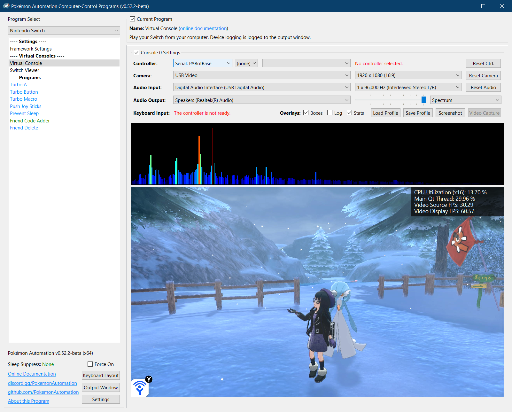
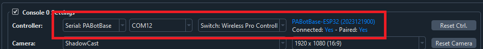
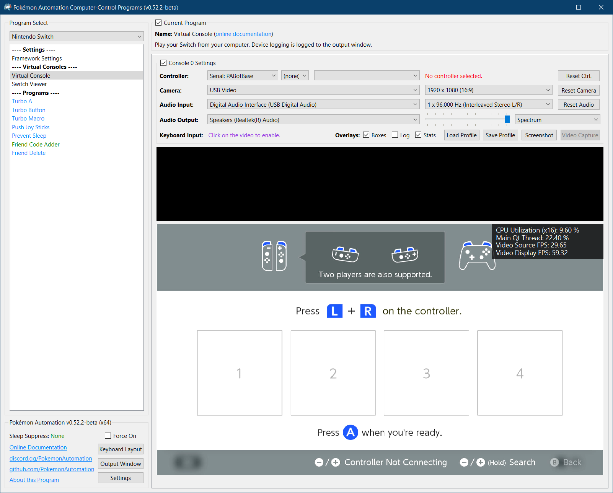

# Wired Controller (AVR8) Software Setup

This is the software setup guide for all the AVR8-based wired controller setups.

### Step 0: Getting Ready

Make sure you have everything else setup so that it looks like this:

If not, you should go back to the [general setup guide](../README.md) and start over.

### Step 1: Install UART drivers

Install your UART drivers. If you purchased as CP240x UART, the driver to install it is here:
- SiLabs CP210x: https://www.silabs.com/documents/public/software/CP210x_Windows_Drivers.zip

### Step 2: Connect CC to the device

1. At the top for the "Controller" option, click the dropdown and select `Serial: PABotBase` (should be on this since this is the default)
2. In the next dropdown, select your serial device. On Windows it will be something like `COM3`.

If you don't see the device in the dropdown, you probably need to refresh it (especially if you kept the program open since Step 0). You can refresh the list by clicking away to a different program and coming back.

If everything worked correctly, it will look like this:

If you see the following instead, then you actually connected to our wireless controller setup instead (ESP32-WROOM). (We love your enthusiasm for having both setups!)

Both the wired and wireless setups use serial ports. The program can distinguish them when it connects to it.

If you see neither, then see [troubleshooting](#troubleshooting).

### Step 3: Navigate your Switch to where it will accept a new controller.

The Arduino/Teensy/Pro Micro behaves like a real wired controller. So it can only connect if your Switch is ready for it.

Places where the Switch will accept a new controller:
1. The grip menu.
2. The Switch home or settings.
3. In a game when no other controllers are connected.

### Step 4: Test the connection

You can control your Switch from the keyboard. Click on the video display to activate the keyboard controls. Then try pressing some buttons. You can view the keyboard -> controller mapping by clicking on the "keyboard layout" at the bottom left corner of the program.

We recommend familiarizing yourself with the keyboard controls as this is the preferred way to control your Switch while setting up to run a program. In effect you can play your Switch from your computer. While it's not as nice as using a native controller, it is good enough to easily setup programs - especially if you're doing this remotely where you do not have physical access to the Switch.

The default layout is the standard WASD setup for FPS games on the most common QWERTY keyboard layout. If you don't like it or you have a different keyboard layout, you can change the key mappings in the "Framework Settings" panel at the top of the program list to the left.

### Step 5: You are done!

If keyboard commands are working (along with video and audio), you are done!

Try clicking on other programs on the sidebar. You will find that all of them are "virtual consoles" that will accept keyboard commands. At the top of every program is a link to the wiki that explains how to setup and use that program.

Continue on to [Finishing Up](../README.md#step-4-finishing-up)!

## Troubleshooting:

### Troubleshooting serial connections:

Step 1: Plug your device into the Switch without connecting the UART to the computer.
| Error | Solution |
| --- | --- |
| Device flashes rapidly for 5 seconds, then stops | Proceed to "Step 2" below. |
| Device doesn't turn on the LED at all | The .hex isn't properly flashed. Also, check that the Switch dock is connected to power. |
| LED turns on and stays on | Usually means it's not properly connecting to the Switch. Ensure your Switch is turned on and try redocking your Switch. |

Step 2: Plug the UART side into the computer and select it in the dropdown.
| Error | Solution |
| --- | --- |
| Blue status text that says, "Program: PABotBase..." | No error. You're done! |
| "Incompatible version..." | Please flash the PABotBase .hex that came with that version of the program. |
| "PABotBase level not met" | You have the wrong program flashed to the device. Flash the PABotBase in the included folder. |
| "Not connected" | You either chose the wrong COM port or your drivers are messed up. |
| Stuck on "Connecting..." | If the device is not flashing the LEDs and either stays off or on, it means the line from computer -> device is broken. Make sure you chose the correct COM port and double check your wiring. Try swapping TX and RX since they are commonly mixed up. |
| Stuck on "Connecting..." | If the device is alternating two of the LEDs (Leonardo models), it means the device is receiving the commands from the computer, but the computer isn't hearing back from the device. In other words, the line from device -> computer is broken. Double check your wiring is snug and connected. |
| Stuck on "Stopping..." | Ensure your Switch dock is connected to power. |

### Output Window (Log):
1. Spamming of "RESET" messages with nothing else
   - Check your wires
2. Spams of invalid length and CRC errors.
   - Check your wires.
   - Make sure you don't have a PLxxx UART Controller (If you do, you need to buy a CP21xx UART)

**Correct output window:** 

**Incorrect output window:** 

**Credits:**
- Kuroneko/Mysticial
- jw

**Discord Server:** 

