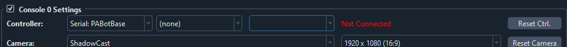
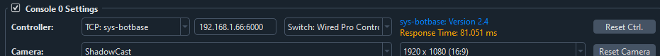
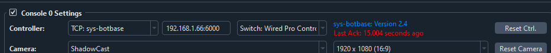
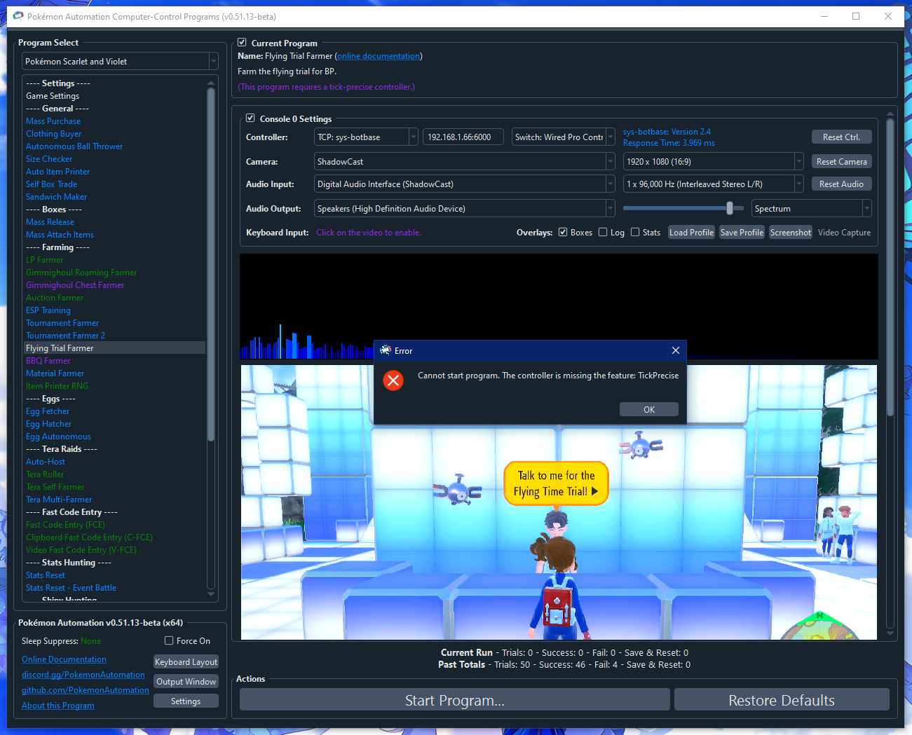

# Controller Setup: sys-botbase

***Update August 9, 2025: This guide has been updated for sys-botbase 3 (sbb3).***

This sys-botbase setup is intended for experienced CFW (custom firmware) Switch users who want to try out our computer-control (CC) programs without buying all the additional hardware that is needed.

If you do not have CFW (and are thus starting from scratch), we [recommend going back](../README.md#the-controller-the-computers-hands) and choosing one of the other controller options as they are more reliable than this option. You do not need CFW or sys-botbase to run CC programs. Likewise, the CC programs only use sys-botbase for its controller. It does not touch any of its "hacking" features like reading and modifying game memory.

Since this is intended for existing CFW users, we will not cover how to hack your Switch or to setup CFW.

Our current sys-botbase support only covers the wired pro controller. So it will not be able to run any LGPE programs.

## Hardware Setup:

**Required Hardware (Full List):**
1. A regular [Nintendo Switch](../README.md#video-capture-card-the-computers-eyes) and its accessories (dock, power cable, HDMI cable). (You cannot use a Switch Lite.)
2. A [computer](../README.md#the-computer-the-player) running x64 Windows. (or another OS if you are able to set it up.)
3. A [video capture card](../README.md#video-capture-card-the-computers-eyes).

**Estimated Total Cost (USD):** (not including computer and Nintendo Switch)
- **Single Setup:** $10 - $20 (for the capture card)
- **Bulk Purchase:** (no discounts over single setup)

All of these are part of the initial setup. If your Switch is already running CFW, then no further hardware is needed. If not, then this guide is not for you.

Since there is no additional hardware, there are no additional hardware setup instructions!

## Software Setup:

### Step 0: Getting Ready

Make sure you have everything else setup so that it looks like this:

If not, you should go back to the [general setup guide](../README.md) and start over.

### Step 1: Install ldn_mitm

1. Download and unzip ld-mitm: https://github.com/Lusamine/ldn_mitm/releases/latest
2. Copy the contents into the root of your SD card.

### Step 2: Install sys-botbase 3 (sbb3)

1. Download and unzip sbb3: https://github.com/PokemonAutomation/sys-botbase-cpp/releases/latest
2. Copy the contents into the root of your SD card.

Note that this is sys-botbase 3. This is an improved rewrite of the original sys-botbase that has additional features required by CC to achieve maximum performance and stability.
sbb3 is backwards compatible with the official sys-botbase (sbb2) aside from the removal of the ACNH features. So you should be able to still use all your existing programs that rely on sbb2.

### Step 3: Navigate your Switch to where it will accept a new controller.

sys-botbase will create a virtual wired controller that behaves like a real controller. So it can only connect if your Switch is ready for it.

Places where the Switch will accept a new controller:
1. The grip menu.
2. The Switch home or settings.
3. In a game when no other controllers are connected.

### Step 4: Connect to the Switch

1. At the top for the "Controller" option, click the dropdown and select `TCP: sys-botbase` .
2. Enter the IP address and port of your Switch. (e.g. `192.168.1.123:6000`) The port is always 6000 for all versions of sbb to date.

If everything worked correctly, it will look like this:

If not, see [troubleshooting](#troubleshooting).

### Step 5: Test the connection

You can control your Switch from the keyboard. Click on the video display to activate the keyboard controls. Then try pressing some buttons. You can view the keyboard -> controller mapping by clicking on the "keyboard layout" at the bottom left corner of the program.

We recommend familiarizing yourself with the keyboard controls as this is the preferred way to control your Switch while setting up to run a program. In effect you can play your Switch from your computer. While it's not as nice as using a native controller, it is good enough to easily setup programs - especially if you're doing this remotely where you do not have physical access to the Switch.

The default layout is the standard WASD setup for FPS games on the most common QWERTY keyboard layout. If you don't like it or you have a different keyboard layout, you can change the key mappings in the "Framework Settings" panel at the top of the program list to the left.

### Step 6: You are done!

If keyboard commands are working (along with video and audio), you are done!

Try clicking on other programs on the sidebar. You will find that all of them are "virtual consoles" that will accept keyboard commands. At the top of every program is a link to the wiki that explains how to setup and use that program.

Continue on to [Finishing Up](../README.md#step-4-finishing-up)!

## Troubleshooting:

### Stuck on "Not Connected"

This usually means the IP address is wrong.

### Stuck on "Connecting" or "Timed Out"

Try clicking "Reset Ctrl". This can sometimes fix intermittent issues.

These are standard network connection issues. Common causes:
 - The IP address is wrong or there is no network path from your computer to the Switch.
 - A firewall (either on your computer or your network) is blocking the connection.
 - sys-botbase is not installed correctly.
 - sys-botbase is already running a controller and is not accepting another one.
 - Local connection is enabled and ldn-mitm is not enabled. This will block the network connection.
 - You have dual-band wifi where your Switch is connected to one band while your computer is connected to the other.

If all else fails, try undocking your Switch and going in/out of a game several times, similarly with airplane mode. Otherwise, you may need to reboot the Switch.

### Connected, but keyboard commands don't work.

This usually means that you have another controller connected to the Switch and it has priority over sbb. Try disconnecting that controller.

Most programs will block keyboard inputs if the program is running. So if you happen to be running a program and it ignores your keyboard commands, this is expected.

### Response time is very high

The response time is how long it takes to round-trip from your computer to sys-botbase and back. It will always be longer than a ping due to overhead within sys-botbase and/or Atmosphere.

High reponse time used to be a huge problem with sys-botbase 2.4. But starting from sys-botbase 3.0, it is less of an issue since it can buffer commands to retain timing precision.

### "Last Ack: xxx seconds ago"

This means the Switch has stopped responding to the computer's commands. The most common (unobvious) cause of this is that the Switch entered local connection mode because you didn't have ldn-mitm enabled. Because sys-botbase relies on the network connection to communicate with the Switch, going into local connection mode will kill this connection. So while sys-botbase is still running on the Switch, no commands are getting through.

### "Cannot start program. The controller is missing the feature: TickPrecise"

If you are seeing this message, it means you are running sys-botbase 2.x. This version of sys-botbase lacks the timing precision needed to run many of our programs.

Please upgrade to sys-botbase 3.0 or later.

### Multi-Switch programs don't work.

Multi-Switch programs generally involve the two Switches using local communication to talk to each other. ldn-mitm will block local connections which means the two Switches cannot connect unless both are running ldn-mitm. Turning off ldn-mitm to allow the local communication mode will kill the network connection to the computer.

There is no general solution to this. For some programs, you may be able to work-around this by having both Switches go online. But this is not possible for programs that require resetting the game.

Using ethernet instead of wireless does not solve this problem as local communication mode will kill this as well.

**Credits:**
- Kuroneko/Mysticial

**Discord Server:** 

