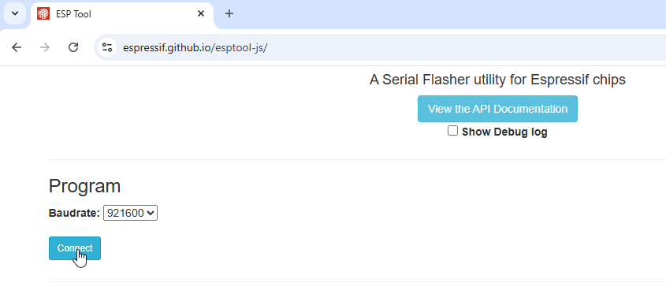
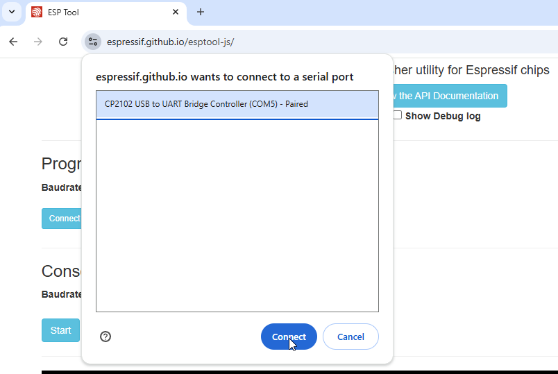
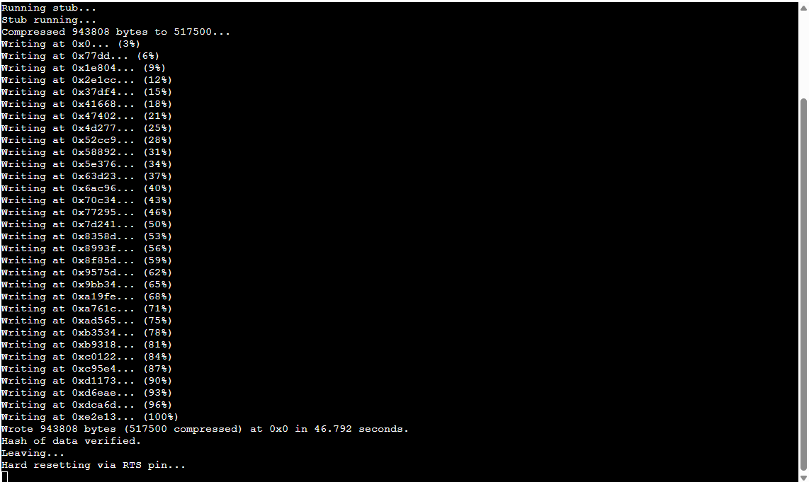

# Flash the ESP32 using EspressIf's website.

This is an alternate method to flash the ESP32.


1. Open this website in Chrome or Edge: https://espressif.github.io/esptool-js/
2. Under `Program`, you may keep the `Baudrate` at the default of 921600.
3. Click `Connect`.

<table><tr><td>

</td></tr></table>

5. Select your ESP32 device in the pop-up. Click `Connect`.
<table><tr><td>

</td></tr></table>

6. Under `Flash Address`, set the text box to 0x0 (instead of the default 0x1000)
7. Click `Choose File`: Select the firmware file (will be named something like: `PABotBase-ESP32-2025032100.bin`), then click `Open` to choose the file.


9. Click `Program`.
<table><tr><td>

</td></tr></table>

9. Wait for the program to flash. If successful, you should see the following in the console:
```
Hash of data verified.
Leaving...
Hard resetting via RTS pin...
```
<table><tr><td>

</td></tr></table>

If instead, you get the error: `Error: Invalid head of packet (0x80): Possible serial noise or corruption.`. Then refresh the page, restart at step 2, but try changing the baudrate to 115200.

<hr>

**Credits:**
- jw
- kichithewolf

**Discord Server:** 

[](https://discord.gg/cQ4gWxN)


