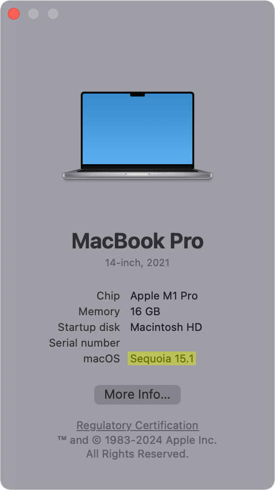
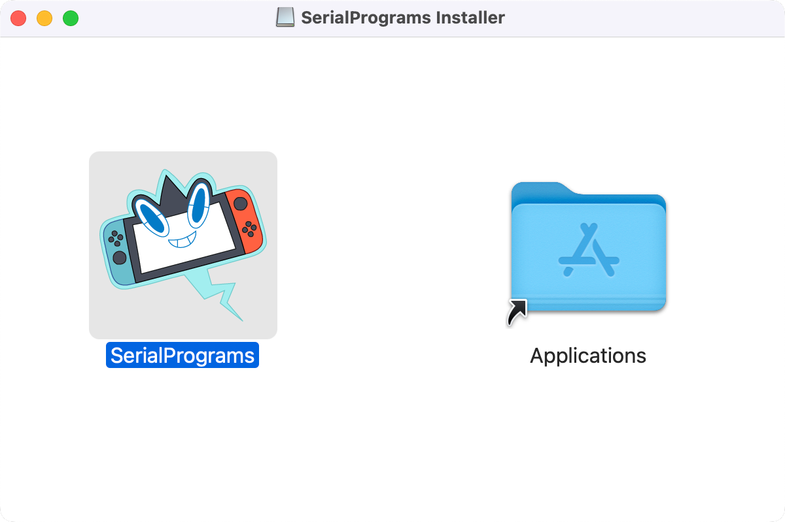
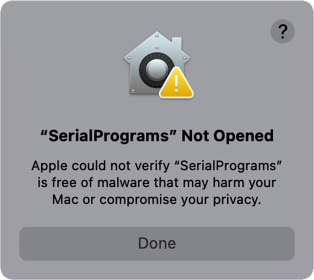
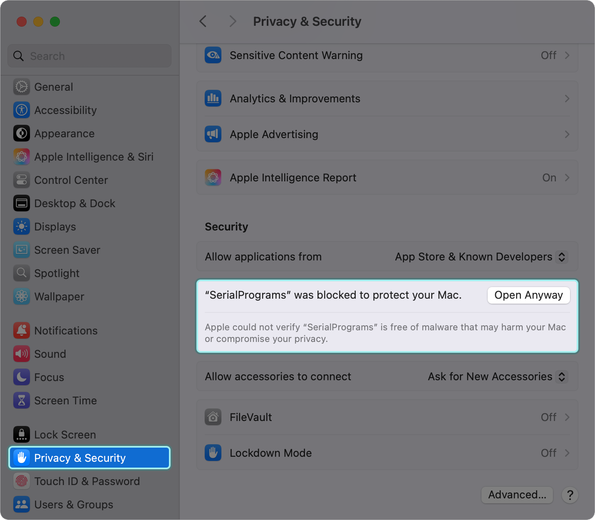
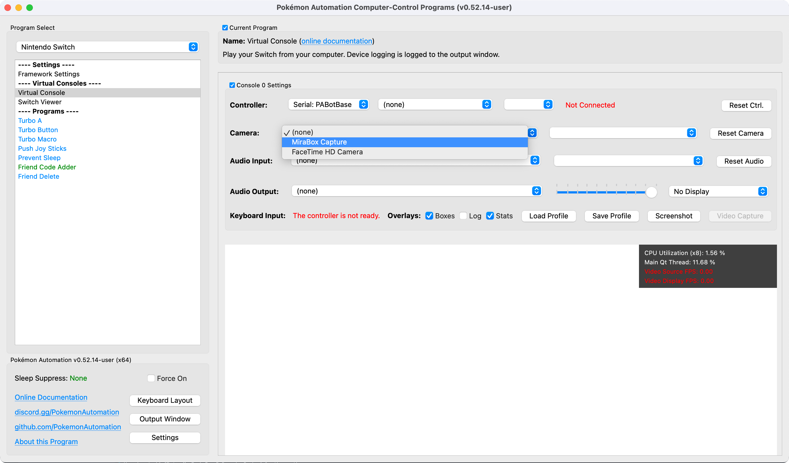
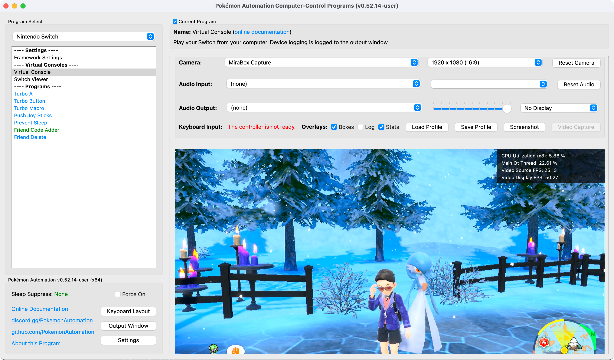
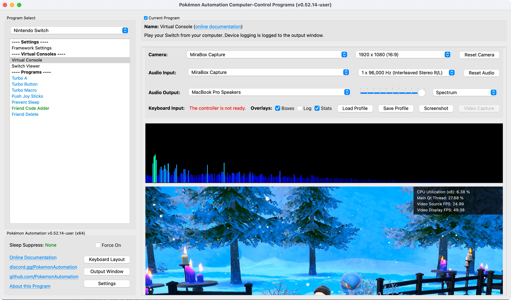

# General Setup:

This section will walk you through setting up everything leading up the the controller.

## Step 1: Download the CC programs.

### Stop and Check:

If your MacOS version is Monterrey (12) or lower, you will need to compile SerialPrograms from source code. Instructions to do so can be found [here](CompilingForMac.md). Follow the tutorial to build SerialProgram and return back here to setup video/audio.

> To check your OS version, click the Apple logo at the top left in the Toolbar and select **About This Mac**.

### Download SerialPrograms-Installer.dmg

For those with MacOS Ventura (13) and later, download the latest version of our programs [here](https://github.com/PokemonAutomation/AutoBuildRelease/releases)

## Step 2: Open up SerialPrograms.

1. Open `SerialPrograms-Installer.dmg`
2. Drag `SerialPrograms` into the `Applications` folder
   

3. Go to your `Applications` folder and open `SerialPrograms` 
4. You will be greeted with the following warning, click **Done**. This warning is given on any program downloaded on the internet that does not have Apple's official (paid) notarization. This project is unmonitized and the entirety of the MacOS installation is open sourced if you wish to vet the program yourself.

5. Open **System Settings** and navigate to the **Privacy & Security** section. Scroll down until you see the SerialPrograms warning. Click **Open Anyway**.

6. Follow the prompts to open the app. You may need to click **Open Anyways** multiple times and you may need to input your password. Note that this is only needed the first time you open the app. For the first time, the app may take some time to open.
7. The app may ask you to install Rosetta and/or give the app permissions to files/camera/microphone. These are required in order to read video and audio from your capture card. The program does not access your Mac's actual camera and microphone!

 

## Step 3: Setup video.

1. Connect an HDMI cable from your Switch dock to your video capture card.
2. Connect your capture card to your computer.

Depending on your capture card, it may look different from this:

1. Select your capture card in the "Camera" dropdown. If you don't see it there, click "Reset Camera" to refresh the list.

 

## Step 4: Setup sound.

The sound options are below the Camera options. Most of these options are self-explanatory.
1. Select the Audio Input that comes from your capture card. If you don't know which one it is, try all of them.
2. Select the Audio Output for your speakers. This will play back what your audio input is.
3. The slider is for playback volume.

If you did everything right until now, the black bar will light up with the audio spectrum and you will hear the sound from your Switch.

 

The Audio Input is the important one since programs that listen to audio will be using that.
The Audio Output and playback are only for user consumption. You can mute the program by changing the Audio Output to (none) or moving the slider all the way to the left.

**Notes:**

- Some high-end capture cards (such as AVerMedia) do not have audio inputs. They use a proprietary system that fuses the audio channel with the video. Since we do not support this, you will need to run an audio cable from your Switch's headphone jack into your computer's line-in or microphone jacks.
- Due a quirk* with many cheap capture cards (including the ones we recommend), the left and right audio channels may be reversed. If this is the case for you, try the other "Interleaved Stereo" format.

\*This "quirk" causes OBS to treat these capture cards as mono-channel audio. While we are able to recover the stereo output by separating the left/right audio channels, we can't always determine which is which - hence the reversed left/right channels.

## Step 5: You are done!

At this point, your computer is playing both the video and the audio from your Switch. In effect, you have turned your computer into a TV as far as your Switch is concerned. You can play your Switch on your computer using a controller connected to the Switch. (your regular joycons or pro controller)

Feel free to adjust the visual settings:
- You can toggle various overlays by checking/unchecking the boxes next to "Overlays". Right now, the only visible overlay is the stats in the upper right corner of the video feed.
- You can change the audio visualization by clicking on the dropdown next to the volume slider.
- You can change the theme (light or dark themes) in the "Settings" button at the bottom left corner of the window.

Of course there are many other programs that can also play video and audio from your Switch through a capture card. But in the next step, we will be connecting a controller to it to allow the program to play (and automate) your Switch!

Back to the [Setup Guide](README.md#step-3-controller-setup).

## Troubleshooting:

### Common video capture errors:
- The capture card is in use by another program. Close OBS or any other program potentially using the card.
- The capture card is not receiving enough power over the USB connection.
- There are multiple capture cards connected to the same physical USB port on the computer (by means of a hub). (see [multiple capture cards](#multiple-switch-considerations))
- The USB port is broken or does not provide enough power to the capture card. Try other USB ports.
- Check your connection is secure for cables and capure card.
- The HDMI cable may be broken. Try a new cable.

To rule out possible video capture errors:
- Check if the PC sees the capture card via Windows Device Manager (or other device management software).
- Check if the video stream is available on OBS (or other streaming software).

### Multiple Switch Considerations

Some programs support (or require) the use of multiple Switches. That means multiple capture cards and controller setups!

However, we have found that setting up the hardware to handle multiple serial ports and capture cards can be tricky. Sometimes they work, sometimes they don't. And it's often difficult to troubleshoot. This is regardless of whether you are running multiple Switches under the same instance or if you are running multiple instances of one Switch each.

**Capture Cards don't always play well with USB hubs.**

Capture cards are very hit-and-miss when you try to put multiple of them on the same USB hub.

Some general observations:
1. Capture cards draw a lot of power. If you put them with other high-powered USB devices drawing power from the same source, the card may not function.
2. Capture cards use a lot of USB bandwidth. If you put multiple capture cards on the same USB hub, you may saturate the bandwidth on that hub.
3. For some unknown reason (even when both the above do not apply), it can be difficult to get multiple capture cards on the same physical USB port (by means of a hub) on the computer to work simultaneously. You may need to spread them out. Thus for a 4-Switch setup, your computer will need at least 4 USB ports - one for each capture card. But within each port, you can use a hub to connect *one* capture card and other devices as well. (such as the UART serial connections)

**Discord Server:** 

