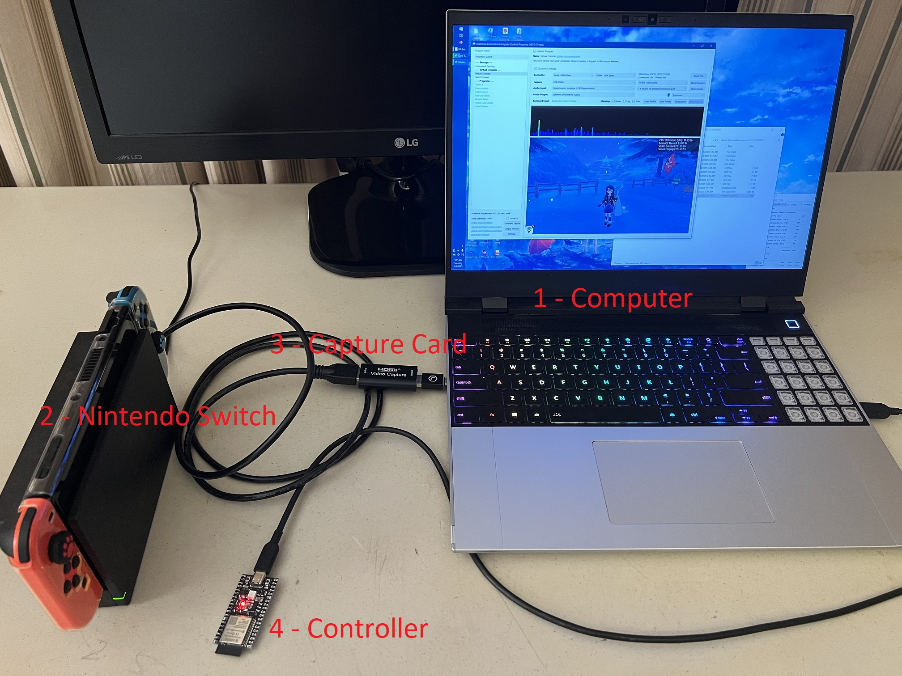
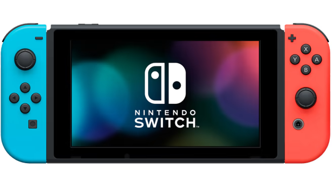
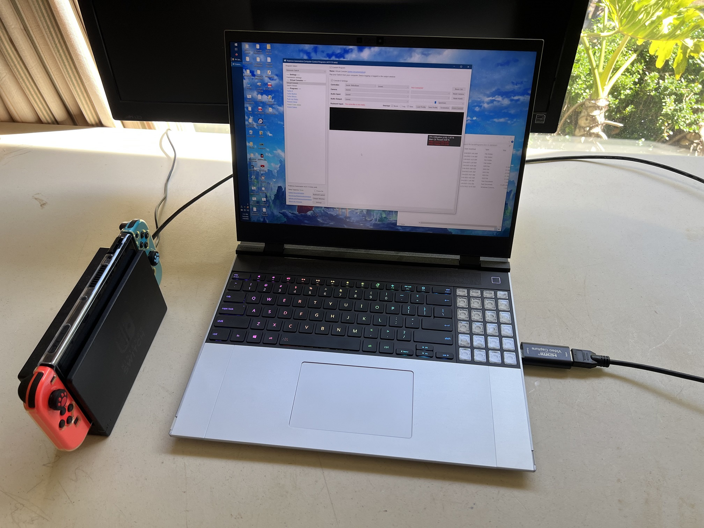
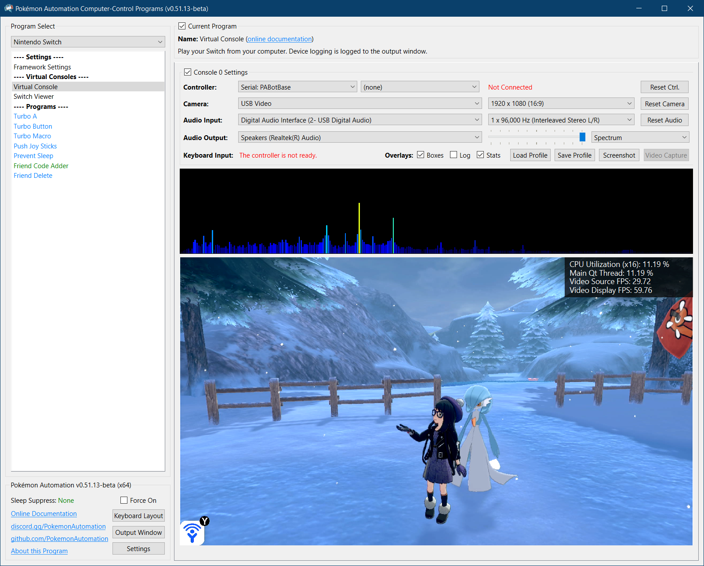

# Computer Control (CC) Setup Guide

**Jump To:**
 - [**Step 1:** The Hardware](#step-1-the-hardware)
 - [**Step 2:** General Setup (setting up everything except the controller)](#step-2-general-setup-setting-up-everything-except-the-controller)
 - [**Step 3:** Controller Setup](#step-3-controller-setup)
 - [**Step 4:** Finishing up](#step-4-finishing-up)

This is the setup guide for the computer control (CC) automation setup. We recommend that you read this before purchasing any hardware. Cost estimates will vary depending on the method you choose.

The computer control (CC) automation setup consists of 4 main components:
1. A computer.
2. A Nintendo Switch.
3. A video capture card.
4. A controller to control the Switch.

The computer is the player. The capture card is its eyes. The controller is its hands.

Here is an example of a full setup using an ESP32 microcontroller:

## Step 1: The Hardware

### The Computer: (the player)

You need a full computer to run CC programs. A phone or tablet will not work.

Specifically, the computer must:

1. Be running 64-bit Windows 10 or later on an x64 CPU. (An Intel or an AMD CPU. You cannot use a Qualcomm Snapdragon.)
2. Be sufficiently powerful.*

*We recommend a quad-core CPU of 3+ GHz, no older than 2015. If you intend to control more than 1 switch, you will need a more powerful CPU with more cores. If you want to run 4 Switches all with feedback, we recommend a modern 8-core computer.

You will also need 2 spare USB ports. (or 2 ports per Switch if you intend to run multiple Switches)

**Other Platforms:**

Due to lack of developer support, our support of Mac and Linux is limited. While you can set these programs up on Mac and Linux, you will need to know how to run command-line build scripts.

If you are not willing to do that or you have no idea what this means, then stop. Unfortunately, you will not be able to run these programs unless you can go to Windows.

If you are willing and able to go down this rabbit hole:
- M1 Mac builds are working and almost fully functional with only a few features missing.
- Linux builds have broken video and are thus not usable. We would love some help here!

### The Nintendo Switch

If you're going to automate a Nintendo Switch game, then you need to have a Nintendo Switch.

However, it needs to be a *regular* Nintendo Switch that can be docked with HDMI video output. You cannot use a Switch Lite. We need the video output for the computer to see your Switch. Unfortunately you cannot just point a camera at the Switch Lite's screen since that comes with too much loss of quality. (Even if this worked, it's bad idea anyway since 24/7 gameplay will burn out the screen.)

### Video Capture Card (the computer's eyes)

A video capture card will allow a computer to capture the HDMI video output from your Nintendo Switch (or any other game console).

Example Shopping Links:
- https://www.amazon.com/dp/B088HBRM7T
- https://www.amazon.com/dp/B09FLN63B3

Most cheap capture cards work. Higher end-capture cards may cause issues with color detection.
Ensure the capture card is capable of a video output resolution of 1080p at 30 frames per second.

### The Controller: (the computer's hands)

The controller is the most difficult part to setup because there is no off-the-shelf product that will do it for you.

In the past, the only controller we supported was the wired pro controller. But as of today, we have expanded support to 3 different setups!

| **Wireless** | **Wired** | **Custom Firmware** |
| --- | --- | --- |
|  |  |  |
| **Supported Controller Types:** - Wireless Pro Controller - Left Joycon - Right Joycon | **Supported Controller Types:** Wired Pro Controller    | **Supported Controller Types:** Wired Pro Controller    |
| **Supported Microcontrollers:** ESP32-WROOM-32     | **Supported Microcontrollers:** [Arduino Uno R3](https://docs.arduino.cc/hardware/uno-rev3) [Arduino Leonardo](https://docs.arduino.cc/hardware/leonardo) [Teensy 2.0](https://www.pjrc.com/store/teensy.html) / [Teensy++ 2.0](https://www.pjrc.com/store/teensypp.html) Pro Micro | **Supported Microcontrollers:** None required.     |
| Cheapest and easiest to setup for the average user. | More expensive. Significantly more difficult to setup. | Requires a hacked Switch running custom firmware (CFW). |
| Runs nearly all programs including LGPE.* | Runs all programs except for LGPE.*  | Runs most programs.* Cannot run LGPE. Cannot run programs that require precise button timings. |
| Fast and reliable for most programs. Cannot run Sword/Shield day-skippers. | Fastest and most reliable for high-speed programs. (date-spam exploits, FCE) | Runs most programs well. Slow and unreliable for high-speed programs. |
| Not recommended for remote access. Not recommended for high density setups due to wireless interference. | Very good for remote access. | Not recommended for remote access. |
| Recommended for all users including beginners. | Recommended for experienced users or electrical engineering majors. | Recommended for regular CFW users who want to try CC programs with minimal investment. |

*Please consult the [program list](/Wiki/Programs/README.md) for the full compatibility table.

**If you are new to automation and are interested in trying it out, we strongly recommend the wireless ESP32 setup.**

If you are an existing user who already has the wired setup, we recommend getting the wireless ESP32 if:
- You wish to automate LGPE (Let's Go Pikachu and Eevee).
- You want to get rid of your complicated and bulky wiring setup and replace it with something cleaner and slimmer.

We don't recommend the CFW/sys-botbase setup to anyone except those who already have CFW and are seasoned users of Sysbot and other hacked Switch projects. This is more of a, "Hey, try us out!" sort of thing for those who already get all their automation from CFW-land.

## Step 2: General Setup: (setting up everything except the controller)

The setup is quite simple until you get to the controller. So we will cover everything before the controller here.

See: [General Setup](GeneralSetup.md)

When you are done, you should have the CC window running and looking like this:

 

## Step 3: Controller Setup:

Here the guide will diverge depending on which controller type you have chosen. Pick the one you chose earlier.

**Wireless Controller:**
 - [ESP32-WROOM](Controllers/Controller-ESP32-WROOM.md)

**Wired Controller:**
 - [Arduino Uno R3](Controller-ArduinoUnoR3.md)
 - [Arduino Leonardo](Controllers/Controller-ArduinoLeonardo.md)
 - Teensy(++) 2.0
   - [UART + Mini Grabbers](Controller-Teensy2-MiniGrabbers.md)
   - [UART + Solderless Hammer Headers](Controller-Teensy2-HammerHeaders.md)
 - Pro Micro
   - [UART + Mini Grabbers](Controller-ProMicro-MiniGrabber.md)
   - [UART + Solderless Hammer Headers](Controller-ProMicro-HammerHeaders.md)

For wired controllers, if you are a beginner, we recommend the Arduino Leonardo setup since it is the easiest. If you have soldering experience, we actually recommend the Pro Micro, but that you directly solder the pins to the microcontroller instead.

The Arduino Uno is not recommended because the ATmega16U2 chip has very little memory which has caused us problems in the past.
Teensy(++) 2.0 has been discontinued by the manufacturer and thus we cannot recommend it anymore. (it's a nice controller though!)

The difference between the mini grabber vs. solderless pin option is that the mini grabbers are easier to setup, but are very unwieldy to maintain. Conversely, the solderless pin options are much harder to setup, but have a much cleaner (and smaller) final product. For expert users (people with soldering experience), we recommend that you choose neither and just solder the wires directly.

**Custom Firmware:**
 - [sys-botbase](Controllers/Controller-sys-botbase.md)

Note that usb-botbase is not supported because it clashes with the capture card which needs the same USB port.

## Step 4: Finishing Up

Now that you are done with your setup, go run some programs!

[Computer Control Program List](/Wiki/Programs/README.md)

Here are some misc. tips/tricks, and other hidden features of the CC programs!

- **Disable Sticky Keys:** The SHIFT key is mapped to the B button. So if you press it 5 times in the row, you will get a notification about sticky keys. You should turn it off.
- **Per-Program Wiki:** The top of the window is a link to wiki for the currently selected program. It will contain instructions on how to use the program.
- **Full Screen:** Double click a video feed to pop it out into a separate window. Double click the popped-out window again to full screen. ESC will exit full screen.
- **Saving Settings:** Settings are automatically saved when you close a program.
- **Console Settings** (controller, video, audio) are saved on a per-program basis rather than globally. (This is due to the existence of multi-Switch programs where it makes less sense to save globally.) So every time you switch to different program, you may need to re-enter everything. Needless to say, this can be annoying and inconvenient. Use the "Save Profile" and "Load Profile" buttons to easily save and load console settings across programs.
- **Upgrading:** To upgrade to a new version of the CC programs, download and unzip the new version. Then copy and paste the folder `UserSettings/` into the same place of the new version. This will transfer over all of your settings and program stats.
- **Suppress Screensaver:** If you are using the CC program to play your Switch manually using an external controller, the screensaver will likely kick on or your monitors will turn off due to inactivity on the computer. At the bottom left corner is an option called "Sleep Suppress". Check the box to force your computer to keep the monitors on so this doesn't happen. Just remember to turn it off when you are done or your monitors will stay on forever!
- **Stereo Audio:** Most cheap capture cards output mono channel audio at 96 KHz. In reality, it is 48 KHz stereo. We split the channels out to give you the original high-quality stereo sound from your Switch!

### You have now unleashed the power of automation. May you play more than 24 hours per day!

**Discord Server:** 

