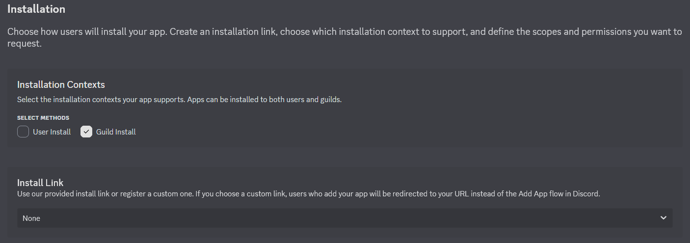
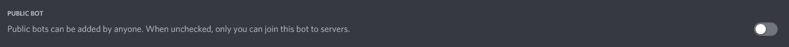
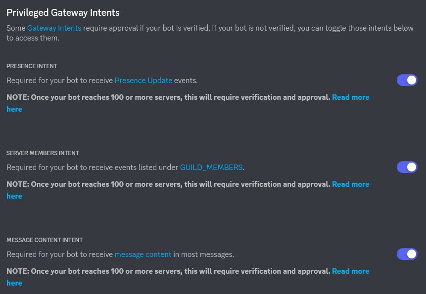
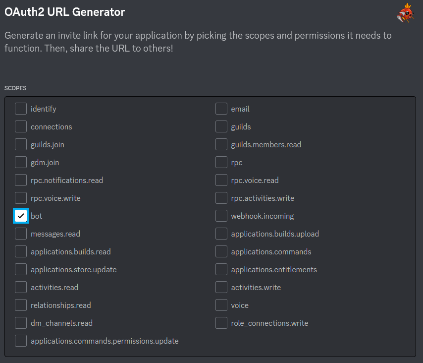
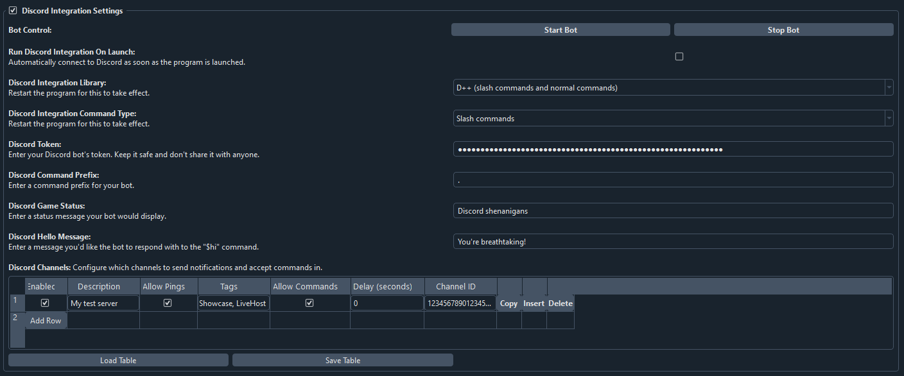
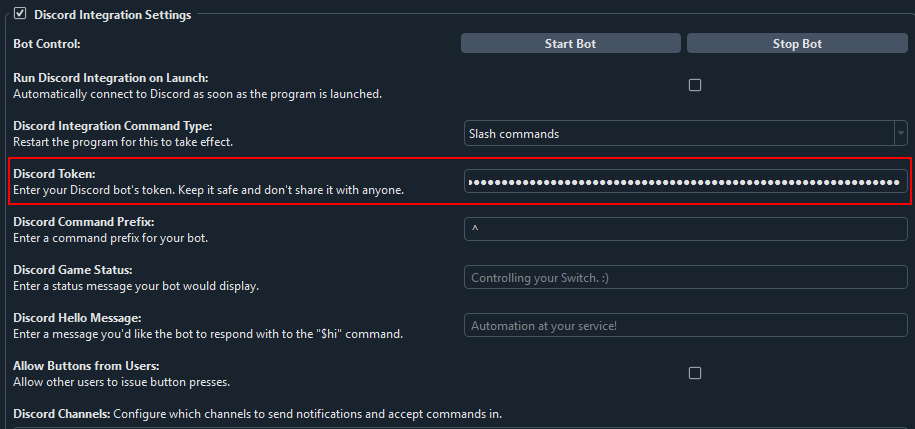
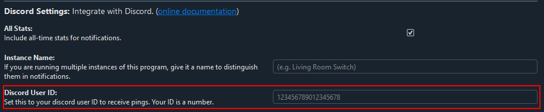
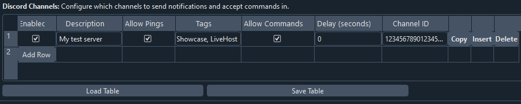
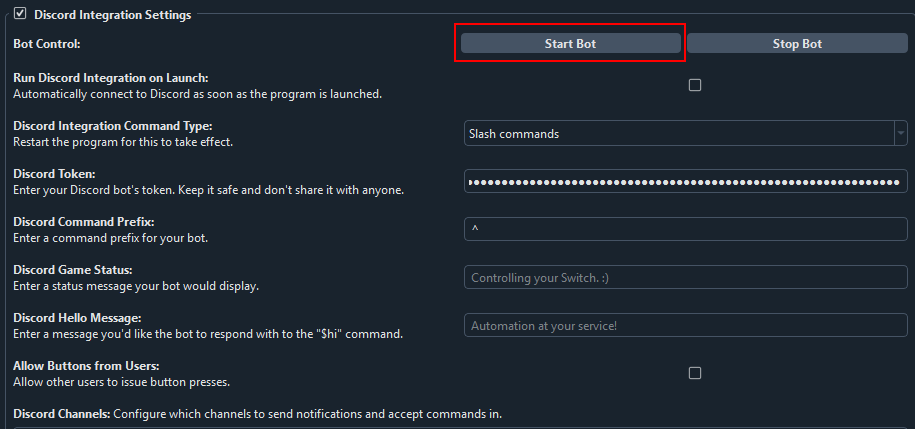
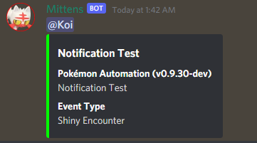

# Discord Bot Integration:

**Back To:** [Discord Integration](DiscordIntegration.md)

This section covers how to set up and configure a Discord bot.

Discord bot integration can be useful for various things. For example:
1. Get notified when a shiny is found.
2. Get notified when a long-running program is finished or otherwise needs your attention.
3. Send notifications for live (real-time) hosting.
4. Use remote control commands to start or stop a program, send controller inputs, take screenshots, etc.

## Step 1: Create and set up your Discord bot application

1. Go to [Discord's Developer Portal](https://discord.com/developers/applications) and create a new application.

2. Navigate to the `Bot` tab on the left sidebar and add a new bot. You can give it a username and an avatar if you wish. This is the tab you will get your bot token from, we'll need it later. Under `TOKEN`, copy the token and save it somewhere. If you forget to copy and save it, just click `Reset Token`, and copy the new token. Note that this will invalidate the old token.

    ***Important note: never share or reveal your token to anyone. If you do, other people will be able to access your bot account and abuse it.***

3. Navigate to the `Installation` tab on the left sidebar. Under `Installation Contexts`, ensure `Guild Install` is checked, and `User Install` is unchecked. Under `Install Link`, set the dropdown to `None`.

4. Make sure your bot is set to private, otherwise anyone will be able to invite it to their servers.

5. Under Privileged Gateway Intents enable `Presence Intent`, `Server Members Intent`, and `Message Content Intent`. Save your changes.

6. Go to the OAuth2 tab in the left sidebar. We will now generate an invite URL with the correct permissions. 

Under SCOPES, select `bot`.

**You now have two options:**

  **a.** Do not grant any permissions, copy the generated URL below and invite the bot to a server you have Manage Server permissions in. Bot will not have any permissions, you can configure a role in the server or configure on a per-channel basis. **This is the preferred option if you are setting up your bot in someone else's server.**

  **b.** Grant `Send Messages`, `Embed Links`, `Attach Files`, `Read Message History` permissions. This will allow you to invite the bot to a server you have Manage Server permissions in, and your bot will have a pre-configured role.

Copy the generated URL shown above and paste it into your browser of choice. Click `Continue`.

**NOTE:** If you don't already have a server that you have Manage Server permissions in, one way is to create your own server. 
- On the Discord left sidebar, scroll to the bottom of the list of servers that you're in.
- Click the `+` button, `Add a Server`.
- `Create My Own`. Then follow the rest of the prompts to create your own server.

## Step 2: Open up the Discord settings.

Open up the Pokemon Automation Computer control program and click on the Settings button in the bottom-left section. This opens up the settings panel. Scroll down to the Discord settings. Enable `Discord Integration Settings`.

## Step 3: Get your Discord bot's token and your user ID.

1. Paste the Discord Bot token into the `Discord Token` box. If you haven't already copied the token, head back to the Bot tab in Discord's Developer Portal, reveal and copy your bot's token. 

2. Your Discord ID is not "Username#1234". It's actually just a number. To get your Discord User ID, [follow this guide](https://support.discord.com/hc/en-us/articles/206346498-Where-can-I-find-my-User-Server-Message-ID-). You will first need to enable Developer mode on your account. Paste your User ID into the `Discord User ID` box.

 

## Step 4: Set up your channels and notifications.

1. Click "Add Row". In the `Description` box enter your own description so it's easier for you to identify channels later on.

2. Similarly to how you got your User ID in the previous step, get the channel ID you want to send notifications to and paste it into `Channel ID`. Note: we want the Channel ID, not the Server ID.

3. If you want your bot to respond to commands in that channel, check `Allow Commands`.

## Step 5: Send a test message and try out commands.

Click `Start Bot`. 

If channel permissions are configured properly, the bot should appear online after a few moments. If it doesn't, check the channel and role permissions.

If the bot is online, good job! Now let's test notifications and commands!

Navigate to any program that sends notifications. All programs that send notifications will have the following section near the bottom of the settings.

Click on any of the "Send Test Message" buttons. If everything worked properly, this will send a message to the configured channel(s).

***When using slash commands for the very first time you will have to register them. To do this, type `_cmd register` in a Discord channel you have commands enabled in.
You can also use this command to re-register commands if new ones are added in the future.***

If it doesn't, there can literally be a million things wrong. A good place to start is to open up the `Output Window` and look for any errors.

***

# Settings overview

* **`Run Discord Integration On Launch`**: If enabled, Discord bot integration will automatically start as soon as you open the program.
* **`Discord Integration Library`**: Dropdown menu that allows you to choose which library you want to use: D++ (slash and message commands) or Sleepy Discord (deprecated, only message commands).
* **`Discord Integration Command Type`**: Dropdown menu that allows you to choose between the modern slash commands or the older style message commands. **Only available when using the D++ library**.
* **`Discord Token`**: This is where you'll paste your bot's token. It will be blanked so you don't accidentally reveal it.
* **`Discord Command Prefix`**: Symbol or text your bot will recognize as the start of a command.
* **`Use Suffix`**: If enabled the prefix will be matched at the end of a command. 
**Only available when using the Sleepy Discord library**.
* **`Discord Game Status`**: Flavor text that will appear under your bot's name in the sidebar.
* **`Discord Hello Message`**: Bot's response to the `$hi` command.
* **`Discord Sudo`**: Enter comma-separated user IDs you wish to grant remote button click command access to. **Only available when using the Sleepy Discord library**.
* **`Discord Owner`**: Enter your own user ID. This will also enable sudo commands. **Only available when using the Sleepy Discord library**.

## `Discord Channels` table - Settings overview

### Column: "Description"

Enter your own description for each channel so you can identify them more easily.

### Column: "Allow Pings"

If unchecked, you will never be pinged by the bot. If checked, you will be pinged if the notification requests a ping.

In order to be pinged by a notification, all of these conditions must be met:
1. The notification is sent to your bot.
2. "Allow Pings" is checked.
3. "Should Ping" is checked for the respective event in the program's discord notification settings.

### Column: "Event Tags"

This lets you filter what events are sent. A notification is only sent if a tag is shared with the event itself.

A notification is sent only if all of these conditions are met:
1. The bot is started and `Enabled` is checked for a given row in Discord settings.
2. The corresponding event in the program is enabled. (Notifications are enabled for the program and "Enable" is checked for the respective event.)
3. There is at least one tag in common between the channel and the event type in the program.
4. The event that is being sent is not being rate limited.

The tag can be any alpha-numeric string and must match exactly. By default the program pre-populates the tags with "Notifs", "Showcase", and "LiveHost". You are free to change them or make your own.

A typical use-case is to send logs ("Notifs") down one channel while broadcasting live-hosting notifications to multiple servers.

### Column: "Allow Commands"

This lets you toggle whether your bot will respond to commands in a given channel.

### Column: "Channel ID"

This lets you specify and fine-tune channels for notifications and commands.

***

# Command Overview

A general command cheat sheet.

## Miscellaneous Commands (D++)

* **`help`**: Will post all commands that are available to the invoking user with their parameters and descriptions.
* **`status`**: Will post information about currently running programs and consoles. Good way to find out your console ID (required as a parameter for some commands).
* **`about`** Will provide some general information about the bot.
* **`hi`**: Will post a cute reply to the command invoker.
* **`ping`**: Will reply with ping!

## Owner Commands

* **`click <console id> <button>`**: Will send a button input command to the specified console.
* **`joystick <console id> <LStick/RStick> <x position (0-255)> <y position (0-255)> <hold ticks>`**: Will hold the left joystick for the specified console for a time.
***Note: if a program is running, remote button commands will be denied. Remotely stop a running program first.***

* **`start <console id>`**: Will start a stopped program for the specified console.
* **`stop <console id>`**: Will stop a running program for the specified console.
* **`resetserial <console id>`**: Will reset the serial connection for the specified console.
* **`resetcamera <console id>`**: Will reset the camera view for the specified console.
* **`screenshot <console id> <format (png or jpg)>`**: Will take a screenshot from the specified console and upload it to the channel this command was invoked in.
* **`register`**: Required for first-time slash command use and for adding new commands in the future. Type `_cmd register` to register slash commands. Afterwards will become usable as a regular slash command.

***
###

## Miscellaneous Commands (Sleepy Discord)

* **`help`**: Will post all commands that are available to the invoking user with their parameters and descriptions.
* **`botinfo`**: Will post information about currently running programs and consoles. Good way to find out your console ID (required as a parameter for some commands).
* **`about`** Will provide some general information about the bot.
* **`hi`**: Will post a cute reply to the command invoker.
* **`ping`**: Will post a latency estimate (bot will post a message and edit it with the delay between server responses).

## Sudo Commands

* **`click <console id> <button> <hold ticks>`**: Will send a button input command to the specified console.
* **`leftstick <console id> <x position (0-255)> <y position (0-255)> <hold ticks>`**: Will hold the left joystick for the specified console for a time.
* **`rightstick <console id> <x position (0-255)> <y position (0-255)> <hold ticks>`**: Will hold the right joystick for the specified console for a time.
***Note: if a program is running, remote button commands will be denied. Remotely stop a running program first.***

## Owner Commands

* **`start <console id>`**: Will start a stopped program for the specified console.
* **`stop <console id>`**: Will stop a running program for the specified console.
* **`resetserial <console id>`**: Will reset the serial connection for the specified console.
* **`resetcamera <console id>`**: Will reset the camera view for the specified console.
* **`screenshot <console id> <format (png or jpg)>`**: Will take a screenshot from the specified console and upload it to the channel this command was invoked in.
* **`reloadsettings`**: Will reload Discord settings.
* **`shutdown`**: Will (ungracefully) terminate the entire program. Best to avoid using it, settings and stats will not be saved.

***
### Troubleshooting

* **My bot won't come online!**

If you can see your bot successfully connecting online in the `Output Window`, most likely your channel and/or role permissions for your bot are wrong.
Double-check permissions specifically related to reading messages and viewing channels. If you have assigned your bot a role, view server as the role to make this easier.

* **My bot is getting rate limited!**

Add a delay for sending messages. If you're sending messages to tons of channels or are running several program instances using the same token you may want to consider making additional bots.

* **My bot's slash commands are showing up in every channel!**

Restrict slash commands in your server settings.

* **I've registered slash commands but I don't see them!**

Assuming the user/role/channel is not restricted you may just have to wait for a few minutes or restart your Discord app for the changes to take effect. Discord is slow at caching them.

* **The console ID parameter that worked before no longer works!**

Console ID changes as you select/switch programs. Use the `status` command to check it after switching programs or restarting the program.

* **I've tried everything but it doesn't work!**

Post a detailed message in Pokémon Automation's Discord server.
For proper human troubleshooting you will be expected to explain how you performed each step in the guide, provide relevant logs, and, if applicable, provide pictures of relevant steps.

**Discord Server:** 

