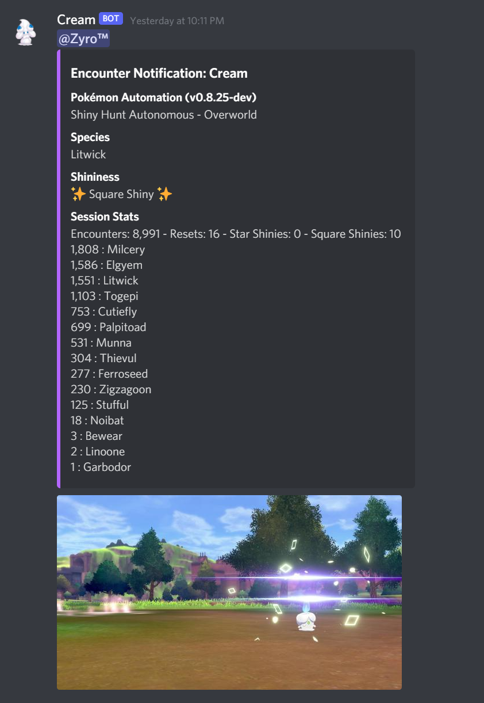

# Discord Integration:

The Computer-Programs application can integrate with Discord. These can be useful for various things:

1. Get notified when a shiny is found.
2. Get notified when a long-running program is finished or otherwise needs your attention.
3. Send notifications for live (real-time) hosting.
4. Remotely control your Switch via Discord bot commands. (under development)
5. Remotely start/stop programs via Discord bot commands. (under development)

**Sub-Articles:**
- [Discord Webhook Notifications](DiscordWebhooks.md)
- Discord Bot (under development)

**Discord Server:** 

