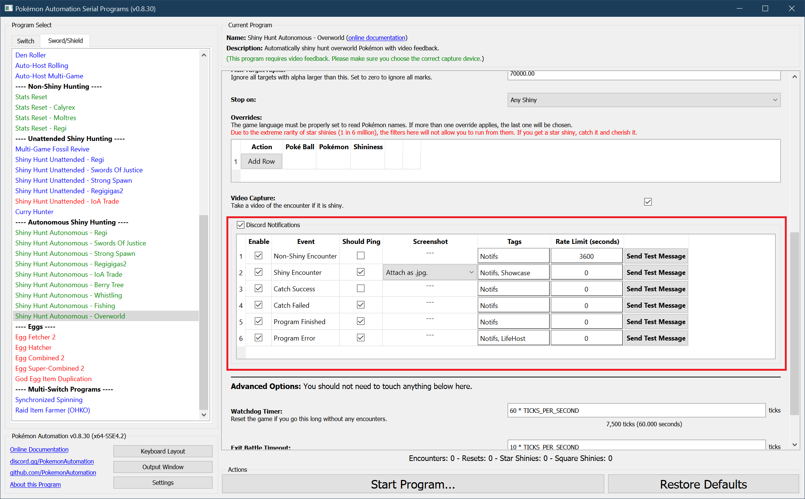

# Discord Notifications: Get program notifications on Discord!

Notifications can be useful for various things. For example:
1. Get notified when a shiny is found.
2. Get notified when a long-running program is finished or otherwise needs your attention.
3. Send notifications for live (real-time) hosting.

## Discord Webhooks:

Currently, the only form of notification that is supported are Discord Webhooks. Full integration is still under development and not available yet.

### Step 1: Open up the Discord settings.

Open up the serial programs and click on the Settings button in the bottom-left section. This opens up the settings panel. Scroll down to the Discord settings.

### Step 2: Get your Discord user ID.

Your Discord ID is not "Username#1234". It's actually just a number. To get your Discord ID, [follow this guide](https://support.discord.com/hc/en-us/articles/206346498-Where-can-I-find-my-User-Server-Message-ID-).

Paste your ID into the "Discord User ID box."

### Step 3: Create a webhook.

[Follow this guide to create a webhook.](https://support.discord.com/hc/en-us/articles/228383668-Intro-to-Webhooks)

Note that you will need webhook permissions for the channel you wish to use. If you don't, you can create your own personal server.

Once you have your webhook URL, check the box for "Discord Webhook Settings" to enable it, then click "Add Row".

Paste the webhook URL into respective box. It will be blanked out just like a password.

You can optionally enter a description for the webhook. This is only for your own purposes and is useful when managing multiple webhooks.

For now, you can leave the Tags alone. These let you control what types of notifications are sent to which webhooks and will be explained in a later section.

### Step 4: Send a test message.

At this point, the webhook should be working and programs that sent notifications will now appear in your channel. But let's test it to make sure.

Navigate to any program that sends notifications. All programs that send notifications will have "Discord Notifications" section near the bottom of the settings. When you find it, check the box to enable the notifications.

Click on any of the "Send Test Message" buttons. If everything worked properly, this will send a message to your channel with the webhook.

If it doesn't, there can literally be a million things wrong. A good place to start is to open up the Output Window and look for any errors.

### Advanced Settings

## Discord Bot

Full integration via a Discord bot is still under development. Stay tuned!

**Discord Server:** 

