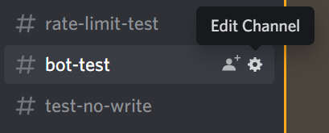
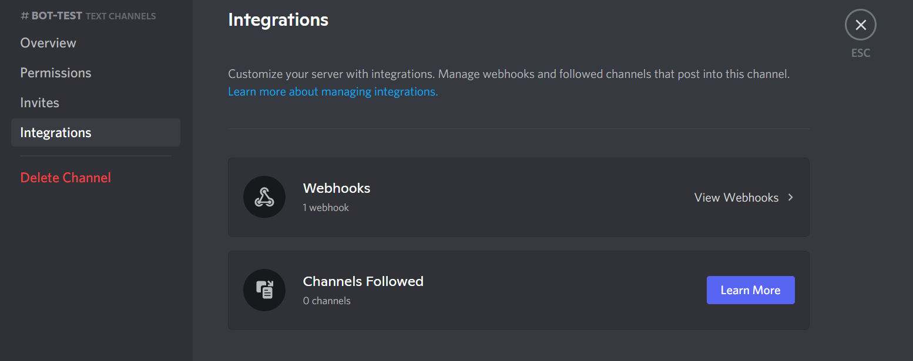
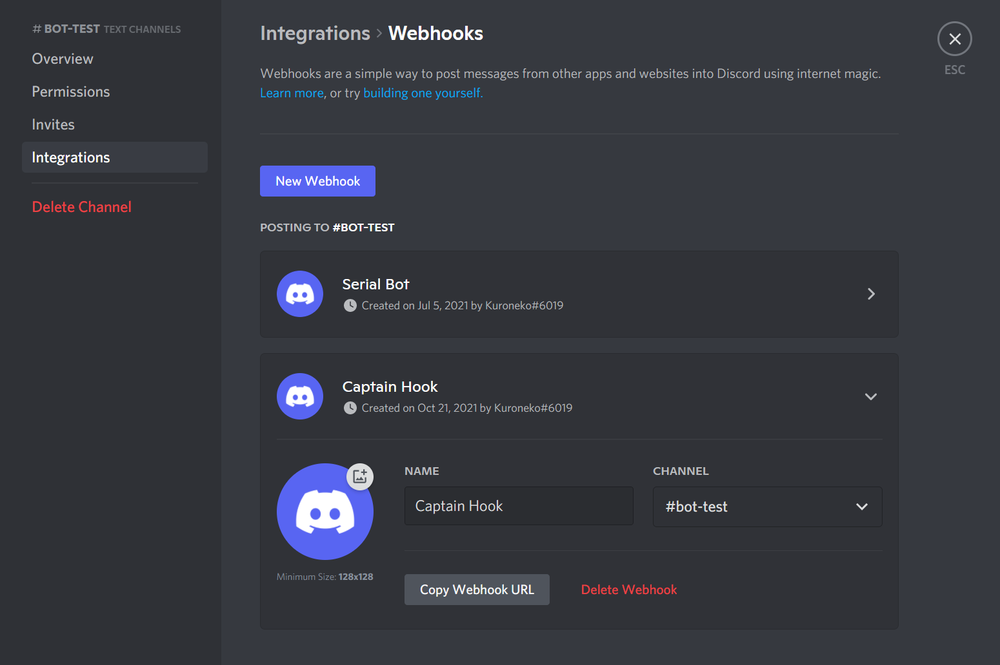
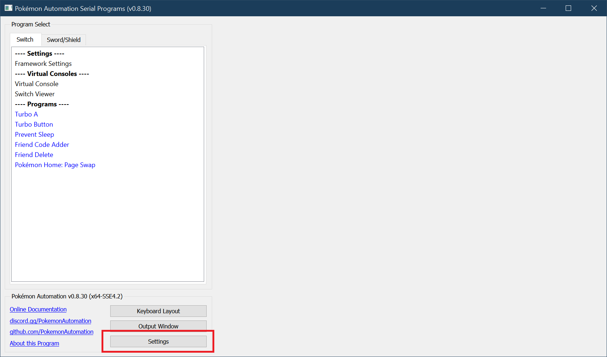

# Discord Notifications: Get program notifications on Discord!

Notifications can be useful for various things. For example:
1. Get notified when a shiny is found.
2. Get notified when a long-running program is finished or otherwise needs your attention.
3. Send notifications for live (real-time) hosting.

## Discord Webhooks:

Currently, the only form of notification that is supported are Discord Webhooks. Full integration is still under development and not available yet.

### Step 1: Create a Webhook.

To do this, you need webhook permissions for the channel you wish to use. If you don't, you can create your own personal server.

Navigate to the channel you want to you and click on the gear symbol to open up the settings. If you don't see the gear symbol, it means you do not have sufficient access to the channel.

On the left sidebar, click on the "Integrations" options. Then click on "View Webhooks".

Click on "New Webhook" to create the webhook. Feel free to customize the name and avatar.

Click on "Copy Webhook URL" to copy the URL.

### Step 2: Add Webhook URL to Program Settings.

Open up the serial programs and click on the Settings button in the bottom-left section. This opens up the settings panel. Scroll down to the Discord settings.

### Advanced Settings

## Discord Bot

Full integration via a Discord bot is still under development. Stay tuned!

**Discord Server:** 

