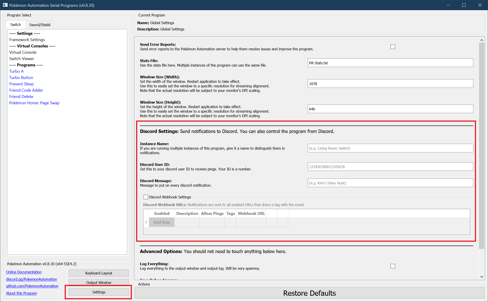
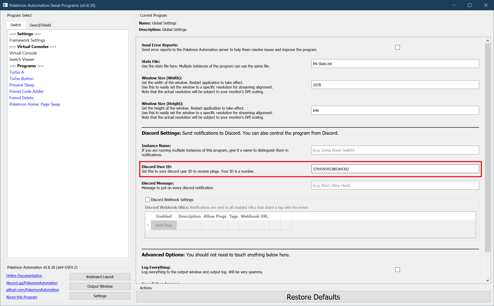
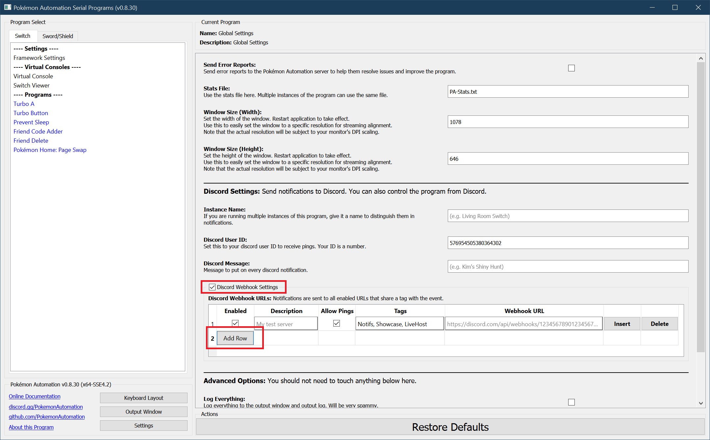
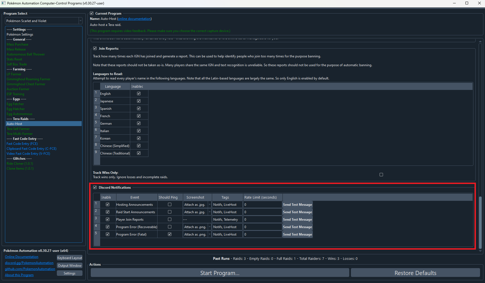
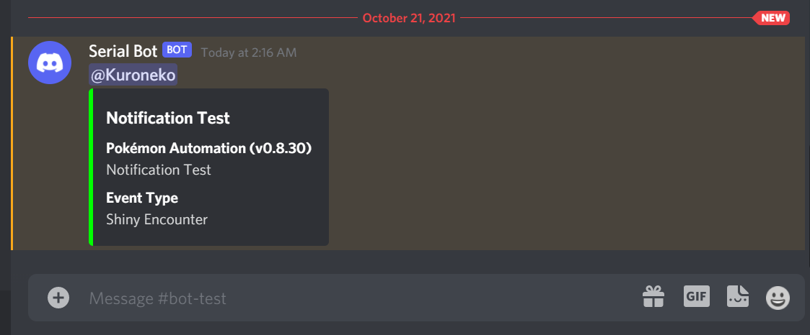

# Discord Webhook Notifications:

**Back To:** [Discord Integration](DiscordIntegration.md)

This section covers how to setup and customize notifications using Discord webhooks.

Notifications can be useful for various things. For example:
1. Get notified when a shiny is found.
2. Get notified when a long-running program is finished or otherwise needs your attention.
3. Send notifications for live (real-time) hosting.

## Step 1: Open up the Discord settings.

Open up the serial programs and click on the Settings button in the bottom-left section. This opens up the settings panel. Scroll down to the Discord settings.

## Step 2: Get your Discord user ID.

Your Discord ID is not "Username#1234". It's actually just a number. To get your Discord ID, [follow this guide](https://support.discord.com/hc/en-us/articles/206346498-Where-can-I-find-my-User-Server-Message-ID-).

Paste your ID into the "Discord User ID box."

## Step 3: Create a webhook.

[Follow this guide to create a webhook.](https://support.discord.com/hc/en-us/articles/228383668-Intro-to-Webhooks)

Note that you will need webhook permissions for the channel you wish to use. If you don't, you can create your own personal server.

Once you have your webhook URL, check the box for "Discord Webhook Settings" to enable it, then click "Add Row".

Paste the webhook URL into respective box. It will be blanked out just like a password.

For now, leave all the other options alone.

## Step 4: Send a test message.

At this point, the webhook should be working and programs that send notifications will now appear in your channel. But let's test it to make sure.

Navigate to any program that sends notifications. All programs that send notifications will have the following section near the bottom of the settings.

Click on any of the "Send Test Message" buttons. If everything worked properly, this will send a message to your channel with the webhook.

If it doesn't, there can literally be a million things wrong. A good place to start is to open up the Output Window and look for any errors.

## Advanced Settings

Now that you have a webhook working, here's the guide for the remaining webhook settings.

### Multiple Webhooks:

The application supports multiple webhooks. This lets you send notifications to multiple channels/servers. (for example, live-hosting in multiple servers, or showing off your shinies) Likewise multiple webhooks can be used to sent different types of notifications to different channels.

### Column: "Enabled"

This lets you turn on or off the entire webhook. If unchecked, nothing will be sent to that webhook. Thus you can disable webhooks without deleting them from the program.

### Column: "Description"

Enter your own description for this webhook so you can identify them. This doesn't matter if you only have webhook, but is very useful when you have many of them.

### Column: "Allow Pings"

If unchecked, you will never be pinged by that webhook. If checked, you will be pinged if the notification requests a ping.

In order to be pinged by a notification, all of these conditions must be met:
1. The notification is sent down this webhook.
2. "Allow Pings" is checked for this webhook.
3. "Should Ping" is checked for the respective event in the program's discord notification settings.

### Column: "Tags"

This lets you filter what events are sent down this webhook. A notification is only sent down a webhook if it shares a tag with the event itself.

A notification is sent down the webhook only if all of these conditions are met:
1. The webhook is enabled. ("Enabled" is checked)
2. The corresponding event in the program is enabled. (Notifications are enabled for the program and "Enable" is checked for the respective event.)
3. There is at least one tag in common between the webhook and the event type in the program.
4. The event that is being sent is not being rate limited.

The tag can be any alpha-numeric string and must match exactly. By default the program pre-populates the tags with "Notifs", "Showcase", and "LiveHost". You are free to change them or make your own.

A typical use-case is to send logs ("Notifs") down one channel while broadcasting live-hosting notifications to multiple servers.

### Column: "Webhook URL"

The URL of the webhook. (duh!) It is blanked out because it is sensitive. Anyone with the URL can send anything they want down your webhook.

**Discord Server:** 

